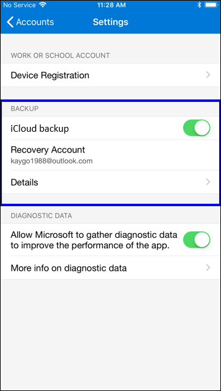
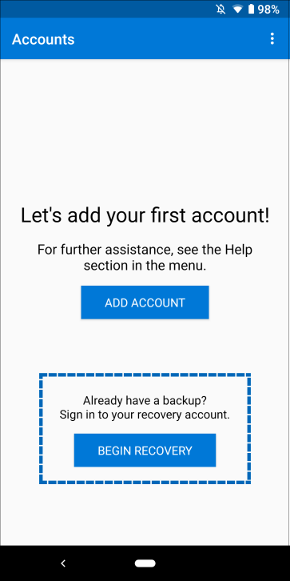
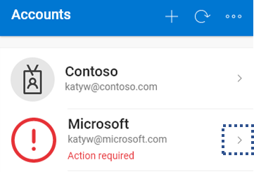
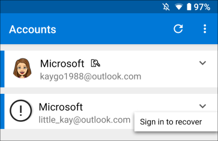
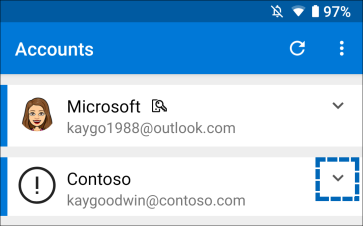
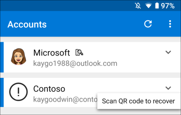

# Backup and recover account credentials with the Microsoft Authenticator app

**Applies to:**

- iOS devices

The Microsoft Authenticator app backs up your account credentials and related app settings, such as the order of your accounts, to the cloud. After backup, you can also use the app to recover your information on a new device, potentially avoiding getting locked out or having to recreate accounts.

> [!IMPORTANT]
> You need one personal Microsoft account and one iCloud account for each backup storage location. But within that storage location, you can back up several accounts. For example, you can have a personal account, a school account, and a third-party account like Facebook, Google, and so on.
> 
> Only your personal and 3rd-party account credentials are stored, which includes your user name and the account verification code that’s required to prove your identity. We don’t store any other information associated with your accounts, including emails or files. We also don’t associate or share your accounts in any way or with any other product or service. And finally, your IT admin won’t get any information about any of these accounts.

## Back up your account credentials
Before you can back up your credentials, must have both:

- A personal [Microsoft account](https://account.microsoft.com/account) to act as your recovery account.

- An [iCloud account](https://www.icloud.com/) for the actual storage location. 

Requiring you to sign in to both accounts together provides stronger security for your backup information.

**To turn on Cloud backup**
-	On your iOS device, select **Settings**, select **Backup**, and then turn on **iCloud backup**.

    Your account credentials are backed up to your iCloud account.

    

## Recover your account credentials on your new device
You can recover your account credentials from your iCloud account, using the same Microsoft recovery account you set up when you backed up your information.

### To recover your information
1.	On your iOS device, open the Microsoft Authenticator app, and select **Begin recovery** from the bottom of the screen.

    

2.	Sign in to your recovery account, using the same personal Microsoft account you used during the backup process.

    Your account credentials are recovered to the new device.

After you finish your recovery, you might notice that your personal Microsoft account verification codes in the Microsoft Authenticator app are different between your old and new phones. The codes are different because each device has its own unique credential, but both are valid and work while signing in using the associated phone.

## Recover additional accounts requiring more verification
If you use push notifications with your personal, work, or school accounts, you'll get an on-screen alert that says you must provide additional verification before you can recover your information. Because push notifications require using a credential that’s tied to your specific device and never sent over the network, you must prove your identity before the credential is created on your device.

For personal Microsoft accounts, you can prove your identity by entering your password along with an alternate email or phone number. For work or school accounts, you must scan a QR code given to you by your account provider.

### To provide additional verification for personal accounts
1.	In the **Accounts** screen of the Microsoft Authenticator app, select the drop-down arrow next to the account you want to recover.

    

2.	Select **Sign in to recover**, type your password, and then confirm your email address or phone number as additional verification.

    

### To provide additional verification for work or school accounts
1.	In the **Accounts** screen of the Microsoft Authenticator app, select the drop-down arrow next to the account you want to recover.

    

2.	Select **Scan QR code to recover**, and then scan the QR code.

    

    >[!NOTE]
    >For more info about how to get a QR code, see [Get started with the Microsoft Authenticator app](https://docs.microsoft.com/azure/active-directory/user-help/user-help-auth-app-download-install) or [Set up security info to use an authenticator app](https://docs.microsoft.com/azure/active-directory/user-help/security-info-setup-auth-app), based on whether your admin has turned on security info.

## Troubleshooting backup and recovery problems
There are a few reasons why your backup might not be available:

-	**Changing operating systems.** Your backup is stored in the cloud storage option provided by your phone’s operating system, which means the backup is unavailable if you switch between Android and iOS. In this situation, you must manually recreate your account within the app.

-	**Network or password problems.** Make sure you’re connected to a network and signed into your iCloud account using the same AppleID you used on your last iPhone.

-	**Accidental deletion.** It’s possible that you deleted your backup account from your previous device or while managing your cloud storage account. In this situation, you must manually recreate your account within the app.

-	**Existing Microsoft Authenticator accounts.** 
 If you've already set up accounts in the Microsoft Authenticator app, the app won't be able to recover your backed-up accounts. Preventing recovery helps ensure that your account details aren't overwritten with out-of-date information. In this situation, you must remove any existing account information from the existing accounts set up in your Authenticator app before you can recover your backup.

## Next steps
Now that you've backed up and recovered your account credentials to your new device, you can continue to use the Microsoft Authenticator app to verify your identity. For more information, see [Sign in to your accounts using the Microsoft Authenticator app](user-help-sign-in.md).

## Related topics

- [What is the Microsoft Authenticator app?](user-help-auth-app-overview.md)

- [Microsoft Authenticator app FAQ](user-help-auth-app-faq.md)

- [Multi-factor Authentication](https://docs.microsoft.com/azure/multi-factor-authentication/)
