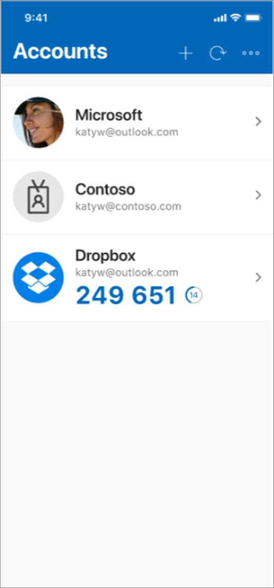
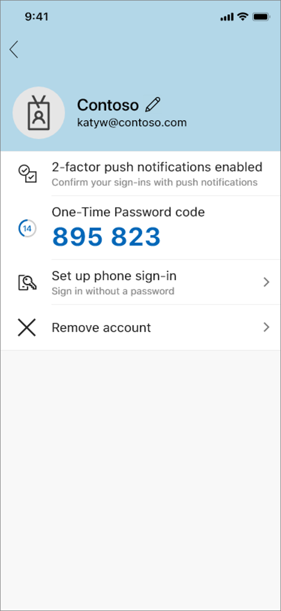

# Frequently asked questions (FAQ) about the Microsoft Authenticator app

This article answers common questions about the Microsoft Authenticator app. If you don't see an answer to your question, go to the [Microsoft Authenticator app forum](https://social.technet.microsoft.com/Forums/en-US/home?forum=MicrosoftAuthenticatorApp).

The Microsoft Authenticator app replaced the Azure Authenticator app, and it's the recommended app when you use Azure Multi-Factor Authentication. The Microsoft Authenticator app is available for [Android](https://app.adjust.com/e3rxkc_7lfdtm?fallback=https%3A%2F%2Fplay.google.com%2Fstore%2Fapps%2Fdetails%3Fid%3Dcom.azure.authenticator) and [iOS](https://app.adjust.com/e3rxkc_7lfdtm?fallback=https%3A%2F%2Fitunes.apple.com%2Fus%2Fapp%2Fmicrosoft-authenticator%2Fid983156458).

## Frequently asked questions

| Question | Answer |
| -------- | ------ |
| Is registering a device agreeing to give the company or service access to my device? | Registering a device gives your device access to your organization's services and doesn't allow your organization access to your device. |
| I have a Windows Mobile device, and the Microsoft Authenticator on Windows Mobile has been deprecated. Can I continue authenticating using the app? | All authentications using the Microsoft Authenticator on Windows Mobile will be retired after July 15, 2020. We strongly recommend that you use an alternate authentication method to avoid being locked out of your accounts. Alternate options for enterprise users include: <ul><li>Setting up the Microsoft Authenticator for Android or iOS.</li><li>Setting up SMS to receive verification codes.</li><li>Setting up phone number to receive phone calls to verify their identity.</li></ul> Alternate options for personal Microsoft account users include: <ul><li>Setting up the Microsoft Authenticator app for Android or iOS.</li><li>Setting up an alternate sign-in method (SMS or email) by updating your security info from the [Microsoft Account Security page](https://account.microsoft.com/security/).</li></ul> |
| Can I take screenshots of my one-time password (OTP) codes on the Android Authenticator? | Beginning with release 6.2003.1704 of Authenticator Android, by default all OTP codes are hidden anytime a screenshot of Authenticator is taken. If you want to see your OTP codes in screenshots or allow other apps to capture the Authenticator screen, you can. Just turn on the **Screen Capture** setting in Authenticator and restart the app. |
| What data does the Authenticator store on my behalf and how can I delete it? | The Authenticator app collects three types of information:<ul><li>Account info you provide when you add your account. This data can be removed by removing your account.</li><li>Diagnostic log data that stays only in the app until you select **Send Logs** the app's **Help** menu to send logs to Microsoft. These logs can contain personal data such as email addresses, server addresses, or IP addresses. They also can contain device data such as device name and operating system version. Any personal data collected is limited to info needed to help troubleshoot app issues. You can browse these log files in the app at any time to see the info being gathered. If you send your log files, Authentication app engineers will use them only to troubleshoot customer-reported issues.</li><li>Non-personally identifiable usage data, such "started add account flow/successfully added account," or "notification approved." This data is an integral part of our engineering decisions. Your usage helps us determine where we can improve the apps in ways that are important to you. You see a notification of this data collection when you use the app for the first time. It informs you then that it can be turned off on the app's **Settings** page. You can turn this setting on or off at any time.</li></ul> |
| What are the codes in the app for? | When you open Authenticator, you'll see your added accounts as tiles. Your work or school accounts and your personal Microsoft accounts will have six or eight digit numbers visible in the full screen view of the account (accessed by tapping the account tile). For other accounts, you’ll see a six or eight digit number in the **Accounts** page of the app. You'll use these codes as single-use password to verify that you are who you say you are. After you sign in with your username and password, you'll type in the verification code that's associated with that account. For example, if you're Katy signing in to your Contoso account, you'd tap the account tile and then use the verification code 895823. For the Outlook account, you’d follow the same steps. Tap the Contoso account tile.  After you tap the Contoso account tile, the verification code is visible in full screen.  |
| Why does the number next to the code keep counting down? | You might see a 30-second timer counting down next to your active verification code. This timer is so that you never sign in using the same code twice. Unlike a password, we don't want you to remember this number. The idea is that only someone with access to your phone knows your code. |
| Why is my account tile gray? | Some organizations require Authenticator to work with single sign-on and to protect organizational resources. In this situation, the account isn't used for two-step verification and shows up as gray or inactive. This type of account is frequently called a "broker" account. |
| What is device registration? | Your org might require you to register the device to track access to secured resources, such as files and apps. They also might turn on Conditional Access to reduce the risk of unwanted access to those resources. You can unregister your device in **Settings**, but you may lose access to emails in Outlook, files in OneDrive, and you'll lose the ability to use phone sign-in. |
| Do I need to be connected to the Internet or my network to get and use the verification codes? | The codes don't require you to be on the Internet or connected to data, so you don't need phone service to sign in. Additionally, because the app stops running as soon as you close it, it won't drain your battery. |
| I only get notifications when the app is open. If the app is closed, I don't get notifications. | If you're getting notifications, but not an alert, even with your ringer on, you should check your app settings. Make sure the app is turned on to use sound or to vibrate for notifications. If you don't get notifications at all, you should check the following conditions:<ul><li>Is your phone in Do Not Disturb or Quiet mode? These modes can prevent apps from sending notifications.</li><li>Can you get notifications from other apps? If not, it could be a problem with the network connections on your phone, or the notifications channel from Android or Apple. You can try to resolve your network connections through your phone settings. You might need to talk to your service provider to help with the Android or Apple notifications channel.</li><li>Can you get notifications for some accounts on the app, but not others? If yes, remove the problematic account from your app, add it again allowing notifications, and see if that fixes the problem.</li></ul>If you tried all of these steps and are still having issues, we recommend sending your log files for diagnostics. Open the app, go to **Help**, and then select **Send logs**. After that, go to the [Microsoft Authenticator app forum](https://social.technet.microsoft.com/Forums/en-US/home?forum=MicrosoftAuthenticatorApp) and tell us the problem you're seeing and the steps you tried. |
| I'm using the verification codes in the app, but how do I switch to the push notifications? | You can set up notifications for your work or school account (if allowed by your administrator) or for your personal Microsoft account. Notifications won't work for third-party accounts, like Google or Facebook. To switch your personal account over to notifications, you'll have to re-register your device with the account. Go to **Add Account**, select **Personal Microsoft Account**, and then sign in using your username and password. Your organization decides whether or not to allow one-click notifications for your work or school account.|
|Do notifications work for non-Microsoft accounts | No, notifications only work with Microsoft accounts and Azure Active Directory accounts. If your work or school uses Azure AD accounts, they might turn off this feature. |
| I got a new device or restored my device from a backup. How do I set up my accounts in Authenticator again? | If you turned on **Cloud Backup** on your old device, you can use your old backup to recover your account credentials on your new iOS or an Android device. For more info, see the [Backup and recover account credentials with Authenticator](user-help-auth-app-backup-recovery.md) article. |
| I lost my device or moved on to a new device. How do I make sure notifications don't continue to go to my old device? | Adding Authenticator to your new device doesn't automatically remove the app from your old device. Even deleting the app from your old device isn't enough. You must both delete the app from your old device AND tell Microsoft or your organization to forget and unregister the old device.<ul><li>**To remove the app from a device using a personal Microsoft account.** Go to the two-step verification area of your [Account Security](https://account.microsoft.com/security) page and choose to turn off verification for your old device.</li><li>**To remove the app from a device using a work or school Microsoft account.** Go to the two-step verification area of either your [MyApps page](https://myapps.microsoft.com/) or your organization's custom portal to turn off verification for your old device.</li></ul> |
| How do I remove an account from the app? | Tap the account tile for the account you’d like to remove from the app to view the account full screen. Tap **Remove account** to remove the account from the app. If you have a device that is registered with your organization, you might need an extra step to remove your account. On these devices, Authenticator is automatically registered as a device administrator. If you want to completely uninstall the app, you need to first unregister the app in the app settings. |
| Why does the app request so many permissions? | Here's the full list of permissions that might be asked for, and how they're used by the app. The specific permissions you see will depend on the type of phone you have.<ul><li>**Use biometric hardware.** Some work and school accounts require an additional PIN whenever you verify your identity. The app requires your consent to use biometric or facial recognition instead of entering the PIN.</li><li>**Camera.** Used to scan QR codes when you add a work, school, or non-Microsoft account.</li><li>**Contacts and phone.** The app requires this permission to search for work or school Microsoft accounts on your phone and add them to the app for you.</li><li>**SMS.** Used to make sure your phone number matches the number on record when you sign in with your personal Microsoft account for the first time. We send a text message to the phone on which you installed the app that includes a 6-8 digit verification code. You don't need to find this code and enter it because Authenticator finds it automatically in the text message.</li><li>**Draw over other apps.** The notification you get that verifies your identity is also displayed on any other running app.</li><li>**Receive data from the internet.** This permission is required for sending notifications.</li><li>**Prevent phone from sleeping.** If you register your device with your organization, your organization can change this policy on your phone.</li><li>**Control vibration.** You can choose whether you would like a vibration whenever you receive a notification to verify your identity.</li><li>**Use fingerprint hardware.** Some work and school accounts require an additional PIN whenever you verify your identity. To make the process easier, we allow you to use your fingerprint instead of entering the PIN.</li><li> **View network connections.** When you add a Microsoft account, the app requires network/internet connection.</li><li>**Read the contents of your storage**. This permission is only used when you report a technical problem through the app settings. Some information from your storage is collected to diagnose the issue.</li><li>**Full network access.** This permission is required for sending notifications to verify your identity.</li><li>**Run at startup.** If you restart your phone, this permission ensures that you continue you receive notifications to verify your identity.</li></ul> |
| Why does Authenticator allow you to approve a request without unlocking the device? | You don't have to unlock your device to approve verification requests because all you need to prove is that you have your phone with you. Two-step verification requires proving two things – a thing you know, and a thing you have. The thing you know is your password. The thing you have is your phone (set up with Authenticator and registered as an MFA proof.) Therefore, having the phone and approving the request meets the criteria for the second factor of authentication. |
| Why aren't all my accounts showing up when I open Authenticator on my Apple Watch? | Authenticator supports only Microsoft personal or school or work accounts with push notifications on the Apple Watch companion app. For your other accounts, like Google or Facebook, you have to open the Authenticator app on your phone to see your verification codes. |
| Why can't I approve or deny notifications on my Apple Watch? | First, make sure you've upgraded to Authenticator, version 6.0.0 or higher on your iPhone. After that, open the Microsoft Authenticator companion app on your Apple Watch and look for any accounts with a **Set Up** button beneath them. Complete the setup process to approve notifications for those accounts. |
| I'm getting a communication error between the Apple Watch and my phone. What can I do to troubleshoot? | This error happens when your Watch screen goes to sleep before it finishes communicating with your phone. <b>If the error happens during setup:</b> Try to run setup again, making sure to keep your Watch awake until the process is done. At the same time, open the app on your phone and respond to any prompts that appear. If your phone and Watch still aren't communicating, you can try the following actions:<ol><li>Force quit the Microsoft Authenticator phone app and open it again on your iPhone.</li><li>Force quit the companion app on your Apple Watch.<ol><li> Open the Microsoft Authenticator companion app on your Watch</li><li>Hold down the side button until the **Shutdown** screen appears.</li><li>Release the side button and hold down the Digital Crown to force quit the active app.</li></ol></li><li>Turn off both Bluetooth and Wi-Fi for both your phone and your Watch, and then turn them back on.</li><li>Restart your iPhone and your Watch.</li></ol><b>If the error occurs when you're trying to approve a notification:</b> The next time you try to approve a notification on your Apple Watch, keep the screen awake until the request is complete and you hear the sound that indicates it was successful. |
| Why isn't the Microsoft Authenticator companion app for Apple Watch syncing or showing up on my watch? | If the app isn't showing up on your Watch, try the following actions: <ol><li>Make sure your Watch is running watchOS 4.0 or higher.</li><li>Sync your Watch again.</li></ol> |
| My Apple Watch companion app crashed. Can I send you my crash logs so you can investigate? | You first have to make sure you've chosen to share your analytics with us. If you're a TestFlight user, you're already signed up. Otherwise, you can go to **Settings > Privacy > Analytics** and select both the **Share iPhone & Watch analytics** and the **Share with App Developers** options. After you sign up, you can try to reproduce your crash so your crash logs are automatically sent to us for investigation. However, if you can't reproduce your crash, you can manually copy your log files and send them to us.<ol><li>Open the Watch app on your phone, go to **Settings > General**, and then click **Copy Watch Analytics**.</li><li>Find the corresponding crash under **Settings > Privacy > Analytics > Analytics Data**, and then manually copy the entire text.</li><li>Open Authenticator on your phone and paste that copied text into the **Share with App Developers** text box on the **Send logs** page.</li></ol> |
| What is the App Lock feature, and how does it help to keep me more secure? | To keep your one-time passcodes, app information, and app settings more secure, you can turn on the App Lock feature in Authenticator. Turning on **App Lock** from the Authenticator **Settings** page asks you to authenticate using your PIN or biometric every time you open Authenticator. This feature offers extra protection, the way you approve your notifications in Authenticator won't change. **Note** Unfortunately, there's no guarantee that App Lock will stop someone from accessing Authenticator. That's because device registration can happen in other locations outside of Authenticator, such as in the Company Portal app or within Android account settings. |
| Why am I getting notifications about my account activity? | Activity notifications are sent to Authenticator immediately whenever a change is made to your personal Microsoft accounts, helping to keep you more secure. We previously sent these notifications only through email and SMS. For more information about these activity notifications, see [What happens if there's an unusual sign-in to your account](https://support.microsoft.com/help/13967/microsoft-account-unusual-sign-in). To change where you receive your notifications, sign in to the [Where can we contact you with non-critical account alerts](https://account.live.com/SecurityNotifications/Update) page of your account. |
| While signing in to my work or school account using the default mail app that comes with iOS, I get prompted by Authenticator for my security verification information. After I enter that information and return to the mail app, I get an error. What can I do? | This most-likely happens because your sign-in and your mail app are occurring across two different apps, causing the initial background sign-in process to stop working and to fail. To try to fix this, we recommend you select the **Safari** icon on the bottom right side of the screen while signing in to your mail app. By moving to Safari, the whole sign-in process happens in a single app, allowing you to sign in to the app successfully. |
| My one-time password (OTP) codes are not working. What should I do? | Make sure the date and time on your device are correct and are being automatically synced. If the date and time is wrong, or out of sync, the code won't work. |
| The Windows 10 Mobile operating system was deprecated December 2019. Will the Microsoft Authenticator on Windows Mobile operating systems be deprecated as well? | Authenticator on all Windows Mobile operating systems will not be supported after Feb 28, 2020. Users will not be eligible for receiving any new updates to the app post the aforementioned date. After Feb 28, 2020 Microsoft services that currently support authentications using the Microsoft Authenticator on all Windows Mobile operating systems will begin to retire their support. In order to authenticate into Microsoft services, we strongly encourage all our users to switch to an alternate authentication mechanism prior to this date. |

## Next steps

- If you're having trouble getting your verification code for your personal Microsoft account, see the **Troubleshooting verification code issues** section of the [Microsoft account security info & verification codes](https://support.microsoft.com/help/12428/microsoft-account-security-info-verification-codes) article.

- If you want more information about two-step verification, see [Set up my account for two-step verification](multi-factor-authentication-end-user-first-time.md)

- If you want more information about security info, see [Security info (preview) overview](user-help-security-info-overview.md)

- If your question wasn't answered here, we want to hear from you. Go to the [Microsoft Authenticator app forum](https://social.technet.microsoft.com/Forums/en-us/home?forum=MicrosoftAuthenticatorApp) to post your question and get help from the community, or leave a comment on this page.
