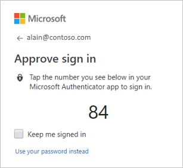
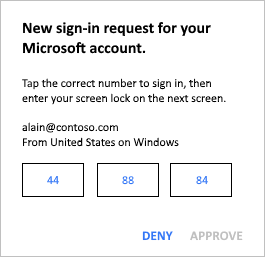

# Sign in to your accounts using the Microsoft Authenticator app
The Microsoft Authenticator app helps you sign-in to your accounts if you use two-factor verification. Two-factor verification helps you to access your accounts more securely, especially while viewing sensitive information. Because passwords can be forgotten, stolen, or compromised, two-factor verification is an additional security step that helps protect your account by making it harder for other people to break in.

You can use the Microsoft Authenticator app in multiple ways, including:

- Providing a prompt for a second verification method after you sign in with your username and password.

- Providing sign-in without requiring a password, using your username and your mobile device with your fingerprint, face, or PIN.

  >[!Important]
  >This phone sign-in method only works with your work or school and personal Microsoft accounts. Your non-Microsoft accounts require you to use the standard two-factor verification process.

## Prerequisites
Before you can use the Microsoft Authenticator app, you must:

 1. Download and install the Microsoft Authenticator app. If you haven't done this yet, see [Download and install the app](user-help-auth-app-download-install.md).

 2. Add your work/school, personal, and third-party accounts to the Microsoft Authenticator app. For the detailed steps, see [Add your work or school account](user-help-auth-app-add-work-school-account.md), [Add your personal accounts](user-help-auth-app-add-personal-ms-account.md), and [Add your non-Microsoft accounts](user-help-auth-app-add-non-ms-account.md).

## Turn on and use phone sign-in for your work or school account
Phone sign-in is a type of two-step verification. You must still verify your identity by providing a thing you know and a thing you have, but phone sign-in lets you skip entering your account password and performs all of your identity verification on your mobile device.

Before you can turn on phone sign-in, you must turn on two-factor verification. For more information about how to turn on two-factor verification for an account, see [Add your work or school account](user-help-auth-app-add-work-school-account.md) and [Add your personal accounts](user-help-auth-app-add-personal-ms-account.md).

Phone sign-in is only available on iOS and Android devices running Android 6.0 or above.

### Turn on phone sign-in 

- Open the Microsoft Authenticator app, go to your work or school account, and turn on phone sign-in:

    - **If you see this icon .** If this icon appears next to your work or school account name, it means that you've already set up phone sign-in for the account. You might be asked to add push notifications for your account, so you can be notified about authentication requests outside of the app.

    - **If you've been using the app for two-factor verification.** If you've already been using the app and two-factor verification, you can choose the drop-down arrow next to the account name, and then select **Enable phone sign-in**.
    
    - **If you can't find your work or school account.** If you can't find your work or school account on the **Accounts** screen of the app, it means that you haven't added it to the app yet. Add your work or school account by following the steps in the [Add your work or school account](user-help-auth-app-add-work-school-account.md) article.

### Sign in to your account using phone sign-in
After you turn on phone sign-in, you can sign in using just the Microsoft Authenticator app.

1. Sign in to your work or school account.

    After typing your username, an **Approve sign in** screen appears showing you a two-digit number and asking you to sign-in through the Microsoft Authenticator app. If you don’t want to use this sign in method, you can select **Use your password instead**, and sign in using your password.

    

2. Open the notification or the Microsoft Authenticator app on your device, and then tap the number that matches the number you see on your computer’s **Approve sign-in** screen.

    

3. Choose **Approve** if you recognize the sign-in attempt. Otherwise, choose **Deny**.

4. Use your phone’s PIN or your biometric key to complete the authentication.

## Turn on and use phone sign-in for your personal Microsoft accounts
You can turn on phone sign-in for your personal Microsoft account, such as the account you use to sign in to Outlook.com, Xbox, or Skype.

>[!NOTE]
>To help protect your account, the Microsoft Authenticator app requires a PIN or biometric lock on your device. If you keep your phone unlocked, the app requires you to set up a security lock before turning on phone sign-in.

### Turn on phone sign-in 

- Open the Microsoft Authenticator app, go to your personal Microsoft account, and turn on phone sign-in:

    - **If you see this icon .** If this icon appears next to your account name, it means that you've already set up phone sign-in for the account. You might be asked to add push notifications for your account, so you can be notified about authentication requests outside of the app.

    - **If you've been using the app for two-factor verification.** If you've already been using the app and two-factor verification, you can choose the drop-down arrow next to the account name, and then select **Enable phone sign-in**.
    
    - **If you can't find your account.** If you can't find your account on the **Accounts** screen of the app, it means that you haven't added it to the app yet. Add your personal Microsoft account by following the steps in the [Add your personal Microsoft account](user-help-auth-app-add-personal-ms-account.md#add-your-personal-microsoft-account) article.

### Sign in to your account using phone sign-in

1. Go to your personal Microsoft account sign-in page, and then instead of typing your password, select the **Use the Microsoft Authenticator app instead** link. 

    Microsoft sends a notification to your phone. 

2. Approve the notification. 

## Sign in using two-factor verification for your account
The standard two-factor verification method requires you to enter your username and password into the device you're logging in to, and then choose whether the Microsoft Authenticator app sends a notification or if you'd prefer to copy the associated verification code from the **Accounts** screen of the Microsoft Authenticator app. You turn on two-factor verification for your account as part of the process to add the account to the Microsoft Authenticator app.

>[!Note]
>If you don't see your work or school account or your personal account on the **Accounts** screen of the Microsoft Authenticator app, it means that you haven't added the account to the Microsoft Authenticator app. To add your account, see [Add your work or school account](user-help-auth-app-add-work-school-account.md) or [Add your personal accounts](user-help-auth-app-add-personal-ms-account.md).

For the steps necessary to sign in to your work or school or your personal account, using the various methods of two-factor verification, see [Sign in using two-step verification or security info](user-help-sign-in.md).

## Frequently asked questions
|**Question**|**Solution**|
|--------------|-------------|
|**How is signing in with my phone more secure than typing a password?**|Today most people sign in to web sites or apps using a username and password. Unfortunately, passwords can be lost, stolen, or guessed by hackers.  After you set up the Microsoft Authenticator app, it creates a key on your phone to unlock your account that’s protected by your phone’s PIN or biometric lock. This key is then used to prove your identity while signing in.  **Important** Your data is only used to protect your key locally. It’s never sent to, or stored in, the cloud.|
|**Does phone sign-in replace two-step verification? Should I turn it off?**|Phone sign-in is a type of two step verification where the two steps both happen on the mobile device. You should keep two step verification turned on to help provide additional security for your account.|
|**If I keep two-step verification turned on for my account, do I have to approve two notifications?**| No. Signing in to your Microsoft account using your phone also counts as two-step verification, so there is no second approval required.|
|**What if I lose my phone or don’t have it with me? How do I access my account?**| You can always select the Use a password instead link on the sign-in page to switch back to using your password. However, if you use two-step verification you’ll still need to use a second method to verify your identity.  **Important** We strongly encourage you to make sure you have more than one, up-to-date, verification method associated with your account.  You can manage your verification methods for personal accounts from your [Security settings](https://account.live.com/proofs/manage) page. For work or school accounts, you can go to your organization’s [Additional security verification](https://aka.ms/MFASetup) page or the **Keep your account secure** page if your administrator has turned on security info. For more information about security info, see [Security info (preview) overview](user-help-security-info-overview.md).  If you’re unable to manage your verification methods, you must contact your administrator.|
|**How do I stop using this feature and go back to using my password?**|For personal accounts, select the **Use a password instead** link during sign in. Your most recent choice is remembered and offered by default the next time you sign in. If you ever want to go back to using phone sign-in, select the **Use an app instead** link during sign in.  For work or school accounts, you must either unregister the device from the **Settings** page of the Microsoft Authenticator app, or disable the device from the **Devices & activity** area of your profile. For more information about disabling your device from your profile, see [Update your profile and account info from the My Apps portal](my-apps-portal-end-user-update-profile.md#view-your-organization-related-profile-information).|
|**Why can’t I use more than one work or school account for phone sign-in?**| A phone must be registered to a single work or school account. If you want to turn on phone sign-in for a different work or school account, you must first unregister the old device through the **Settings** page.|
|**Can I sign in to my computer using my phone?**| For your computer, we recommend signing in using Windows Hello on Windows 10. Windows Hello lets you use your face, fingerprint, or PIN to sign in.|

## Next steps

- If you're having trouble getting your verification code for your personal Microsoft account, see the **Troubleshooting verification code issues** section of the [Microsoft account security info & verification codes](https://support.microsoft.com/en-us/help/12428/microsoft-account-security-info-verification-codes) article.

- If you have more general questions about the app, see the [Microsoft Authenticator FAQs](user-help-auth-app-faq.md)

- If you want more information about two-step verification, see [Set up my account for two-step verification](multi-factor-authentication-end-user-first-time.md)

- If you want more information about security info, see [Security info (preview) overview](user-help-security-info-overview.md)
