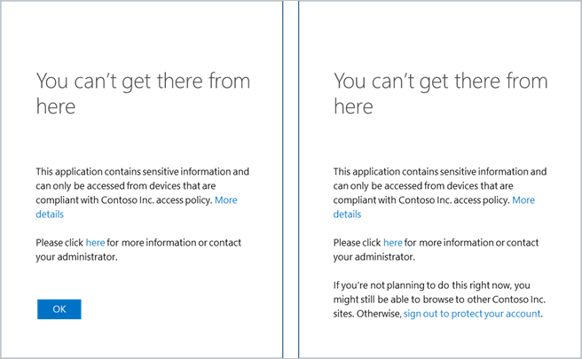

# Potential reasons for the "You can't get there from here" error message
While accessing your organization's internal web apps or services, you might get an error message that says, **You can't get there from here**. This message means your organization has put a policy in place that's preventing your device from accessing your organization's resources. While you might end up having to contact your Helpdesk to fix this problem, here are a few things you can try first.

## Make sure you're using a supported browser
If you get the **You can't get there from here** message saying that you're trying to access your organization's sites from an unsupported browser, check which browser you're running.

To fix this problem, you must install and run a supported browser, based on your operating system. If you're using Windows 10, the supported browsers include Microsoft Edge, Internet Explorer, and Google Chrome. If you're using a different operating system, you can check the complete list of [supported browsers](../conditional-access/technical-reference.md#supported-browsers).

## Make sure you're using a supported operating system
Make sure that you're running a supported version of the operating system, including:

- **Windows Client.** Windows 7 or later.

- **Windows Server.** Windows Server 2008 R2 or later.

- **macOS.** macOS X or later

- **Android and iOS.** Latest version of Android and iOS mobile operating systems

To fix this problem, you must install and run a supported operating system.

## Make sure your device is joined to your network
If you get the **You can't get there from here** message saying that your device is out-of-compliance with your organization's access policy, make sure you've joined your device to your organization's network.

### To check whether your device is joined to your network
1. Sign in to Windows using your work or school account. For example, alain@contoso.com.

2. Connect to your organization's network through a virtual private network (VPN) or DirectAccess.

3. After you're connected, press the **Windows logo key+L** to lock your device.

4. Unlock your device using your work or school account, and then try to access the problematic app or service again.

    If you see the **You can't get there from here** error message again, select the **More details** link, and then contact your Helpdesk with the details.

### To join your device to your network
If your device isn't joined to your organization's network, you can do one of two things:

- **Join your work device.** Join your work-owned Windows 10 device to your organization's network so you can access potentially restricted resources. For more information and step-by-step instructions, see [Join your work device to your organization's network](user-help-join-device-on-network.md).

- **Register your personal device for work.** Register your personal device, typically a phone or tablet, on your organization's network. After your device is registered, it can access your organization's restricted resources. For more information and step-by-step instructions, see [Register your personal device on your organization's network](user-help-register-device-on-network.md).

## Next steps
- [What is the MyApps portal?](active-directory-saas-access-panel-introduction.md)

- [Sign in with your phone, not your password](user-help-auth-app-sign-in.md)
