# Join your work device to your organization's network
Join your work-owned Windows 10 device to your organization's network so you can access potentially restricted resources.

## What happens when you join your device
While you're joining your Windows 10 device to your organization's network, the following actions will happen:

- Windows registers your device to your organization's network, letting you can access your resources using your personal account. After your device is registered, Windows then joins your device to the network, so you can use your organization's username and password to sign in and access restricted resources.

- Optionally, based on your organization's choices, you might be asked to set up two-step verification through either [Multi-Factor Authentication](multi-factor-authentication-end-user-first-time.md) or [security info](user-help-security-info-overview.md).

- Optionally, based on your organization's choices, you might be automatically enrolled in mobile device management, such as Microsoft Intune. For more info about enrolling in Microsoft Intune, see [Enroll your device in Intune](https://docs.microsoft.com/intune-user-help/enroll-your-device-in-intune-all).

- You'll go through the sign-in process, using automatic sign-in with your organizational account.

## To join a brand-new Windows 10 device
If your device is brand-new and hasn't been set up yet, you can go through the Windows Out of Box Experience (OOBE) process to join your device to the network.

1. Start up your new device and begin the OOBE process.

2. On the **Sign in with Microsoft** screen, type your work or school email address.

    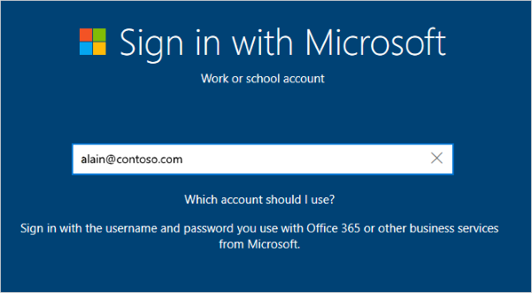

3. On the **Enter your password** screen, type your password.

    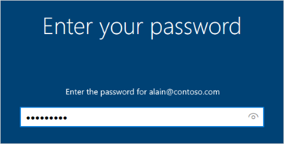

4. On your mobile device, approve your device so it can access your account. 

    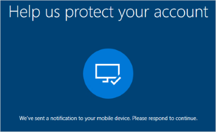

5. Complete the OOBE process, including setting your privacy settings and setting up Windows Hello (if necessary).

    Your device is now joined to your organization's network.

## To make sure you're joined
You can make sure that you're joined by looking at your settings.

1. Open **Settings**, and then select **Accounts**.

    

2. Select **Access work or school**, and make sure you see text that says something like, **Connected to *<your_organization>* Azure AD**.

    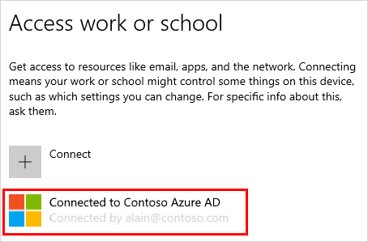

## To join an already configured Windows 10 device
If you've had your device for a while and it's already been set up, you can follow these steps to join your device to the network.

1. Open **Settings**, and then select **Accounts**.

2. Select **Access work or school**, and then select **Connect**.

    

3. On the **Set up a work or school account** screen, select **Join this device to Azure Active Directory**.

    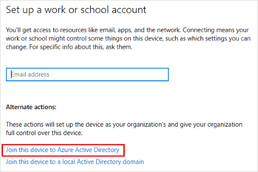

4. On the **Let's get you signed in** screen, type your email address (for example, alain@contoso.com), and then select **Next**.

    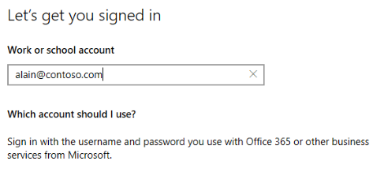

5. On the **Enter password** screen, type your password, and then select **Sign in**.

    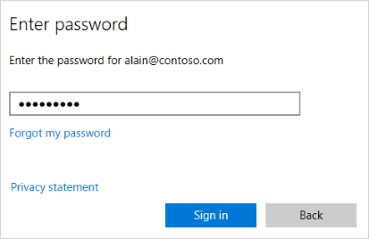

6. On your mobile device, approve your device so it can access your account. 

    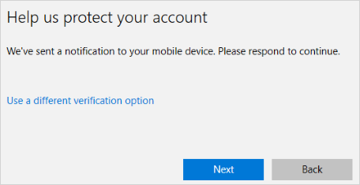

7. On the  **Make sure this is your organization** screen, review the information to make sure it's right, and then select **Join**.

    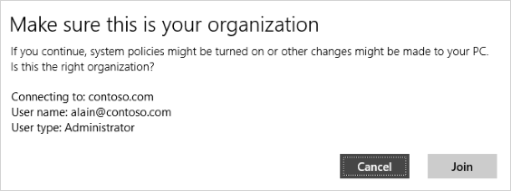

8. On the **You're all set** screen, click **Done**.

    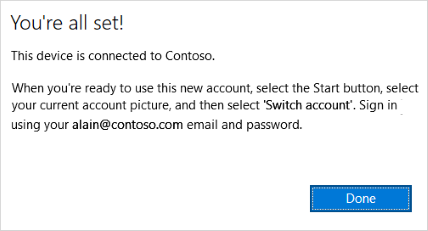

## To make sure you're joined
You can make sure that you're joined by looking at your settings.

1. Open **Settings**, and then select **Accounts**.

    

2. Select **Access work or school**, and make sure you see text that says something like, **Connected to *<your_organization>* Azure AD**.

    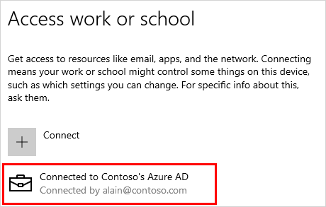

## Next steps
After you join your device to your organization's network, you should be able to access all of your resources using your work or school account information.

- If your organization wants you to register your personal device, such as your phone, see [Register your personal device on your organization's network](user-help-register-device-on-network.md).

