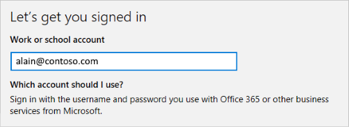

# Join your work device to your organization's network
Join your work-owned Windows 10 device to your organization's network so you can access potentially restricted resources.

## What happens when you join your device
While you're joining your Windows 10 device to your organization's network, the following will happen:

- Windows joins your device to your organization's network.

- You might be asked to set up two-step verification through either [multi-factor authentication](multi-factor-authentication-end-user-first-time.md) or [security info](user-help-security-info-overview.md), depending on what your organization has set up.

- You'll be automatically enrolled in mobile device management, such as Microsoft Intune, if it's required. For more info about enrolling in Microsoft Intune, see [Enroll your device in Intune](https://docs.microsoft.com/en-us/intune-user-help/enroll-your-device-in-intune-all).

- You'll go through the sign-in process, using either automatic sign-in (if your organization manages your device) or by using your work or school account user name and password (if you manage your own device).

## To join a brand-new Windows 10 device
If your device is brand-new and hasn't been set up yet, you can go through the Windows Out of Box Experience (OOBE) process to join your device to the network.

1. Start up your new device and begin the OOBE process.

2. On the **Sign in with Microsoft** screen, type your work or school email address.

    

3. On the **Enter your password** screen, type your password.

    

4. On your mobile device, approve your device to access your account. 

    

5. Complete the OOBE process, including setting your privacy settings and setting up Windows Hello (if required).

Your device is now joined to your organization's network.

## To make sure you're joined
You can make sure that you're joined by looking at your Windows Settings.

1. Open **Settings**, and then select **Accounts**.

2. Select **Access work or school**, and make sure you see text that says something like, **Connected to *<your_organization>* Azure AD**.

    

## To join an existing Windows 10 device
If you've had your device for a while and it's already been set up, you can follow these steps to join your device to the network.

1. Open **Settings**, and then select **Accounts**.

    

2. Select **Access work or school**, and then select **Connect**.

    

3. On the **Set up a work or school account** screen, select **Join this device to Azure Active Directory**.

    

4. On the **Let's get you signed in** screen, type your email address (for example, alain@contoso.com), and then select **Next**.

    

6. On the  **Enter password** dialog, enter your password, and then click **Sign in**.

    

7. On the  **Make sure this is your organization** dialog, click **Join**.

    

8. On the **You're all set** dialog, click **Done**.

    

## Make sure you're joined

To verify whether a device is joined to an Azure AD, you can review the **Access work or school** dialog on your device.

Alternatively, you can run the following command: `dsregcmd /status`  
On a successfully joined device, **AzureAdJoined** is **Yes**.

You can also review device settings on the Azure AD portal.

For more information, see [locate devices](../devices/device-management-azure-portal.md#locate-devices).

## Next steps

For more information, see: 

- The [introduction to device management in Azure Active Directory](../devices/overview.md)
- [Managing devices using the Azure portal](../devices/device-management-azure-portal.md)