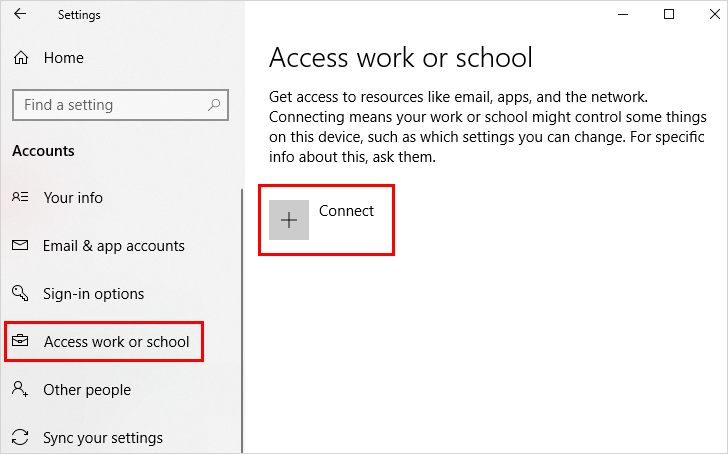

# Register your device on your organization's network

Your organization wants you to register your work-owned (or personally-owned, if allowed by your administrator) Windows 10 devices on their network. If your administrator allows it, you can add your personally-owned devices running Windows 10, iOS, Android, or macOS.

## What happens when you register your device
While you're registering your Windows 10 device on your organization's network, the following will happen:

- Windows registers your device on your organization's network.

- You might be asked to set up two-step verification through either [multi-factor authentication](multi-factor-authentication-end-user-first-time.md) or [security info](user-help-security-info-overview.md), depending on what your administrator has set up.

- You'll be automatically enrolled in mobile device management, such as Microsoft Intune, if it's required. For more info about enrolling in Microsoft Intune, see [Enroll your device in Intune](https://docs.microsoft.com/en-us/intune-user-help/enroll-your-device-in-intune-all).

- You'll go through the sign-in process, using either automatic sign-in (if your organization manages your device) or by using your work or school account user name and password (if you manage your own device).

## To register your Windows 10 device

Follow these steps to register your device on your network.

1. Open **Settings**, and then select **Accounts**.

    

2. Select **Access work or school**, and then select **Connect**.

    

3. On the **Set up a work or school account** screen, select **Join this device to Azure Active Directory**.

    

4. On the **Let's get you signed in** screen, type your email address (for example, alain@contoso.com), and then select **Next**.

    

**To register your Windows 10 device:**

1. In the **Start** menu, click **Settings**.

    

2. Click **Accounts**.

    

3. Click **Access work or school**.

    

4. On the **Access work or school** dialog, click **Connect**.

    

5. On the  **Set up a work or school account** dialog, enter your account name (for example, someone@example.com), and then click **Next**.

    

6. On the  **Enter password** dialog, enter your password, and then click **Next**.

    

7. On the **You're all set** dialog, click **Done**.

    

## Verification

To verify whether a device is joined to an Azure AD, you can review the **Access work or school** dialog on your device.

Alternatively, you can review device settings on the Azure AD portal.

## Next steps

- For more information, see the [introduction to device management in Azure Active Directory](../device-management-introduction.md)

- For more information about managing devices in the Azure AD portal, see the [managing devices using the Azure portal ](../device-management-azure-portal.md).

