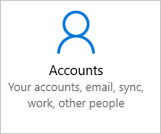
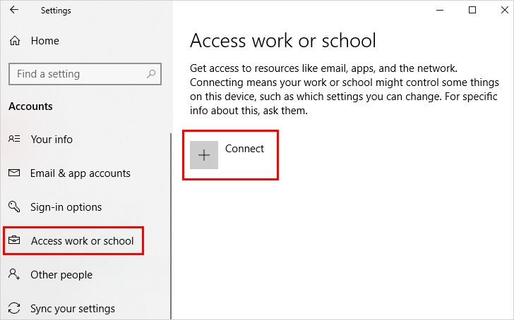

# Register your personal device on your organization's network
Register your personal device (typically a phone or tablet) on your organization's network. After your device is registered, it will be able to access your organization's restricted resources.

>[!Note]
>This article uses a Windows device for demonstration purposes, but you can also register devices running iOS, Android, or macOS.

## What happens when you register your device
While you're registering your device on your organization's network, the following actions will happen:

- Windows registers your device on your organization's network.

- Optionally, based on your organization's choices, you might be asked to set up two-step verification through either [Multi-Factor Authentication](multi-factor-authentication-end-user-first-time.md) or [security info](user-help-security-info-overview.md).

- Optionally, based on your organization's choices, you might be automatically enrolled in mobile device management, such as Microsoft Intune. For more info about enrolling in Microsoft Intune, see [Enroll your device in Intune](https://docs.microsoft.com/intune-user-help/enroll-your-device-in-intune-all).

- You'll go through the sign-in process, using the username and password for your work or school account.

## To register your Windows device

Follow these steps to register your personal device on your network.

1. Open **Settings**, and then select **Accounts**.

    

2. Select **Access work or school**, and then select **Connect** from the **Access work or school** screen.

    

3. On the **Add a work or school account** screen, type in your email address for your work or school account, and then select **Next**. For example, alain@contoso.com.

4. Sign in to your work or school account, and then select **Sign in**.

5. Complete the rest of the registration process, including approving your identity verification request (if you use two-step verification) and setting up Windows Hello (if necessary).

## To verify that you're registered
You can make sure that you're registered by looking at your settings.

1. Open **Settings**, and then select **Accounts**.

    

2. Select **Access work or school**, and make sure you see your work or school account.

    

## Next steps
After you register your personal device to your organization's network, you should be able to access most of your resources.

- If your organization wants you to join your work device, see [Join your work device to your organization's network](user-help-join-device-on-network.md).

