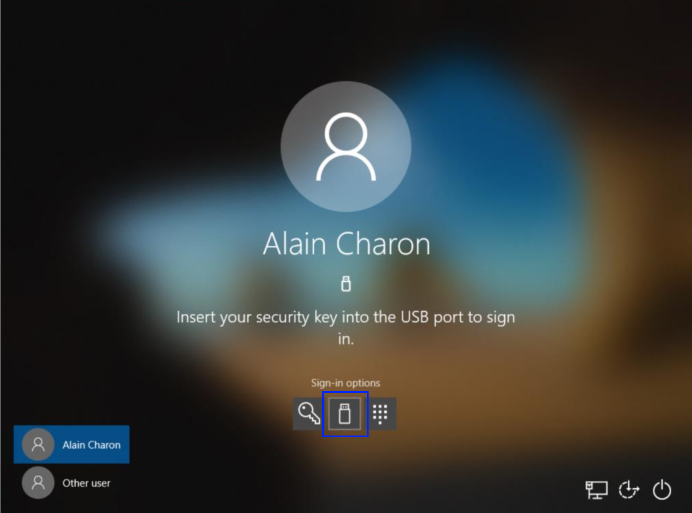
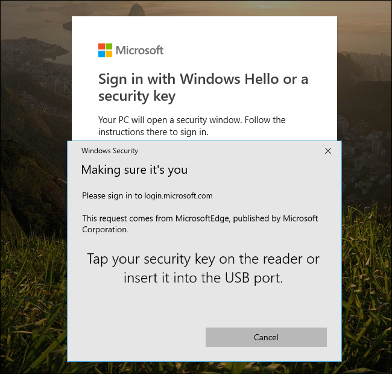
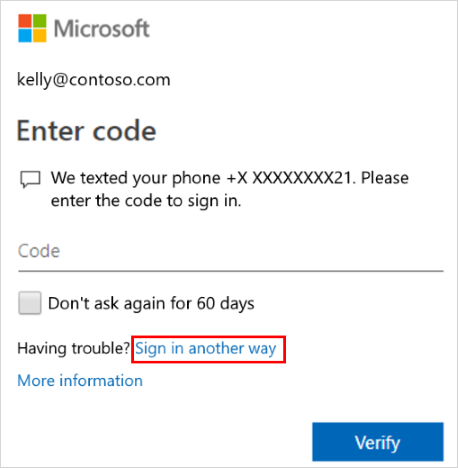

# Sign in using two-step verification or security info

After you set up two-step verification or security info, you'll be able to sign in to your account using your specified verification method.

> [!Note]
> If you're still using the two-step verification experience, you'll need to set up your verification methods by following the instructions in the [Set up my account for two-step verification](multi-factor-authentication-end-user-first-time.md) article.
>
> If your administrator has turned on the security info experience, you'll need to set your verification methods using these step-by-step articles:<ul><li>[Set up security info to use an authentication app](security-info-setup-auth-app.md)</li><li>[Set up security info to use text messaging](security-info-setup-text-msg.md)</li><li>[Set up security info to use a phone call](security-info-setup-phone-number.md)</li><li>[Set up security info to use a security key](security-info-setup-security-key.md)</li></ul>

## Sign in using an authenticator app notification on your mobile device

1. Sign in to your account with your username and password.

2. Select **Approve** from the approval notification sent to your mobile device.

## Sign in using an authenticator app code on your mobile device

1. Sign in to your account with your username and password.

2. Open your authenticator app and type the randomly generated code for your account into the **Enter code** box.

## Sign in using your phone number

1. Sign in to your account with your username and password.

2. Answer your phone and follow the instructions.

## Sign in using a text message

1. Sign in to your account with your username and password.

2. Open the text message and type the code from your text message into the **Enter code** box.

## Sign in using a security key at the lock screen

1. After you've registered your security key, select the security key image from the Windows 10 lock screen.

2. Insert your security key into your device's USB port and sign in to Windows using your security key PIN.

    

## Sign in using a security key and the Microsoft Edge browser

1. After you've registered your security key, open the Microsoft Edge browser.

2. When prompted to sign-in, insert your security key into your device's USB port and sign in to Windows using your security key PIN.

    

    >[!NOTE]
    >For information about signing in using the Microsoft Authenticator app see the article, [Sign in to your accounts using the Microsoft Authenticator app](user-help-auth-app-sign-in.md).

## Sign in using another verification method

If for some reason you're unable to use your primary sign-in method, you can use another previously set up verification method.

1. Sign in to your account normally, and then choose the **Sign in another way** link on the **Two-step verification** page.

    

    >[!Note]
    >If you don't see the **Sign in another way** link, it means that you haven't set up any other verification methods and that you'll have to contact your administrator for help signing into your account. After your administrator helps you to sign in, make sure you add additional verification methods. For more info about adding verification methods, see the [Manage your settings for two-step verification](multi-factor-authentication-end-user-manage-settings.md) article.
    >
    >If you see the **Sign in another way** link, but still don't see any other verification methods, you'll have to contact your administrator for help signing in to your account.

2. Choose your alternative verification method, and continue with the two-step verification process.

3. After you're back in your account, you can update your verification methods (if necessary). For more info about add or changing your methods, see the [Manage your settings for two-step verification](multi-factor-authentication-end-user-manage-settings.md) article.

## Next steps

- Learn about security info in the [Security info (preview) overview](user-help-security-info-overview.md) article.

- Learn about two-step verification in the [Two-step verification overview](user-help-two-step-verification-overview.md) article.

- Reset your password if you've lost or forgotten it, from the [Password reset portal](https://passwordreset.microsoftonline.com/)

- Get troubleshooting tips and help for sign-in problems in the [Can't sign in to your Microsoft account](https://support.microsoft.com/help/12429/microsoft-account-sign-in-cant) article.
