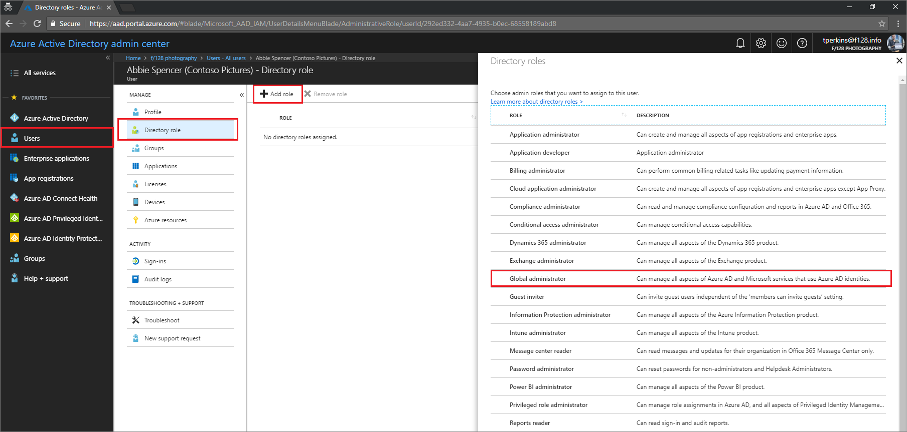

# Assigning administrator roles in Azure Active Directory

Using Azure Active Directory (Azure AD), you can designate separate administrators to serve different functions. Administrators can be designated in the Azure AD portal to perform tasks such as adding or changing users, assigning administrative roles, resetting user passwords, managing user licenses, and managing domain names.

## Details about the global administrator role
The global administrator has access to all administrative features. By default, the person who signs up for an Azure subscription is assigned the global administrator role for the directory. Only global administrators can assign other administrator roles.

## Assign or remove administrator roles
To learn how to assign administrative roles to a user in Azure Active Directory, see [Assign a user to administrator roles in Azure Active Directory](../fundamentals/active-directory-users-assign-role-azure-portal.md).

## Available roles
The following administrator roles are available:

* **[Application Administrator](#application-administrator)**: Users in this role can create and manage all aspects of enterprise applications, application registrations, and application proxy settings. This role also grants the ability to consent to delegated permissions, and application permissions excluding Microsoft Graph and Azure AD Graph. Members of this role are not added as owners when creating new application registrations or enterprise applications.

* **[Application Developer](#application-developer)**: Users in this role can create application registrations when the “Users can register applications” setting is set to No. This role also allows members to consent on their own behalf when the “Users can consent to apps accessing company data on their behalf” setting is set to No. Members of this role are added as owners when creating new application registrations or enterprise applications.

* **[Billing Administrator](#billing-administrator)**: Makes purchases, manages subscriptions, manages support tickets, and monitors service health.

* **[Cloud Application Administrator](#cloud-application-administrator)**: Users in this role have the same permissions as the Application Administrator role, excluding the ability to manage application proxy. This role grants the ability to create and manage all aspects of enterprise applications and application registrations. This role also grants the ability to consent to delegated permissions, and application permissions excluding Microsoft Graph and Azure AD Graph. Members of this role are not added as owners when creating new application registrations or enterprise applications.

* **[Compliance Administrator](#compliance-administrator)**: Users with this role have management permissions within in the Office 365 Security & Compliance Center and Exchange Admin Center. More information at [About Office 365 admin roles](https://support.office.com/article/About-Office-365-admin-roles-da585eea-f576-4f55-a1e0-87090b6aaa9d).

* **[Conditional Access Administrator](#conditional-access-administrator)**: Users with this role have the ability to manage Azure Active Directory conditional access settings.
  > [!NOTE]
  > To deploy Exchange ActiveSync conditional access policy in Azure, the user must also be Global Administrator.
  
* **[Dynamics 365 service administrator / CRM Service Administrator](#crm-service-administrator)**: Users with this role have global permissions within Microsoft CRM Online, when the service is present, as well as the ability to manage support tickets and monitor service health. More information at [Use the service admin role to manage your tenant](https://docs.microsoft.com/en-us/dynamics365/customer-engagement/admin/use-service-admin-role-manage-tenant).

* **[Device Administrators](#device-administrators)**: Users with this role become local machine administrators on all Windows 10 devices that are joined to Azure Active Directory. They do not have the ability to manage device objects in Azure Active Directory.

* **[Directory Readers](#directory-readers)**: This is a legacy role that is to be assigned to applications that do not support the [Consent Framework](../develop/active-directory-integrating-applications.md). It should not be assigned to any users.

* **[Directory Synchronization Accounts](#directory-synchronization-accounts)**: Do not use. This role is automatically assigned to the Azure AD Connect service, and is not intended or supported for any other use.

* **[Directory Writers](#directory-writers)**: This is a legacy role that is to be assigned to applications that do not support the [Consent Framework](../develop/active-directory-integrating-applications.md). It should not be assigned to any users.

* **[Exchange Service Administrator](#exchange-service-administrator)**: Users with this role have global permissions within Microsoft Exchange Online, when the service is present. More information at [About Office 365 admin roles](https://support.office.com/article/About-Office-365-admin-roles-da585eea-f576-4f55-a1e0-87090b6aaa9d).

* **[Global Administrator / Company Administrator](#company-administrator)**: Users with this role have access to all administrative features in Azure Active Directory, as well as services that use Azure Active Directory identities like Exchange Online, SharePoint Online, and Skype for Business Online. The person who signs up for the Azure Active Directory tenant becomes a global administrator. Only global administrators can assign other administrator roles. There can be more than one global administrator at your company. Global admins can reset the password for any user and all other administrators.

  > [!NOTE]
  > In Microsoft Graph API, Azure AD Graph API, and Azure AD PowerShell, this role is identified as "Company Administrator". It is "Global Administrator" in the [Azure portal](https://portal.azure.com).
  >
  >

* **[Guest Inviter](#guest-inviter)**: Users in this role can manage Azure Active Directory B2B guest user invitations when the **Members can invite** user setting is set to No. More information about B2B collaboration at [About Azure AD B2B collaboration](https://docs.microsoft.com/azure/active-directory/active-directory-b2b-what-is-azure-ad-b2b). It does not include any other permissions.

* **[Information Protection Administrator](#information-protection-administrator)**: Users with this role have all permissions in the Azure Information Protection service. This role allows configuring labels for the Azure Information Protection policy, managing protection templates, and activating protection. This role does not grant any permissions in Identity Protection Center, Privileged Identity Management, Monitor Office 365 Service Health, or Office 365 Security & Compliance Center.

* **[Intune Service Administrator](#intune-service-administrator)**: Users with this role have global permissions within Microsoft Intune Online, when the service is present. Additionally, this role contains the ability to manage users and devices in order to associate policy, as well as create and manage groups. More information at [Role-based administration control (RBAC) with Microsoft Intune](https://docs.microsoft.com/en-us/intune/role-based-access-control)

* **[Message Center Reader](#message-center-reader)**: Users in this role can monitor notifications and advisory health updates in [Office 365 Message center](https://support.office.com/article/Message-center-in-Office-365-38FB3333-BFCC-4340-A37B-DEDA509C2093) for their organization on configured services such as Exchange, Intune and Microsoft Teams. Message Center Readers receive weekly email digests of posts, updates, and can share message center posts in Office 365. In Azure AD, users assigned to this role will only have read-only access on Azure AD services such as users and groups. 

* **[Partner Tier1 Support](#partner-tier1-support)**: Do not use. This role has been deprecated and will be removed from Azure AD in the future. This role is intended for use by a small number of Microsoft resale partners, and is not intended for general use.

* **[Partner Tier2 Support](#partner-tier2-support)**: Do not use. This role has been deprecated and will be removed from Azure AD in the future. This role is intended for use by a small number of Microsoft resale partners, and is not intended for general use.

* **[Password Administrator / Helpdesk Administrator](#helpdesk-administrator)**: Users with this role can change passwords, manage service requests, and monitor service health. Helpdesk administrators can change passwords only for users and other Helpdesk administrators. 

  > [!NOTE]
  > In Microsoft Graph API, Azure AD Graph API, and Azure AD PowerShell, this role is identified as "Helpdesk Administrator". It is "Password Administrator" in the [Azure portal](https://portal.azure.com/).
  >
  >
  
* **[Power BI Service Administrator](#power-bi-service-administrator)**: Users with this role have global permissions within Microsoft Power BI, when the service is present, as well as the ability to manage support tickets and monitor service health. More information at [Understanding the Power BI admin role](https://docs.microsoft.com/en-us/power-bi/service-admin-role).

* **[Privileged Role Administrator](#privileged-role-administrator)**: Users with this role can manage role assignments in Azure Active Directory, as well as within Azure AD Privileged Identity Management. In addition, this role allows management of all aspects of Privileged Identity Management.

* **[Reports Reader](#reports-reader)**: Users with this role can view usage reporting data and the reports dashboard in Office 365 admin center and the adoption context pack in PowerBI. Additionally, the role provides access to sign-on reports and activity in Azure AD and data returned by the Microsoft Graph reporting API. A user assigned to the Reports Reader role can access only relevant usage and adoption metrics. They don't have any admin permissions to configure settings or access the product specific admin centers like Exchange. 

* **[Security Administrator](#security-administrator)**: Users with this role have all of the read-only permissions of the Security reader role, plus the ability to manage configuration for security-related services: Azure Active Directory Identity Protection, Azure Information Protection, Privileged Identity Management, and Office 365 Security & Compliance Center. More information about Office 365 permissions is available at [Permissions in the Office 365 Security & Compliance Center](https://support.office.com/article/Permissions-in-the-Office-365-Security-Compliance-Center-d10608af-7934-490a-818e-e68f17d0e9c1).
  
  | In | Can do |
  | --- | --- |
  | Identity Protection Center |<ul><li>All permissions of the Security Reader role.<li>Additionally, the ability to perform all IPC operations except for resetting passwords. |
  | Privileged Identity Management |<ul><li>All permissions of the Security Reader role.<li>**Cannot** manage Azure AD role memberships or settings. |
  | 
Monitor Office 365 Service Health

Office 365 Security & Compliance Center |<ul><li>All permissions of the Security Reader role.<li>Can configure all settings in the Advanced Threat Protection feature (malware & virus protection, malicious URL config, URL tracing, etc.). |
  
* **[Security Reader](#security-reader)**: Users with this role have global read-only access, including all information in Azure Active Directory, Identity Protection, Privileged Identity Management, as well as the ability to read Azure Active Directory sign-in reports and audit logs. The role also grants read-only permission in Office 365 Security & Compliance Center. More information about Office 365 permissions is available at [Permissions in the Office 365 Security & Compliance Center](https://support.office.com/article/Permissions-in-the-Office-365-Security-Compliance-Center-d10608af-7934-490a-818e-e68f17d0e9c1).

  | In | Can do |
  | --- | --- |
  | Identity Protection Center |Read all security reports and settings information for security features<ul><li>Anti-spam<li>Encryption<li>Data loss prevention<li>Anti-malware<li>Advanced threat protection<li>Anti-phishing<li>Mailflow rules |
  | Privileged Identity Management |
Has read-only access to all information surfaced in Azure AD PIM: Policies and reports for Azure AD role assignments, security reviews and in the future read access to policy data and reports for scenarios besides Azure AD role assignment.
**Cannot** sign up for Azure AD PIM or make any changes to it. In PIM's portal or via PowerShell, someone in this role can activate additional roles (for example, Global Admin or Privileged Role Administrator), if the user is a candidate for them. |
  | 
Monitor Office 365 Service Health

Office 365 Security & Compliance Center
 |<ul><li>Read and manage alerts<li>Read security policies<li>Read threat intelligence, Cloud App Discovery, and Quarantine in Search and Investigate<li>Read all reports |

* **[Service Support Administrator](#service-support-administrator)**: Users with this role can open support requests with Microsoft for Azure and Office 365 services, and views the service dashboard and message center in the Azure portal and Office 365 admin portal. More information at [About Office 365 admin roles](https://support.office.com/article/About-Office-365-admin-roles-da585eea-f576-4f55-a1e0-87090b6aaa9d).

* **[SharePoint Service Administrator](#sharepoint-service-administrator)**: Users with this role have global permissions within Microsoft SharePoint Online, when the service is present, as well as the ability to manage support tickets and monitor service health. More information at [About Office 365 admin roles](https://support.office.com/article/About-Office-365-admin-roles-da585eea-f576-4f55-a1e0-87090b6aaa9d).

* **[Skype for Business / Lync Service Administrator](#lync-service-administrator)**: Users with this role have global permissions within Microsoft Skype for Business, when the service is present, as well as manage Skype-specific user attributes in Azure Active Directory. Additionally, this role grants the ability to manage support tickets and monitor service health. More information at [About the Skype for Business admin role](https://support.office.com/en-us/article/about-the-skype-for-business-admin-role-aeb35bda-93fc-49b1-ac2c-c74fbeb737b5).

  > [!NOTE]
  > In Microsoft Graph API, Azure AD Graph API, and Azure AD PowerShell, this role is identified as "Lync Service Administrator". It is "Skype for Business Service Administrator" in the [Azure portal](https://portal.azure.com/).
  >
  >

* **[User Account Administrator](#user-account-administrator)**: Users with this role can create and manage all aspects of users and groups. Additionally, this role includes the ability to manage support tickets and monitor service health. Some restrictions apply. For example, this role does not allow deleting a global administrator. User Account administrators can change passwords for users, Helpdesk administrators, and other User Account administrators only.

| Can do | Cannot do |
| --- | --- |
| 
View company and user information

Manage Office support tickets

Change passwords for users, Helpdesk administrators, and other User Account administrators only

Create and manage user views

Create, edit, and delete users and groups, and manage user licenses, with limitations. He or she cannot delete a global administrator or create other administrators.
 |
Perform billing and purchasing operations for Office products

Manage domains

Manage company information

Delegate administrative roles to others

Use directory synchronization

Enable or disable multi-factor authentication

View audit logs
 |

## Deprecated roles

The following roles should not be used. They been deprecated and will be removed from Azure AD in the future.

* AdHoc License Administrator
* Device Join
* Device Managers
* Device Users
* Email Verified User Creator
* Mailbox Administrator
* Workplace Device Join

### To add a colleague as a global administrator

1. Sign in to the [Azure Active Directory Admin Center](https://aad.portal.azure.com) with an account that's a global admin or privileged role admin for the tenant directory.

   

2. Select **Users**.

3. Find the user you want to designate as a global administrator and open the blade for that user.

4. On the user blade, select **Directory role**.
 
5. On the directory role blade, select the **Global administrator** role, and save.

## Detailed Azure Active Directory Permissions
The following tables describe the specific permissions in Azure Active Directory given to each role. Some roles, such as the Global Administrator, may have additional permissions in Microsoft services outide of Azure Active Directory.

### Application Administrator
Can create and manage all aspects of app registrations and enterprise apps.

  > [!NOTE]
  > This role inherits additional permissions from the [User role](https://docs.microsoft.com/en-us/azure/active-directory/users-default-permissions).
  >
  >

| **Actions** | **Description** |
| --- | --- |
| microsoft.aad.directory/Application/Create | Create Applications in Azure Active Directory. |
| microsoft.aad.directory/Application/Delete | Delete Applications in Azure Active Directory. |
| microsoft.aad.directory/Application/Update | Update standard properties on Applications in Azure Active Directory. |
| microsoft.aad.directory/Application/Update/DefaultPolicy | Update Applications.DefaultPolicy property in Azure Active Directory. |
| microsoft.aad.directory/Application/Update/Owners | Update Applications.Owners property in Azure Active Directory. |
| microsoft.aad.directory/AppRoleAssignment/Create | Create AppRoleAssignments in Azure Active Directory. |
| microsoft.aad.directory/AppRoleAssignment/Delete | Delete AppRoleAssignments in Azure Active Directory. |
| microsoft.aad.directory/AppRoleAssignment/Update | Update standard properties on AppRoleAssignments in Azure Active Directory. |
| microsoft.aad.directory/Policy/Create | Create Policies in Azure Active Directory. |
| microsoft.aad.directory/Policy/Delete | Delete Policies in Azure Active Directory. |
| microsoft.aad.directory/Policy/Update | Update standard properties on Policies in Azure Active Directory. |
| microsoft.aad.directory/Policy/Update/Owners | Update Policies.Owners property in Azure Active Directory. |
| microsoft.aad.directory/ServiceAction/ConsentOnBehalfOfAllNoDirectory | Can consent on behalf of all users to all resources except Azure Active Directory (Azure AD Graph & Microsoft Graph). |
| microsoft.aad.directory/ServicePrincipal/Create | Create ServicePrincipals in Azure Active Directory. |
| microsoft.aad.directory/ServicePrincipal/Delete | Delete ServicePrincipals in Azure Active Directory. |
| microsoft.aad.directory/ServicePrincipal/Update | Update standard properties on ServicePrincipals in Azure Active Directory. |
| microsoft.aad.directory/ServicePrincipal/Update/AppRoleAssignedTo | Update ServicePrincipals.AppRoleAssignedTo property in Azure Active Directory. |
| microsoft.aad.directory/ServicePrincipal/Update/AppRoleAssignments | Update ServicePrincipals.AppRoleAssignments property in Azure Active Directory. |
| microsoft.aad.directory/ServicePrincipal/Update/DefaultPolicy | Update ServicePrincipals.DefaultPolicy property in Azure Active Directory. |
| microsoft.aad.directory/ServicePrincipal/Update/Owners | Update ServicePrincipals.Owners property in Azure Active Directory. |
| microsoft.aad.directory/User/AssignLicense | Manage licenses on Users in Azure Active Directory. |
| microsoft.aad.reports/AllEntities/Read | Read Azure AD Reports. |
| microsoft.aad.servicehealth/AllEntities/AllActions | Read and configure Office 365 Service Health. |
| microsoft.aad.supporttickets/AllEntities/AllActions | Create and manage Office 365 support tickets. |

### Application Developer
Can create application registrations independent of the **Users can register applications** setting.

  > [!NOTE]
  > This role inherits additional permissions from the [User role](https://docs.microsoft.com/en-us/azure/active-directory/users-default-permissions).
  >
  >

| **Actions** | **Description** |
| --- | --- |
| microsoft.aad.directory/Application/CreateAsOwner | Create Applications in Azure Active Directory. Creator is added as the first owner, and the created object counts against the creator's 250 created objects quota. |
| microsoft.aad.directory/AppRoleAssignment/CreateAsOwner | Create AppRoleAssignments in Azure Active Directory. Creator is added as the first owner, and the created object counts against the creator's 250 created objects quota. |
| microsoft.aad.directory/OAuth2PermissionGrant/CreateAsOwner | Create OAuth2PermissionGrants in Azure Active Directory. Creator is added as the first owner, and the created object counts against the creator's 250 created objects quota. |
| microsoft.aad.directory/ServicePrincipal/CreateAsOwner | Create ServicePrincipals in Azure Active Directory. Creator is added as the first owner, and the created object counts against the creator's 250 created objects quota. |

### Billing Administrator
Can perform common billing related tasks like updating payment information.

  > [!NOTE]
  > This role inherits additional permissions from the [User role](https://docs.microsoft.com/en-us/azure/active-directory/users-default-permissions).
  >
  >

  > This role has additional permissions outside of Azure Active Directory. See the role description above for more information.
  >
  >

| **Actions** | **Description** |
| --- | --- |
| microsoft.aad.directory/Organization/Read/TrustedCAsForPasswordlessAuth | Read Organizations.TrustedCAsForPasswordlessAuth property in Azure Active Directory. |
| microsoft.aad.directory/Organization/Update | Update standard properties on Organizations in Azure Active Directory. |
| microsoft.aad.directory/Organization/Update/TrustedCAsForPasswordlessAuth | Update Organizations.TrustedCAsForPasswordlessAuth property in Azure Active Directory. |
| microsoft.aad.accessservice/AllEntities/AllActions | Create and delete all resources, and read and update standard properties in Azure Access Control. |
| microsoft.aad.billing/AllEntities/AllActions | Manage all aspects of Office 365 billing. |
| microsoft.aad.servicehealth/AllEntities/AllActions | Read and configure Office 365 Service Health. |
| microsoft.aad.supporttickets/AllEntities/AllActions | Create and manage Office 365 support tickets. |

### Cloud Application Administrator
Can create and manage all aspects of app registrations and enterprise apps except App Proxy.

  > [!NOTE]
  > This role inherits additional permissions from the [User role](https://docs.microsoft.com/en-us/azure/active-directory/users-default-permissions).
  >
  >

| **Actions** | **Description** |
| --- | --- |
| microsoft.aad.directory/Application/Create | Create Applications in Azure Active Directory. |
| microsoft.aad.directory/Application/Delete | Delete Applications in Azure Active Directory. |
| microsoft.aad.directory/Application/Update | Update standard properties on Applications in Azure Active Directory. |
| microsoft.aad.directory/Application/Update/DefaultPolicy | Update Applications.DefaultPolicy property in Azure Active Directory. |
| microsoft.aad.directory/Application/Update/Owners | Update Applications.Owners property in Azure Active Directory. |
| microsoft.aad.directory/AppRoleAssignment/Create | Create AppRoleAssignments in Azure Active Directory. |
| microsoft.aad.directory/AppRoleAssignment/Delete | Delete AppRoleAssignments in Azure Active Directory. |
| microsoft.aad.directory/AppRoleAssignment/Update | Update standard properties on AppRoleAssignments in Azure Active Directory. |
| microsoft.aad.directory/Policy/Create | Create Policies in Azure Active Directory. |
| microsoft.aad.directory/Policy/Delete | Delete Policies in Azure Active Directory. |
| microsoft.aad.directory/Policy/Update | Update standard properties on Policies in Azure Active Directory. |
| microsoft.aad.directory/Policy/Update/Owners | Update Policies.Owners property in Azure Active Directory. |
| microsoft.aad.directory/ServiceAction/ConsentOnBehalfOfAllNoDirectory | Can consent on behalf of all users to all resources except Azure Active Directory (Azure AD Graph & Microsoft Graph). |
| microsoft.aad.directory/ServicePrincipal/Create | Create ServicePrincipals in Azure Active Directory. |
| microsoft.aad.directory/ServicePrincipal/Delete | Delete ServicePrincipals in Azure Active Directory. |
| microsoft.aad.directory/ServicePrincipal/Update | Update standard properties on ServicePrincipals in Azure Active Directory. |
| microsoft.aad.directory/ServicePrincipal/Update/AppRoleAssignedTo | Update ServicePrincipals.AppRoleAssignedTo property in Azure Active Directory. |
| microsoft.aad.directory/ServicePrincipal/Update/AppRoleAssignments | Update ServicePrincipals.AppRoleAssignments property in Azure Active Directory. |
| microsoft.aad.directory/ServicePrincipal/Update/DefaultPolicy | Update ServicePrincipals.DefaultPolicy property in Azure Active Directory. |
| microsoft.aad.directory/ServicePrincipal/Update/Owners | Update ServicePrincipals.Owners property in Azure Active Directory. |
| microsoft.aad.directory/User/AssignLicense | Manage licenses on Users in Azure Active Directory. |
| microsoft.aad.reports/AllEntities/Read | Read Azure AD Reports. |
| microsoft.aad.servicehealth/AllEntities/AllActions | Read and configure Office 365 Service Health. |
| microsoft.aad.supporttickets/AllEntities/AllActions | Create and manage Office 365 support tickets. |

### Company Administrator
Can manage all aspects of Azure AD and Microsoft services that use Azure AD identities. In Microsoft Graph API, Azure AD Graph API, and Azure AD PowerShell, this role is identified as "Company Administrator". It is "Global Administrator" in the [Azure portal](https://portal.azure.com).

  > [!NOTE]
  > This role has additional permissions outside of Azure Active Directory. See role description above for more information.
  >
  >

| **Actions** | **Description** |
| --- | --- |
| microsoft.aad.directory/AdministrativeUnit/AllActions/AllProperties | Create and delete AdministrativeUnits, and read and update all properties in Azure Active Directory. |
| microsoft.aad.directory/Application/AllActions/AllProperties | Create and delete Applications, and read and update all properties in Azure Active Directory. |
| microsoft.aad.directory/AppRoleAssignment/AllActions/AllProperties | Create and delete AppRoleAssignments, and read and update all properties in Azure Active Directory. |
| microsoft.aad.directory/CollaborationSpace/AllActions/AllProperties | Create and delete CollaborationSpaces, and read and update all properties in Azure Active Directory. |
| microsoft.aad.directory/Contact/AllActions/AllProperties | Create and delete Contacts, and read and update all properties in Azure Active Directory. |
| microsoft.aad.directory/Device/AllActions/AllProperties | Create and delete Devices, and read and update all properties in Azure Active Directory. |
| microsoft.aad.directory/DirectoryRole/AllActions/AllProperties | Create and delete DirectoryRoles, and read and update all properties in Azure Active Directory. |
| microsoft.aad.directory/DirectoryRoleTemplate/AllActions/AllProperties | Create and delete DirectoryRoleTemplates, and read and update all properties in Azure Active Directory. |
| microsoft.aad.directory/DirectorySetting/AllActions/AllProperties | Create and delete DirectorySettings, and read and update all properties in Azure Active Directory. |
| microsoft.aad.directory/DirectorySettingTemplate/AllActions/AllProperties | Create and delete DirectorySettingTemplates, and read and update all properties in Azure Active Directory. |
| microsoft.aad.directory/Domain/AllActions/AllProperties | Create and delete Domains, and read and update all properties in Azure Active Directory. |
| microsoft.aad.directory/Group/AllActions/AllProperties | Create and delete Groups, and read and update all properties in Azure Active Directory. |
| microsoft.aad.directory/LoginTenantBranding/AllActions/AllProperties | Create and delete LoginTenantBrandings, and read and update all properties in Azure Active Directory. |
| microsoft.aad.directory/OAuth2PermissionGrant/AllActions/AllProperties | Create and delete OAuth2PermissionGrants, and read and update all properties in Azure Active Directory. |
| microsoft.aad.directory/Policy/AllActions/AllProperties | Create and delete Policies, and read and update all properties in Azure Active Directory. |
| microsoft.aad.directory/ServiceAction/ConsentOnBehalfOfAllWithDirectory | Can consent on behalf of all users to all resources including Azure Active Directory (Azure AD Graph & Microsoft Graph). |
| microsoft.aad.directory/ServicePrincipal/AllActions/AllProperties | Create and delete ServicePrincipals, and read and update all properties in Azure Active Directory. |
| microsoft.aad.directory/Organization/AllActions/AllProperties | Create and delete Organizations, and read and update all properties in Azure Active Directory. |
| microsoft.aad.directory/User/AllActions/AllProperties | Create and delete Users, and read and update all properties in Azure Active Directory. |
| microsoft.aad.aadconnect/AllEntities/AllActions | Create and delete all resources, and read and update standard properties in microsoft.aad.aadconnect. |
| microsoft.aad.accessservice/AllEntities/AllActions | Create and delete all resources, and read and update standard properties in Azure Access Control. |
| microsoft.aad.billing/AllEntities/AllActions | Manage all aspects of Office 365 billing. |
| microsoft.aad.compliance/AllEntities/AllActions | Create and delete all resources, and read and update standard properties in Compliance Center. |
| microsoft.aad.directorysync/AllEntities/AllActions | Perform all actions in Azure AD Connect. |
| microsoft.aad.lockbox/AllEntities/AllActions | Manage all aspects of the Lockbox service. |
| microsoft.aad.privilegedrolemanagement/AllEntities/AllActions | Manage all aspects of the Privileged Role Management service. |
| microsoft.aad.reports/AllEntities/AllActions | Read and configure Azure AD Reports. |
| microsoft.aad.servicehealth/AllEntities/AllActions | Read and configure Office 365 Service Health. |
| microsoft.aad.supporttickets/AllEntities/AllActions | Create and manage Office 365 support tickets. |
| microsoft.crm/AllEntities/AllActions | Manage all aspects of Dynamics 365. |
| microsoft.exchange/AllEntities/AllActions | Manage all aspects of Exchange Online. |
| microsoft.aad.informationprotection/AllEntities/AllActions | Manage all aspects of Information Protection. |
| microsoft.intune/AllEntities/AllActions | Manage all aspects of Intune. |
| microsoft.powerbi/AllEntities/AllActions | Manage all aspects of Power BI. |
| microsoft.protectioncenter/AllEntities/AllActions | Manage Office 365 Protection Center. |
| microsoft.sharepoint/AllEntities/AllActions | Manage SharePoint Online. |
| microsoft.skypeforbusiness/AllEntities/AllActions | Manage Skype for Business Online. |

### Compliance Administrator
Can read and manage compliance configuration and reports in Azure AD and Office 365.

  > [!NOTE]
  > This role inherits additional permissions from the [User role](https://docs.microsoft.com/en-us/azure/active-directory/users-default-permissions).
  >
  >

  > [!NOTE]
  > This role has additional permissions outside of Azure Active Directory. See role description above for more information.
  >
  >

| **Actions** | **Description** |
| --- | --- |
| microsoft.aad.accessservice/AllEntities/AllActions | Create and delete all resources, and read and update standard properties in Azure Access Control. |
| microsoft.aad.compliance/AllEntities/AllActions | Create and delete all resources, and read and update standard properties in Compliance Center. |
| microsoft.aad.servicehealth/AllEntities/AllActions | Read and configure Office 365 Service Health. |
| microsoft.aad.supporttickets/AllEntities/AllActions | Create and manage Office 365 support tickets. |
| microsoft.exchange/Compliance/AllActions | Manage compliance in Exchange Online. |
| microsoft.sharepoint/Compliance/AllActions | Manage compliance in SharePoint Online. |
| microsoft.skypeforbusiness/Compliance/AllActions | Manage compliance in Skype for Business Online. |

### Conditional Access Administrator
Can manage conditional access capabilities.

  > [!NOTE]
  > This role inherits additional permissions from the [User role](https://docs.microsoft.com/en-us/azure/active-directory/users-default-permissions).
  >
  >

| **Actions** | **Description** |
| --- | --- |
| microsoft.aad.directory/ConditionalAccessPolicy/Create | Create ConditionalAccessPolicys in Azure Active Directory. |
| microsoft.aad.directory/ConditionalAccessPolicy/Delete | Delete ConditionalAccessPolicys in Azure Active Directory. |
| microsoft.aad.directory/ConditionalAccessPolicy/Read | Read standard properties on ConditionalAccessPolicys in Azure Active Directory. |
| microsoft.aad.directory/ConditionalAccessPolicy/Read/Owners | Read ConditionalAccessPolicys.Owners property in Azure Active Directory. |
| microsoft.aad.directory/ConditionalAccessPolicy/Read/PolicyAppliedTo | Read ConditionalAccessPolicys.PolicyAppliedTo property in Azure Active Directory. |
| microsoft.aad.directory/ConditionalAccessPolicy/Update | Update standard properties on ConditionalAccessPolicys in Azure Active Directory. |
| microsoft.aad.directory/ConditionalAccessPolicy/Update/Owners | Update ConditionalAccessPolicys.Owners property in Azure Active Directory. |

### CRM Service Administrator
Can manage all aspects of the Dynamics 365 product.

  > [!NOTE]
  > This role inherits additional permissions from the [User role](https://docs.microsoft.com/en-us/azure/active-directory/users-default-permissions).
  >
  >

  > [!NOTE]
  > This role has additional permissions outside of Azure Active Directory. See role description above for more information.
  >
  >

| **Actions** | **Description** |
| --- | --- |
| microsoft.aad.directory/Organization/Read/TrustedCAsForPasswordlessAuth | Read Organizations.TrustedCAsForPasswordlessAuth property in Azure Active Directory. |
| microsoft.aad.accessservice/AllEntities/AllActions | Create and delete all resources, and read and update standard properties in Azure Access Control. |
| microsoft.aad.servicehealth/AllEntities/AllActions | Read and configure Office 365 Service Health. |
| microsoft.aad.supporttickets/AllEntities/AllActions | Create and manage Office 365 support tickets. |
| microsoft.crm/AllEntities/AllActions | Manage all aspects of Dynamics 365. |

### Device Administrators
Members of this role are added to the local administrators group on Azure AD-joined devices.

  > [!NOTE]
  > This role inherits additional permissions from the [User role](https://docs.microsoft.com/en-us/azure/active-directory/users-default-permissions).
  >
  >

| **Actions** | **Description** |
| --- | --- |

### Directory Readers
Can read basic directory information. For granting access to applications

| **Actions** | **Description** |
| --- | --- |
| microsoft.aad.directory/AdministrativeUnit/Read | Read standard properties on AdministrativeUnits in Azure Active Directory. |
| microsoft.aad.directory/AdministrativeUnit/Read/Members | Read AdministrativeUnits.Members property in Azure Active Directory. |
| microsoft.aad.directory/Application/Read | Read standard properties on Applications in Azure Active Directory. |
| microsoft.aad.directory/Application/Read/Owners | Read Applications.Owners property in Azure Active Directory. |
| microsoft.aad.directory/CollaborationSpace/Read | Read standard properties on CollaborationSpaces in Azure Active Directory. |
| microsoft.aad.directory/CollaborationSpace/Read/Owners | Read CollaborationSpaces.Owners property in Azure Active Directory. |
| microsoft.aad.directory/Contact/Read | Read standard properties on Contacts in Azure Active Directory. |
| microsoft.aad.directory/Contact/Read/MemberOf | Read Contacts.MemberOf property in Azure Active Directory. |
| microsoft.aad.directory/Device/Read | Read standard properties on Devices in Azure Active Directory. |
| microsoft.aad.directory/Device/Read/MemberOf | Read Devices.MemberOf property in Azure Active Directory. |
| microsoft.aad.directory/Device/Read/RegisteredOwners | Read Devices.RegisteredOwners property in Azure Active Directory. |
| microsoft.aad.directory/Device/Read/RegisteredUsers | Read Devices.RegisteredUsers property in Azure Active Directory. |
| microsoft.aad.directory/DirectoryRole/Read | Read standard properties on DirectoryRoles in Azure Active Directory. |
| microsoft.aad.directory/DirectoryRole/Read/EligibleMembers | Read DirectoryRoles.EligibleMembers property in Azure Active Directory. |
| microsoft.aad.directory/DirectoryRole/Read/Members | Read DirectoryRoles.Members property in Azure Active Directory. |
| microsoft.aad.directory/DirectorySetting/Read | Read standard properties on DirectorySettings in Azure Active Directory. |
| microsoft.aad.directory/DirectorySettingTemplate/Read | Read standard properties on DirectorySettingTemplates in Azure Active Directory. |
| microsoft.aad.directory/Domain/Read | Read standard properties on Domains in Azure Active Directory. |
| microsoft.aad.directory/Group/Read | Read standard properties on Groups in Azure Active Directory. |
| microsoft.aad.directory/Group/Read/AppRoleAssignments | Read Groups.AppRoleAssignments property in Azure Active Directory. |
| microsoft.aad.directory/Group/Read/MemberOf | Read Groups.MemberOf property in Azure Active Directory. |
| microsoft.aad.directory/Group/Read/Members | Read Groups.Members property in Azure Active Directory. |
| microsoft.aad.directory/Group/Read/Owners | Read Groups.Owners property in Azure Active Directory. |
| microsoft.aad.directory/Group/Read/Settings | Read Groups.Settings property in Azure Active Directory. |
| microsoft.aad.directory/OAuth2PermissionGrant/Read | Read standard properties on OAuth2PermissionGrants in Azure Active Directory. |
| microsoft.aad.directory/ServicePrincipal/Read | Read standard properties on ServicePrincipals in Azure Active Directory. |
| microsoft.aad.directory/ServicePrincipal/Read/AppRoleAssignedTo | Read ServicePrincipals.AppRoleAssignedTo property in Azure Active Directory. |
| microsoft.aad.directory/ServicePrincipal/Read/AppRoleAssignments | Read ServicePrincipals.AppRoleAssignments property in Azure Active Directory. |
| microsoft.aad.directory/ServicePrincipal/Read/DefaultPolicy | Read ServicePrincipals.DefaultPolicy property in Azure Active Directory. |
| microsoft.aad.directory/ServicePrincipal/Read/MemberOf | Read ServicePrincipals.MemberOf property in Azure Active Directory. |
| microsoft.aad.directory/ServicePrincipal/Read/OAuth2PermissionGrants | Read ServicePrincipals.OAuth2PermissionGrants property in Azure Active Directory. |
| microsoft.aad.directory/ServicePrincipal/Read/Owners | Read ServicePrincipals.Owners property in Azure Active Directory. |
| microsoft.aad.directory/ServicePrincipal/Read/OwnedObjects | Read ServicePrincipals.OwnedObjects property in Azure Active Directory. |
| microsoft.aad.directory/Organization/Read | Read standard properties on Organizations in Azure Active Directory. |
| microsoft.aad.directory/Organization/Read/TrustedCAsForPasswordlessAuth | Read Organizations.TrustedCAsForPasswordlessAuth property in Azure Active Directory. |
| microsoft.aad.directory/User/Read | Read standard properties on Users in Azure Active Directory. |
| microsoft.aad.directory/User/Read/AppRoleAssignments | Read Users.AppRoleAssignments property in Azure Active Directory. |
| microsoft.aad.directory/User/Read/DirectReports | Read Users.DirectReports property in Azure Active Directory. |
| microsoft.aad.directory/User/Read/InvitedBy | Read Users.InvitedBy property in Azure Active Directory. |
| microsoft.aad.directory/User/Read/InvitedUsers | Read Users.InvitedUsers property in Azure Active Directory. |
| microsoft.aad.directory/User/Read/Manager | Read Users.Manager property in Azure Active Directory. |
| microsoft.aad.directory/User/Read/MemberOf | Read Users.MemberOf property in Azure Active Directory. |
| microsoft.aad.directory/User/Read/OAuth2PermissionGrants | Read Users.OAuth2PermissionGrants property in Azure Active Directory. |
| microsoft.aad.directory/User/Read/OwnedDevices | Read Users.OwnedDevices property in Azure Active Directory. |
| microsoft.aad.directory/User/Read/OwnedObjects | Read Users.OwnedObjects property in Azure Active Directory. |
| microsoft.aad.directory/User/Read/RegisteredDevices | Read Users.RegisteredDevices property in Azure Active Directory. |

### Directory Synchronization Accounts
Only used by Azure AD Connect service.

| **Actions** | **Description** |
| --- | --- |
| microsoft.aad.directory/Policy/Create | Create Policies in Azure Active Directory. |
| microsoft.aad.directory/Policy/Delete | Delete Policies in Azure Active Directory. |
| microsoft.aad.directory/Policy/Read | Read standard properties on Policies in Azure Active Directory. |
| microsoft.aad.directory/Policy/Read/Owners | Read Policies.Owners property in Azure Active Directory. |
| microsoft.aad.directory/Policy/Read/PolicyAppliedTo | Read Policies.PolicyAppliedTo property in Azure Active Directory. |
| microsoft.aad.directory/Policy/Update | Update standard properties on Policies in Azure Active Directory. |
| microsoft.aad.directory/Policy/Update/Owners | Update Policies.Owners property in Azure Active Directory. |
| microsoft.aad.directory/ServicePrincipal/Create | Create ServicePrincipals in Azure Active Directory. |
| microsoft.aad.directory/ServicePrincipal/Read | Read standard properties on ServicePrincipals in Azure Active Directory. |
| microsoft.aad.directory/ServicePrincipal/Read/AppRoleAssignedTo | Read ServicePrincipals.AppRoleAssignedTo property in Azure Active Directory. |
| microsoft.aad.directory/ServicePrincipal/Read/AppRoleAssignments | Read ServicePrincipals.AppRoleAssignments property in Azure Active Directory. |
| microsoft.aad.directory/ServicePrincipal/Read/DefaultPolicy | Read ServicePrincipals.DefaultPolicy property in Azure Active Directory. |
| microsoft.aad.directory/ServicePrincipal/Read/MemberOf | Read ServicePrincipals.MemberOf property in Azure Active Directory. |
| microsoft.aad.directory/ServicePrincipal/Read/OAuth2PermissionGrants | Read ServicePrincipals.OAuth2PermissionGrants property in Azure Active Directory. |
| microsoft.aad.directory/ServicePrincipal/Read/Owners | Read ServicePrincipals.Owners property in Azure Active Directory. |
| microsoft.aad.directory/ServicePrincipal/Read/OwnedObjects | Read ServicePrincipals.OwnedObjects property in Azure Active Directory. |
| microsoft.aad.directory/ServicePrincipal/Update | Update standard properties on ServicePrincipals in Azure Active Directory. |
| microsoft.aad.directory/ServicePrincipal/Update/AppRoleAssignedTo | Update ServicePrincipals.AppRoleAssignedTo property in Azure Active Directory. |
| microsoft.aad.directory/ServicePrincipal/Update/AppRoleAssignments | Update ServicePrincipals.AppRoleAssignments property in Azure Active Directory. |
| microsoft.aad.directory/ServicePrincipal/Update/DefaultPolicy | Update ServicePrincipals.DefaultPolicy property in Azure Active Directory. |
| microsoft.aad.directory/ServicePrincipal/Update/Owners | Update ServicePrincipals.Owners property in Azure Active Directory. |
| microsoft.aad.directory/Organization/Update/DirSync | Update Organizations.DirSync property in Azure Active Directory. |
| microsoft.aad.directorysync/AllEntities/AllActions | Perform all actions in Azure AD Connect. |

### Directory Writer
Can read & write basic directory information. For granting access to applications

| **Actions** | **Description** |
| --- | --- |
| microsoft.aad.directory/DirectorySetting/Create | Create DirectorySettings in Azure Active Directory. |
| microsoft.aad.directory/DirectorySetting/Delete | Delete DirectorySettings in Azure Active Directory. |
| microsoft.aad.directory/DirectorySetting/Update | Update standard properties on DirectorySettings in Azure Active Directory. |
| microsoft.aad.directory/Group/Create | Create Groups in Azure Active Directory. |
| microsoft.aad.directory/Group/CreateAsOwner | Create Groups in Azure Active Directory. Creator is added as the first owner, and the created object counts against the creator's 250 created objects quota. |
| microsoft.aad.directory/Group/Read | Read standard properties on Groups in Azure Active Directory. |
| microsoft.aad.directory/Group/Update | Update standard properties on Groups in Azure Active Directory. |
| microsoft.aad.directory/Group/Update/AppRoleAssignments | Update Groups.AppRoleAssignments property in Azure Active Directory. |
| microsoft.aad.directory/Group/Update/Members | Update Groups.Members property in Azure Active Directory. |
| microsoft.aad.directory/Group/Update/Owners | Update Groups.Owners property in Azure Active Directory. |
| microsoft.aad.directory/Group/Update/Settings | Update Groups.Settings property in Azure Active Directory. |
| microsoft.aad.directory/Organization/Read/TrustedCAsForPasswordlessAuth | Read Organizations.TrustedCAsForPasswordlessAuth property in Azure Active Directory. |
| microsoft.aad.directory/User/AssignLicense | Manage licenses on Users in Azure Active Directory. |
| microsoft.aad.directory/User/InvalidateAllRefreshTokens | Invalidate all user refresh tokens in Azure Active Directory. |
| microsoft.aad.directory/User/Update | Update standard properties on Users in Azure Active Directory. |
| microsoft.aad.directory/User/Update/AppRoleAssignments | Update Users.AppRoleAssignments property in Azure Active Directory. |
| microsoft.aad.directory/User/Update/Manager | Update Users.Manager property in Azure Active Directory. |

### Exchange Service Administrator
Can manage all aspects of the Exchange product.

  > [!NOTE]
  > This role inherits additional permissions from the [User role](https://docs.microsoft.com/en-us/azure/active-directory/users-default-permissions).
  >
  >

  > [!NOTE]
  > This role has additional permissions outside of Azure Active Directory. See role description above for more information.
  >
  >

| **Actions** | **Description** |
| --- | --- |
| microsoft.aad.accessservice/AllEntities/AllActions | Create and delete all resources, and read and update standard properties in Azure Access Control. |
| microsoft.aad.supporttickets/AllEntities/AllActions | Create and manage Office 365 support tickets. |
| microsoft.aad.servicehealth/AllEntities/AllActions | Read and configure Office 365 Service Health. |
| microsoft.exchange/AllEntities/AllActions | Manage all aspects of Exchange Online. |

### Guest Inviter
Can invite guest users independent of the **Members can invite guests** setting.

  > [!NOTE]
  > This role inherits additional permissions from the Guest role.
  >
  >

| **Actions** | **Description** |
| --- | --- |
| microsoft.aad.directory/User/InviteGuest | Invite guest users in Azure Active Directory. |
| microsoft.aad.directory/User/Read | Read standard properties on Users in Azure Active Directory. |
| microsoft.aad.directory/User/Read/AppRoleAssignments | Read Users.AppRoleAssignments property in Azure Active Directory. |
| microsoft.aad.directory/User/Read/DirectReports | Read Users.DirectReports property in Azure Active Directory. |
| microsoft.aad.directory/User/Read/InvitedBy | Read Users.InvitedBy property in Azure Active Directory. |
| microsoft.aad.directory/User/Read/InvitedUsers | Read Users.InvitedUsers property in Azure Active Directory. |
| microsoft.aad.directory/User/Read/Manager | Read Users.Manager property in Azure Active Directory. |
| microsoft.aad.directory/User/Read/MemberOf | Read Users.MemberOf property in Azure Active Directory. |
| microsoft.aad.directory/User/Read/OAuth2PermissionGrants | Read Users.OAuth2PermissionGrants property in Azure Active Directory. |
| microsoft.aad.directory/User/Read/OwnedDevices | Read Users.OwnedDevices property in Azure Active Directory. |
| microsoft.aad.directory/User/Read/OwnedObjects | Read Users.OwnedObjects property in Azure Active Directory. |
| microsoft.aad.directory/User/Read/RegisteredDevices | Read Users.RegisteredDevices property in Azure Active Directory. |

### Helpdesk Administrator
Can reset passwords for non-administrators and Helpdesk Administrators.

  > [!NOTE]
  > This role inherits additional permissions from the [User role](https://docs.microsoft.com/en-us/azure/active-directory/users-default-permissions).
  >
  >

| **Actions** | **Description** |
| --- | --- |
| microsoft.aad.directory/Organization/Read/TrustedCAsForPasswordlessAuth | Read Organizations.TrustedCAsForPasswordlessAuth property in Azure Active Directory. |
| microsoft.aad.directory/User/InvalidateAllRefreshTokens | Invalidate all user refresh tokens in Azure Active Directory. |
| microsoft.aad.directory/User/Update/PasswordHelpdeskScope | Update passwords for limited admins and other Helpdesk admins in Azure Active Directory. See online documentation for more detail. |
| microsoft.aad.accessservice/AllEntities/AllActions | Create and delete all resources, and read and update standard properties in Azure Access Control. |
| microsoft.aad.supporttickets/AllEntities/AllActions | Create and manage Office 365 support tickets. |
| microsoft.aad.servicehealth/AllEntities/AllActions | Read and configure Office 365 Service Health. |

### Information Protection Administrator
Can manage all aspects of the Azure Information Protection product.

  > [!NOTE]
  > This role inherits additional permissions from the [User role](https://docs.microsoft.com/en-us/azure/active-directory/users-default-permissions).
  >
  >

  > [!NOTE]
  > This role has additional permissions outside of Azure Active Directory. See role description above for more information.
  >
  >

| **Actions** | **Description** |
| --- | --- |
| microsoft.aad.directory/Group/Read | Read standard properties on Groups in Azure Active Directory. |
| microsoft.aad.directory/Organization/Read/TrustedCAsForPasswordlessAuth | Read Organizations.TrustedCAsForPasswordlessAuth property in Azure Active Directory. |
| microsoft.aad.informationprotection/AllEntities/AllActions | Manage all aspects of Information Protection. |
| microsoft.aad.servicehealth/AllEntities/AllActions | Read and configure Office 365 Service Health. |
| microsoft.aad.supporttickets/AllEntities/AllActions | Create and manage Office 365 support tickets. |

### Intune Service Administrator
Can manage all aspects of the Intune product.

  > [!NOTE]
  > This role inherits additional permissions from the [User role](https://docs.microsoft.com/en-us/azure/active-directory/users-default-permissions).
  >
  >

  > [!NOTE]
  > This role has additional permissions outside of Azure Active Directory. See role description above for more information.
  >
  >

| **Actions** | **Description** |
| --- | --- |
| microsoft.aad.directory/Contact/Create | Create Contacts in Azure Active Directory. |
| microsoft.aad.directory/Contact/Delete | Delete Contacts in Azure Active Directory. |
| microsoft.aad.directory/Contact/Update | Update standard properties on Contacts in Azure Active Directory. |
| microsoft.aad.directory/Device/Create | Create Devices in Azure Active Directory. |
| microsoft.aad.directory/Device/Delete | Delete Devices in Azure Active Directory. |
| microsoft.aad.directory/Device/Update | Update standard properties on Devices in Azure Active Directory. |
| microsoft.aad.directory/Device/Update/RegisteredOwners | Update Devices.RegisteredOwners property in Azure Active Directory. |
| microsoft.aad.directory/Device/Update/RegisteredUsers | Update Devices.RegisteredUsers property in Azure Active Directory. |
| microsoft.aad.directory/Group/Create | Create Groups in Azure Active Directory. |
| microsoft.aad.directory/Group/CreateAsOwner | Create Groups in Azure Active Directory. Creator is added as the first owner, and the created object counts against the creator's 250 created objects quota. |
| microsoft.aad.directory/Group/Delete | Delete Groups in Azure Active Directory. |
| microsoft.aad.directory/Group/Read | Read standard properties on Groups in Azure Active Directory. |
| microsoft.aad.directory/Group/Read/HiddenMembers | Read Groups.HiddenMembers property in Azure Active Directory. |
| microsoft.aad.directory/Group/Restore | Restore Groups in Azure Active Directory. |
| microsoft.aad.directory/Group/Update | Update standard properties on Groups in Azure Active Directory. |
| microsoft.aad.directory/Group/Update/AppRoleAssignments | Update Groups.AppRoleAssignments property in Azure Active Directory. |
| microsoft.aad.directory/Group/Update/Members | Update Groups.Members property in Azure Active Directory. |
| microsoft.aad.directory/Group/Update/Owners | Update Groups.Owners property in Azure Active Directory. |
| microsoft.aad.directory/Group/Update/Settings | Update Groups.Settings property in Azure Active Directory. |
| microsoft.aad.directory/Organization/Read/TrustedCAsForPasswordlessAuth | Read Organizations.TrustedCAsForPasswordlessAuth property in Azure Active Directory. |
| microsoft.aad.directory/User/Update | Update standard properties on Users in Azure Active Directory. |
| microsoft.aad.directory/User/Update/AppRoleAssignments | Update Users.AppRoleAssignments property in Azure Active Directory. |
| microsoft.aad.directory/User/Update/Manager | Update Users.Manager property in Azure Active Directory. |
| microsoft.aad.supporttickets/AllEntities/AllActions | Create and manage Office 365 support tickets. |
| microsoft.intune/AllEntities/AllActions | Manage all aspects of Intune. |

### Lync Service Administrator
Can manage all aspects of the Skype for Business product.

  > [!NOTE]
  > This role inherits additional permissions from the [User role](https://docs.microsoft.com/en-us/azure/active-directory/users-default-permissions).
  >
  >

  > [!NOTE]
  > This role has additional permissions outside of Azure Active Directory. See role description above for more information.
  >
  >

| **Actions** | **Description** |
| --- | --- |
| microsoft.aad.accessservice/AllEntities/AllActions | Create and delete all resources, and read and update standard properties in Azure Access Control. |
| microsoft.aad.servicehealth/AllEntities/AllActions | Read and configure Office 365 Service Health. |
| microsoft.aad.supporttickets/AllEntities/AllActions | Create and manage Office 365 support tickets. |
| microsoft.skypeforbusiness/AllEntities/AllActions | Manage Skype for Business Online. |

### Message Center Reader
Can read messages and updates for their organization in Office 365 Message Center only. 

  > [!NOTE]
  > This role inherits additional permissions from the Directory Readers role.
  >
  >

  > [!NOTE]
  > This role has additional permissions outside of Azure Active Directory. See role description above for more information.
  >
  >

| **Actions** | **Description** |
| --- | --- |
| microsoft.aad.directory/Group/Read | Read standard properties on Groups in Azure Active Directory. |
| microsoft.aad.accessmessagecenter/AllEntities/AllActions | Create and delete all resources, and read and update standard properties in Message Center. |
| microsoft.aad.accessservice/AllEntities/AllActions | Create and delete all resources, and read and update standard properties in Azure Access Control. |

### Partner Tier1 Support
Do not use - not intended for general use.

  > [!NOTE]
  > This role inherits additional permissions from the [User role](https://docs.microsoft.com/en-us/azure/active-directory/users-default-permissions).
  >
  >

  > [!NOTE]
  > This role has additional permissions outside of Azure Active Directory. See role description above for more information.
  >
  >

| **Actions** | **Description** |
| --- | --- |
| microsoft.aad.accessservice/AllEntities/AllActions | Create and delete all resources, and read and update standard properties in Azure Access Control. |
| microsoft.aad.directory/Contact/Create | Create Contacts in Azure Active Directory. |
| microsoft.aad.directory/Contact/Delete | Delete Contacts in Azure Active Directory. |
| microsoft.aad.directory/Contact/Update | Update standard properties on Contacts in Azure Active Directory. |
| microsoft.aad.directory/Group/Create | Create Groups in Azure Active Directory. |
| microsoft.aad.directory/Group/CreateAsOwner | Create Groups in Azure Active Directory. Creator is added as the first owner, and the created object counts against the creator's 250 created objects quota. |
| microsoft.aad.directory/Group/Read | Read standard properties on Groups in Azure Active Directory. |
| microsoft.aad.directory/Group/Update/Members | Update Groups.Members property in Azure Active Directory. |
| microsoft.aad.directory/Group/Update/Owners | Update Groups.Owners property in Azure Active Directory. |
| microsoft.aad.directory/Organization/Read/TrustedCAsForPasswordlessAuth | Read Organizations.TrustedCAsForPasswordlessAuth property in Azure Active Directory. |
| microsoft.aad.directory/User/AssignLicense | Manage licenses on Users in Azure Active Directory. |
| microsoft.aad.directory/User/Delete | Delete Users in Azure Active Directory. |
| microsoft.aad.directory/User/InvalidateAllRefreshTokens | Invalidate all user refresh tokens in Azure Active Directory. |
| microsoft.aad.directory/User/Restore | Restore deleted users in Azure Active Directory. |
| microsoft.aad.directory/User/Update | Update standard properties on Users in Azure Active Directory. |
| microsoft.aad.directory/User/Update/AppRoleAssignments | Update Users.AppRoleAssignments property in Azure Active Directory. |
| microsoft.aad.directory/User/Update/Manager | Update Users.Manager property in Azure Active Directory. |
| microsoft.aad.directory/User/Update/PasswordUserScope | Update passwords for non-admins in Azure Active Directory. See online documentation for more detail. |
| microsoft.aad.servicehealth/AllEntities/AllActions | Read and configure Office 365 Service Health. |
| microsoft.aad.supporttickets/AllEntities/AllActions | Create and manage Office 365 support tickets. |

### Partner Tier2 Support
Do not use - not intended for general use.

  > [!NOTE]
  > This role inherits additional permissions from the [User role](https://docs.microsoft.com/en-us/azure/active-directory/users-default-permissions).
  >
  >

  > [!NOTE]
  > This role has additional permissions outside of Azure Active Directory. See role description above for more information.
  >
  >

| **Actions** | **Description** |
| --- | --- |
| microsoft.aad.accessservice/AllEntities/AllActions | Create and delete all resources, and read and update standard properties in Azure Access Control. |
| microsoft.aad.directory/Contact/Create | Create Contacts in Azure Active Directory. |
| microsoft.aad.directory/Contact/Delete | Delete Contacts in Azure Active Directory. |
| microsoft.aad.directory/Contact/Update | Update standard properties on Contacts in Azure Active Directory. |
| microsoft.aad.directory/Domain/AllActions | Create and delete Domains, and read and update standard properties in Azure Active Directory. |
| microsoft.aad.directory/Group/Create | Create Groups in Azure Active Directory. |
| microsoft.aad.directory/Group/Delete | Delete Groups in Azure Active Directory. |
| microsoft.aad.directory/Group/Read | Read standard properties on Groups in Azure Active Directory. |
| microsoft.aad.directory/Group/Restore | Restore Groups in Azure Active Directory. |
| microsoft.aad.directory/Group/Update/Members | Update Groups.Members property in Azure Active Directory. |
| microsoft.aad.directory/Organization/Read/TrustedCAsForPasswordlessAuth | Read Organizations.TrustedCAsForPasswordlessAuth property in Azure Active Directory. |
| microsoft.aad.directory/Organization/Update | Update standard properties on Organizations in Azure Active Directory. |
| microsoft.aad.directory/Organization/Update/TrustedCAsForPasswordlessAuth | Update Organizations.TrustedCAsForPasswordlessAuth property in Azure Active Directory. |
| microsoft.aad.directory/User/AssignLicense | Manage licenses on Users in Azure Active Directory. |
| microsoft.aad.directory/User/Delete | Delete Users in Azure Active Directory. |
| microsoft.aad.directory/User/InvalidateAllRefreshTokens | Invalidate all user refresh tokens in Azure Active Directory. |
| microsoft.aad.directory/User/Restore | Restore deleted users in Azure Active Directory. |
| microsoft.aad.directory/User/Update | Update standard properties on Users in Azure Active Directory. |
| microsoft.aad.directory/User/Update/AppRoleAssignments | Update Users.AppRoleAssignments property in Azure Active Directory. |
| microsoft.aad.directory/User/Update/Manager | Update Users.Manager property in Azure Active Directory. |
| microsoft.aad.directory/User/Update/Password | Update passwords for all users in Azure Active Directory. See online documentation for more detail. |
| microsoft.aad.servicehealth/AllEntities/AllActions | Read and configure Office 365 Service Health. |
| microsoft.aad.supporttickets/AllEntities/AllActions | Create and manage Office 365 support tickets. |

### Power BI Service Administrator
Can manage all aspects of the Power BI product.

  > [!NOTE]
  > This role inherits additional permissions from the [User role](https://docs.microsoft.com/en-us/azure/active-directory/users-default-permissions).
  >
  >

  > [!NOTE]
  > This role has additional permissions outside of Azure Active Directory. See role description above for more information.
  >
  >

| **Actions** | **Description** |
| --- | --- |
| microsoft.aad.directory/Organization/Read/TrustedCAsForPasswordlessAuth | Read Organizations.TrustedCAsForPasswordlessAuth property in Azure Active Directory. |
| microsoft.aad.accessservice/AllEntities/AllActions | Create and delete all resources, and read and update standard properties in Azure Access Control. |
| microsoft.aad.servicehealth/AllEntities/AllActions | Read and configure Office 365 Service Health. |
| microsoft.aad.supporttickets/AllEntities/AllActions | Create and manage Office 365 support tickets. |
| microsoft.powerbi/AllEntities/AllActions | Manage all aspects of Power BI. |

### Privileged Role Administrator
Can manage role assignments in Azure AD

  > [!NOTE]
  > This role inherits additional permissions from the [User role](https://docs.microsoft.com/en-us/azure/active-directory/users-default-permissions).
  >
  >

  > [!NOTE]
  > This role has additional permissions outside of Azure Active Directory. See role description above for more information.
  >
  >

| **Actions** | **Description** |
| --- | --- |
| microsoft.aad.directory/DirectoryRole/Update | Update standard properties on DirectoryRoles in Azure Active Directory. |
| microsoft.aad.privilegedrolemanagement/AllEntities/AllActions | Manage all aspects of the Privileged Role Management service. |

### Reports Reader
Can read sign-in and audit reports.

  > [!NOTE]
  > This role inherits additional permissions from the Directory Readers role.
  >
  >

  > [!NOTE]
  > This role has additional permissions outside of Azure Active Directory. See role description above for more information.
  >
  >

| **Actions** | **Description** |
| --- | --- |
| microsoft.aad.reports/AllEntities/Read | Read Azure AD Reports. |
| microsoft.aad.servicehealth/AllEntities/AllActions | Read and configure Office 365 Service Health. |
| microsoft.office365.usagereports/AllEntities/Read | Read Office 365 usage reports. |

### Security Administrator
Can read security information and reports

  > [!NOTE]
  > This role inherits additional permissions from the [User role](https://docs.microsoft.com/en-us/azure/active-directory/users-default-permissions).
  >
  >

  > [!NOTE]
  > This role has additional permissions outside of Azure Active Directory. See role description above for more information.
  >
  >

| **Actions** | **Description** |
| --- | --- |
| microsoft.aad.directory/Application/Update/DefaultPolicy | Update Applications.DefaultPolicy property in Azure Active Directory. |
| microsoft.aad.directory/Policy/Create | Create Policies in Azure Active Directory. |
| microsoft.aad.directory/Policy/Delete | Delete Policies in Azure Active Directory. |
| microsoft.aad.directory/Policy/Update | Update standard properties on Policies in Azure Active Directory. |
| microsoft.aad.directory/Policy/Update/Owners | Update Policies.Owners property in Azure Active Directory. |
| microsoft.aad.directory/ServicePrincipal/Update/DefaultPolicy | Update ServicePrincipals.DefaultPolicy property in Azure Active Directory. |
| microsoft.aad.directory/Organization/Read/TrustedCAsForPasswordlessAuth | Read Organizations.TrustedCAsForPasswordlessAuth property in Azure Active Directory. |
| microsoft.aad.accessservice/AllEntities/AllActions | Create and delete all resources, and read and update standard properties in Azure Access Control. |
| microsoft.aad.servicehealth/AllEntities/AllActions | Read and configure Office 365 Service Health. |
| microsoft.aad.privilegedrolemanagement/AllEntities/Read | Read all aspects of Privileged Identity Management. |
| microsoft.protectioncenter/AllEntities/Read | Read all aspects of Office 365 Protection Center. |
| microsoft.protectioncenter/AllEntities/Update | Manage Office 365 Protection Center. |

### Security Reader
Can read security information and reports in Azure AD and Office 365.

  > [!NOTE]
  > This role inherits additional permissions from the Directory Readers role.
  >
  >

  > [!NOTE]
  > This role has additional permissions outside of Azure Active Directory. See role description above for more information.
  >
  >

| **Actions** | **Description** |
| --- | --- |
| microsoft.aad.directory/Organization/Read/TrustedCAsForPasswordlessAuth | Read Organizations.TrustedCAsForPasswordlessAuth property in Azure Active Directory. |
| microsoft.aad.accessservice/AllEntities/AllActions | Create and delete all resources, and read and update standard properties in Azure Access Control. |
| microsoft.aad.servicehealth/AllEntities/AllActions | Read and configure Office 365 Service Health. |
| microsoft.privilegedidentitymanagement/AllEntities/Read | Read all aspects of Privileged Identity Management. |
| microsoft.protectioncenter/AllEntities/Read | Read all aspects of Office 365 Protection Center. |

### Service Support Administrator
Can read service health information and manage support tickets.

  > [!NOTE]
  > This role inherits additional permissions from the [User role](https://docs.microsoft.com/en-us/azure/active-directory/users-default-permissions).
  >
  >

  > [!NOTE]
  > This role has additional permissions outside of Azure Active Directory. See role description above for more information.
  >
  >

| **Actions** | **Description** |
| --- | --- |
| microsoft.aad.directory/Organization/Read/TrustedCAsForPasswordlessAuth | Read Organizations.TrustedCAsForPasswordlessAuth property in Azure Active Directory. |
| microsoft.aad.accessservice/AllEntities/AllActions | Create and delete all resources, and read and update standard properties in Azure Access Control. |
| microsoft.aad.supporttickets/AllEntities/AllActions | Create and manage Office 365 support tickets. |
| microsoft.aad.servicehealth/AllEntities/AllActions | Read and configure Office 365 Service Health. |

### SharePoint Service Administrator
Can manage all aspects of the SharePoint service.

  > [!NOTE]
  > This role inherits additional permissions from the [User role](https://docs.microsoft.com/en-us/azure/active-directory/users-default-permissions).
  >
  >

  > [!NOTE]
  > This role has additional permissions outside of Azure Active Directory. See role description above for more information.
  >
  >

| **Actions** | **Description** |
| --- | --- |
| microsoft.aad.accessservice/AllEntities/AllActions | Create and delete all resources, and read and update standard properties in Azure Access Control. |
| microsoft.aad.servicehealth/AllEntities/AllActions | Read and configure Office 365 Service Health. |
| microsoft.aad.supporttickets/AllEntities/AllActions | Create and manage Office 365 support tickets. |
| microsoft.sharepoint/AllEntities/AllActions | Manage SharePoint Online. |

### User Account Administrator
Can manage all aspects of users and groups

  > [!NOTE]
  > This role inherits additional permissions from the [User role](https://docs.microsoft.com/en-us/azure/active-directory/users-default-permissions).
  >
  >

| **Actions** | **Description** |
| --- | --- |
| microsoft.aad.directory/AppRoleAssignment/Create | Create AppRoleAssignments in Azure Active Directory. |
| microsoft.aad.directory/AppRoleAssignment/Delete | Delete AppRoleAssignments in Azure Active Directory. |
| microsoft.aad.directory/AppRoleAssignment/Update | Update standard properties on AppRoleAssignments in Azure Active Directory. |
| microsoft.aad.directory/Contact/Create | Create Contacts in Azure Active Directory. |
| microsoft.aad.directory/Contact/Delete | Delete Contacts in Azure Active Directory. |
| microsoft.aad.directory/Contact/Update | Update standard properties on Contacts in Azure Active Directory. |
| microsoft.aad.directory/Group/Create | Create Groups in Azure Active Directory. |
| microsoft.aad.directory/Group/CreateAsOwner | Create Groups in Azure Active Directory. Creator is added as the first owner, and the created object counts against the creator's 250 created objects quota. |
| microsoft.aad.directory/Group/Delete | Delete Groups in Azure Active Directory. |
| microsoft.aad.directory/Group/Read | Read standard properties on Groups in Azure Active Directory. |
| microsoft.aad.directory/Group/Read/HiddenMembers | Read Groups.HiddenMembers property in Azure Active Directory. |
| microsoft.aad.directory/Group/Restore | Restore Groups in Azure Active Directory. |
| microsoft.aad.directory/Group/Update | Update standard properties on Groups in Azure Active Directory. |
| microsoft.aad.directory/Group/Update/AppRoleAssignments | Update Groups.AppRoleAssignments property in Azure Active Directory. |
| microsoft.aad.directory/Group/Update/Members | Update Groups.Members property in Azure Active Directory. |
| microsoft.aad.directory/Group/Update/Owners | Update Groups.Owners property in Azure Active Directory. |
| microsoft.aad.directory/Group/Update/Settings | Update Groups.Settings property in Azure Active Directory. |
| microsoft.aad.directory/Organization/Read/TrustedCAsForPasswordlessAuth | Read Organizations.TrustedCAsForPasswordlessAuth property in Azure Active Directory. |
| microsoft.aad.directory/User/AssignLicense | Manage licenses on Users in Azure Active Directory. |
| microsoft.aad.directory/User/Create | Create Users in Azure Active Directory. |
| microsoft.aad.directory/User/Delete | Delete Users in Azure Active Directory. |
| microsoft.aad.directory/User/InvalidateAllRefreshTokens | Invalidate all user refresh tokens in Azure Active Directory. |
| microsoft.aad.directory/User/Restore | Restore deleted users in Azure Active Directory. |
| microsoft.aad.directory/User/Update | Update standard properties on Users in Azure Active Directory. |
| microsoft.aad.directory/User/Update/AppRoleAssignments | Update Users.AppRoleAssignments property in Azure Active Directory. |
| microsoft.aad.directory/User/Update/Manager | Update Users.Manager property in Azure Active Directory. |
| microsoft.aad.directory/User/Update/PasswordUserAcctAdminScope | Update passwords for limited admins, Helpdesk admins, and other User Account admins in Azure Active Directory. See online documentation for more detail. |
| microsoft.aad.accessservice/AllEntities/AllActions | Create and delete all resources, and read and update standard properties in Azure Access Control. |
| microsoft.aad.supporttickets/AllEntities/AllActions | Create and manage Office 365 support tickets. |
| microsoft.aad.servicehealth/AllEntities/AllActions | Read and configure Office 365 Service Health. |

## Next steps

* To learn more about how to change administrators for an Azure subscription, see [How to add or change Azure administrator roles](../../billing/billing-add-change-azure-subscription-administrator.md)
* To learn more about how resource access is controlled in Microsoft Azure, see [Understanding resource access in Azure](../../role-based-access-control/rbac-and-directory-admin-roles.md)
* For more information on how Azure Active Directory relates to your Azure subscription, see [How Azure subscriptions are associated with Azure Active Directory](../fundamentals/active-directory-how-subscriptions-associated-directory.md)
