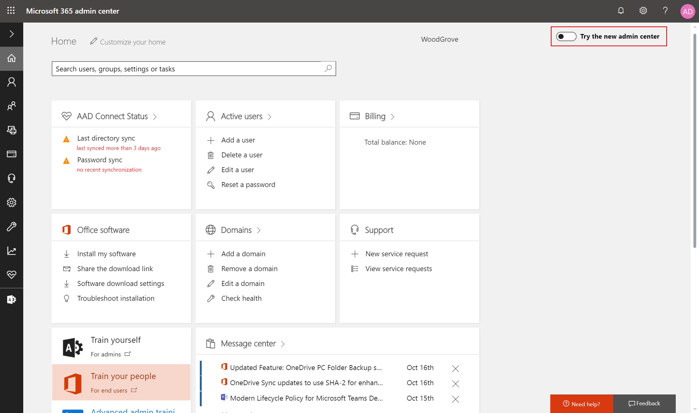
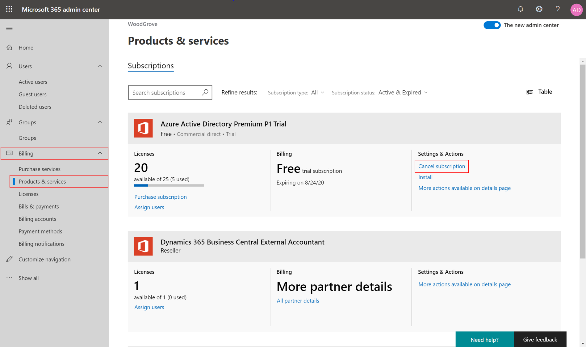
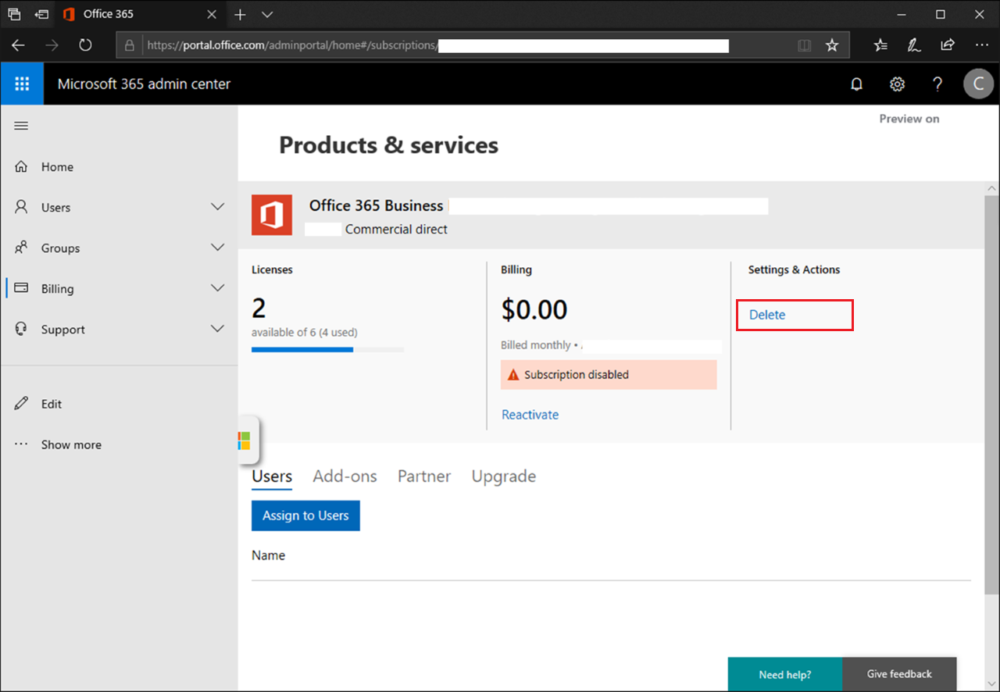
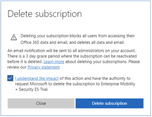
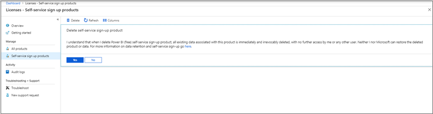
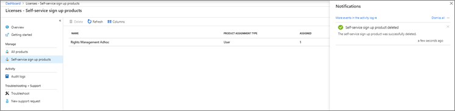

# Delete a tenant in Azure Active Directory

When an Azure AD organization (tenant) is deleted, all resources that are contained in the organization are also deleted. Prepare your organization by minimizing its associated resources before you delete. Only an Azure Active Directory (Azure AD) global administrator can delete an Azure AD organization from the portal.

## Prepare the organization

You can't delete a organization in Azure AD until it passes several checks. These checks reduce risk that deleting an Azure AD organization negatively impacts user access, such as the ability to sign in to Office 365 or access resources in Azure. For example, if the organization associated with a subscription is unintentionally deleted, then users can't access the Azure resources for that subscription. The following conditions are checked:

* There can be no users in the Azure AD organization (tenant) except one global administrator who is to delete the organization. Any other users must be deleted before the organization can be deleted. If users are synchronized from on-premises, then sync must first be turned off, and the users must be deleted in the cloud organization using the Azure portal or Azure PowerShell cmdlets.
* There can be no applications in the organization. Any applications must be removed before the organization can be deleted.
* There can be no multi-factor authentication providers linked to the organization.
* There can be no subscriptions for any Microsoft Online Services such as Microsoft Azure, Office 365, or Azure AD Premium associated with the organization. For example, if a default Azure AD organization was created for you in Azure, you cannot delete this organization if your Azure subscription still relies on this organization for authentication. Similarly, you can't delete a organization if another user has associated a subscription with it.

## Delete the organization

1. Sign in to the [Azure AD admin center](https://aad.portal.azure.com) with an account that is the Global Administrator for your organization.

2. Select **Azure Active Directory**.

3. Switch to the organization you want to delete.
  
   

4. Select **Delete tenant**.
  
   

5. If your organization does not pass one or more checks, you're provided with a link to more information on how to pass. After you pass all checks, select **Delete** to complete the process.

## If you can't delete the organization

When you configured your Azure AD organization, you may have also activated license-based subscriptions for your organization like Azure AD Premium P2, Office 365 Business Premium, or Enterprise Mobility + Security E5. To avoid accidental data loss, you can't delete a organization until the subscriptions are fully deleted. The subscriptions must be in a **Deprovisioned** state to allow organization deletion. An **Expired** or **Canceled** subscription moves to the **Disabled** state, and the final stage is the **Deprovisioned** state.

For what to expect when a trial Office 365 subscription expires (not including paid Partner/CSP, Enterprise Agreement, or Volume Licensing), see the following table. For more information on Office 365 data retention and subscription lifecycle, see [What happens to my data and access when my Office 365 for business subscription ends?](https://support.office.com/article/what-happens-to-my-data-and-access-when-my-office-365-for-business-subscription-ends-4436582f-211a-45ec-b72e-33647f97d8a3). 

Subscription state | Data | Access to data
----- | ----- | -----
Active (30 days for trial) | Data accessible to all	| Users have normal access to Office 365 files, or apps Admins have normal access to Microsoft 365 admin center and resources 
Expired (30 days) | Data accessible to all| Users have normal access to Office 365 files, or apps Admins have normal access to Microsoft 365 admin center and resources
Disabled (30 days) | Data accessible to admin only | Users can’t access Office 365 files, or apps Admins can access the Microsoft 365 admin center but can’t assign licenses to or update users
Deprovisioned  (30 days after Disabled) | Data deleted (automatically deleted if no other services are in use) | Users can’t access Office 365 files, or apps Admins can access the Microsoft 365 admin center to purchase and manage other subscriptions

## Delete a subscription

You can put a subscription into the **Deprovisioned** state to be deleted in three days using the Microsoft 365 admin center.

1. Sign in to the [Microsoft 365 admin center](https://admin.microsoft.com) with an account that is a global administrator in your organization. If you are trying to delete the “Contoso” organization that has the initial default domain contoso.onmicrosoft.com, sign in with a UPN such as admin@contoso.onmicrosoft.com.

2. Preview the new Microsoft 365 admin center by making sure the **Try the new admin center** toggle is enabled.

   

3. Once the new admin center is enabled, you need to cancel a subscription before you can delete it. Select **Billing** and select **Products & services**, then select **Cancel subscription** for the subscription you want to cancel. You will be brought to a feedback page.

   

4. Complete the feedback form and select **Cancel subscription** to cancel the subscription.

   

5. You can now delete the subscription. Select **Delete** for the subscription you want to delete. If you cannot find the subscription in the **Products & services** page, make sure you have **Subscription status** set to **All**.

   

6. Select **Delete subscription** to delete the subscription and accept the terms and conditions. All data is permanently deleted within three days. You can [reactivate the subscription](https://docs.microsoft.com/office365/admin/subscriptions-and-billing/reactivate-your-subscription?view=o365-worldwide) during the three-day period if you change your mind.
  
   

7. Now the subscription state has changed, and the subscription is marked for deletion. The subscription enters the **Deprovisioned** state 72 hours later.

8. Once you have deleted a subscription in your organization and 72 hours have elapsed, you can sign back into the Azure AD admin center again and there should be no required action and no subscriptions blocking your organization deletion. You should be able to successfully delete your Azure AD organization.
  
   

## I have a trial subscription that blocks deletion

There are [self-service sign-up products](https://docs.microsoft.com/office365/admin/misc/self-service-sign-up?view=o365-worldwide) like Microsoft Power BI, Rights Management Services, Microsoft Power Apps, or Dynamics 365, individual users can sign up via Office 365, which also creates a guest user for authentication in your Azure AD organization. These self-service products block directory deletions until the products are fully deleted from the organization, to avoid data loss. They can be deleted only by the Azure AD admin whether the user signed up individually or was assigned the product.

There are two types of self-service sign-up products in how they are assigned: 

* Org-level assignment: An Azure AD admin assigns the product to the entire organization and a user can be actively using the service with this org-level assignment even if they are not licensed individually.
* User level assignment: An individual user during self-service sign-up essentially assigns the product to themselves without an admin. Once the organization becomes managed by an admin (see [Administrator takeover of an unmanaged organization](domains-admin-takeover.md), then the admin can directly assign the product to users without self-service sign-up.  

When you begin the deletion of the self-service sign-up product, the action permanently deletes the data and removes all user access to the service. Any user that was assigned the offer individually or on the organization level is then blocked from signing in or accessing any existing data. If you want to prevent data loss with the self-service sign-up product like [Microsoft Power BI dashboards](https://docs.microsoft.com/power-bi/service-export-to-pbix) or [Rights Management Services policy configuration](https://docs.microsoft.com/azure/information-protection/configure-policy#how-to-configure-the-azure-information-protection-policy), ensure that the data is backed up and saved elsewhere.

For more information about currently available self-service sign-up products and services, see [Available self-service programs](https://docs.microsoft.com/office365/admin/misc/self-service-sign-up?view=o365-worldwide#available-self-service-programs).

For what to expect when a trial Office 365 subscription expires (not including paid Partner/CSP, Enterprise Agreement, or Volume Licensing), see the following table. For more information on Office 365 data retention and subscription lifecycle, see [What happens to my data and access when my Office 365 for business subscription ends?](https://docs.microsoft.com/office365/admin/subscriptions-and-billing/what-if-my-subscription-expires?view=o365-worldwide).

Product state | Data | Access to data
------------- | ---- | --------------
Active (30 days for trial) | Data accessible to all | Users have normal access to self-service sign-up product, files, or apps Admins have normal access to Microsoft 365 admin center and resources
Deleted | Data deleted | Users can’t access self-service sign-up product, files, or apps Admins can access the Microsoft 365 admin center to purchase and manage other subscriptions

## How can I delete a self-service sign-up product in the Azure portal?

You can put a self-service sign-up product like Microsoft Power BI or Azure Rights Management Services into a **Delete** state to be immediately deleted in the Azure AD portal.

1. Sign in to the [Azure AD admin center](https://aad.portal.azure.com/#blade/Microsoft_AAD_IAM/ActiveDirectoryMenuBlade/Overview) with an account that is a Global administrator in the organization. If you are trying to delete the “Contoso” organization that has the initial default domain contoso.onmicrosoft.com, sign on with a UPN such as admin@contoso.onmicrosoft.com.

2. Select **Licenses**, and then select **Self-service sign-up products**. You can see all the self-service sign-up products separately from the seat-based subscriptions. Choose the product you want to permanently delete. Here's an example in Microsoft Power BI:

    

3. Select **Delete** to delete the product and accept the terms that data is deleted immediately and irrevocably. This delete action will remove all users and remove organization access to the product. Click Yes to move forward with the deletion.  

    

4. When you select **Yes**, the deletion of the self-service product will be initiated. There is a notification that will tell you of the deletion in progress.  

    

5. Now the self-service sign-up product state has changed to **Deleted**. When you refresh the page, the product should be removed from the **Self-service sign-up products** page.  

    

6. Once you have deleted all the products, you can sign back into the Azure AD admin center again and there should be no required action and no products blocking your organization deletion. You should be able to successfully delete your Azure AD organization.

    

## Next steps

[Azure Active Directory documentation](https://docs.microsoft.com/azure/active-directory/)
