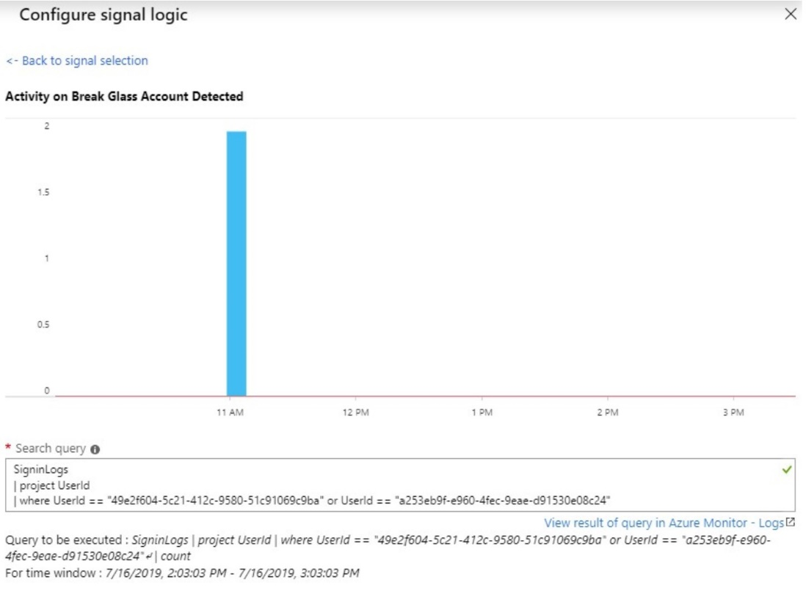
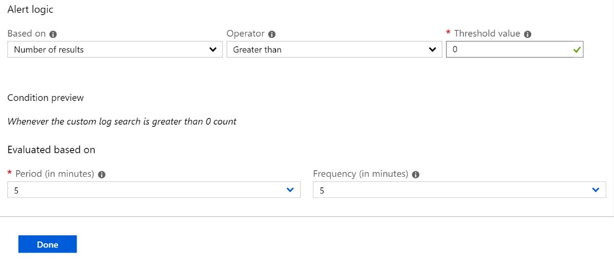
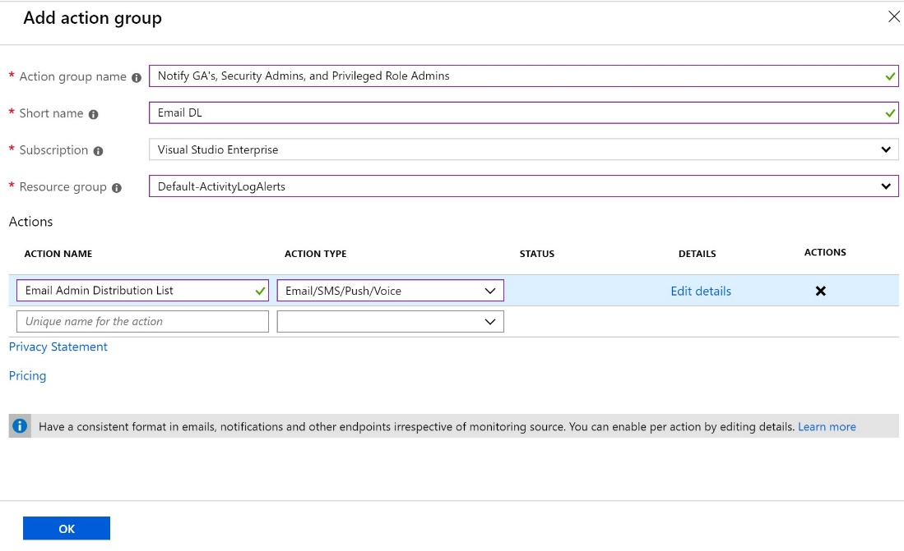

---

title: Manage emergency access admin accounts - Azure AD | Microsoft Docs
description: This article describes how to use emergency access accounts to help prevent being inadvertently locked out of your Azure Active Directory (Azure AD) organization. 
services: active-directory 
author: markwahl-msft
manager: daveba
ms.author: curtand
ms.date: 11/08/2019
ms.topic: conceptual
ms.service: active-directory
ms.subservice: users-groups-roles
ms.workload: identity
ms.custom: it-pro
ms.reviewer: markwahl-msft
ms.collection: M365-identity-device-management
---

# Manage emergency access accounts in Azure AD

It is important that you prevent being accidentally locked out of your Azure Active Directory (Azure AD) organization because you can't sign in or activate another user's account as an administrator. You can mitigate the impact of accidental lack of administrative access by creating two or more *emergency access accounts* in your organization.

Emergency access accounts are highly privileged, and they are not assigned to specific individuals. Emergency access accounts are limited to emergency or "break glass"' scenarios where normal administrative accounts can't be used. We recommend that you maintain a goal of restricting emergency account use to only the times when it is absolutely necessary.

This article provides guidelines for managing emergency access accounts in Azure AD.

## Why use an emergency access account

An organization might need to use an emergency access account in the following situations:

- The user accounts are federated, and federation is currently unavailable because of a cell-network break or an identity-provider outage. For example, if the identity provider host in your environment has gone down, users might be unable to sign in when Azure AD redirects to their identity provider.
- The administrators are registered through Azure Multi-Factor Authentication, and all their individual devices are unavailable or the service is unavailable. Users might be unable to complete Multi-Factor Authentication to activate a role. For example, a cell network outage is preventing them from answering phone calls or receiving text messages, the only two authentication mechanisms that they registered for their device.
- The person with the most recent Global Administrator access has left the organization. Azure AD prevents the last Global Administrator account from being deleted, but it does not prevent the account from being deleted or disabled on-premises. Either situation might make the organization unable to recover the account.
- Unforeseen circumstances such as a natural disaster emergency, during which a mobile phone or other networks might be unavailable. 

## Create emergency access accounts

Create two or more emergency access accounts. These accounts should be cloud-only accounts that use the \*.onmicrosoft.com domain and that are not federated or synchronized from an on-premises environment.

When configuring these accounts, the following requirements must be met:

- The emergency access accounts should not be associated with any individual user in the organization. Make sure that your accounts are not connected with any employee-supplied mobile phones, hardware tokens that travel with individual employees, or other employee-specific credentials. This precaution covers instances where an individual employee is unreachable when the credential is needed. It is important to ensure that any registered devices are kept in a known, secure location that has multiple means of communicating with Azure AD.
- The authentication mechanism used for an emergency access account should be distinct from that used by your other administrative accounts, including other emergency access accounts.  For example, if your normal administrator sign-in is via on-premises MFA, then Azure MFA would be a different mechanism.  However if Azure MFA is your primary part of authentication for your administrative accounts, then consider a different approach for these, such as using Conditional Access with a third-party MFA provider via [Custom controls](https://docs.microsoft.com/azure/active-directory/conditional-access/controls).
- The device or credential must not expire or be in scope of automated cleanup due to lack of use.  
- You should make the Global Administrator role assignment permanent for your emergency access accounts. 

### Exclude at least one account from phone-based multi-factor authentication

To reduce the risk of an attack resulting from a compromised password, Azure AD recommends that you require multi-factor authentication for all individual users. This group includes administrators and all others (for example, financial officers) whose compromised account would have a significant impact.

However, at least one of your emergency access accounts should not have the same multi-factor authentication mechanism as your other non-emergency accounts. This includes third-party multi-factor authentication solutions. If you have a Conditional Access policy to require [multi-factor authentication for every administrator](../authentication/howto-mfa-userstates.md) for Azure AD and other connected software as a service (SaaS) apps, you should exclude emergency access accounts from this requirement, and configure a different mechanism instead. Additionally, you should make sure the accounts do not have a per-user multi-factor authentication policy.

### Exclude at least one account from Conditional Access policies

During an emergency, you do not want a policy to potentially block your access to fix an issue. At least one emergency access account should be excluded from all Conditional Access policies. If you have enabled a [baseline policy](../conditional-access/baseline-protection.md), you should exclude your emergency access accounts.

## Federation guidance

An additional option for organizations that use AD Domain Services and ADFS or similar identity provider to federate to Azure AD, is to configure an emergency access account whose MFA claim could be supplied by that identity provider.  For example, the emergency access account could be backed by a certificate and key pair such as one stored on a smartcard.  When that user is authenticated to AD, ADFS can supply a claim to Azure AD indicating that the user has met MFA requirements.  Even with this approach, organizations must still have cloud-based emergency access accounts in case federation cannot be established. 

## Store account credentials safely

Organizations need to ensure that the credentials for emergency access accounts are kept secure and known only to individuals who are authorized to use them. Some customers use a smartcard and others use passwords. A password for an emergency access account is usually separated into two or three parts, written on separate pieces of paper, and stored in secure, fireproof safes that are in secure, separate locations.

If using passwords, make sure the accounts have strong passwords that do not expire the password. Ideally, the passwords should be at least 16 characters long and randomly generated.

## Monitor sign-in and audit logs

Organizations should monitor sign-in and audit log activity from the emergency accounts and trigger notifications to other administrators. When you monitor the activity on break glass accounts, you can verify these accounts are only used for testing or actual emergencies. You can use Azure Log Analytics to monitor the sign-in logs and trigger email and SMS alerts to your admins whenever break glass accounts sign in.

### Prerequisites

1. [Send Azure AD sign-in logs](https://docs.microsoft.com/azure/active-directory/reports-monitoring/howto-integrate-activity-logs-with-log-analytics) to Azure Monitor.

### Obtain Object IDs of the break glass accounts

1. Sign in to the [Azure portal](https://portal.azure.com) with an account assigned to the User administrator role.
1. Select **Azure Active Directory** > **Users**.
1. Search for the break-glass account and select the user’s name.
1. Copy and save the Object ID attribute so that you can use it later.
1. Repeat previous steps for second break-glass account.

### Create an alert rule

1. Sign in to the [Azure portal](https://portal.azure.com) with an account assigned to the Monitoring Contributor role in Azure Monitor.
1. Select **All services**", enter "log analytics" in Search and then select **Log Analytics workspaces**.
1. Select a workspace.
1. In your workspace, select **Alerts** > **New alert rule**.
    1. Under **Resource**, verify that the subscription is the one with which you want to associate the alert rule.
    1. Under **Condition**, select **Add**.
    1. Select **Custom log search** under **Signal name**.
    1. Under **Search query**, enter the following query, inserting the object IDs of the two break glass accounts.
        > [!NOTE]
        > For each additional break glass account you want to include, add another "or UserId == "ObjectGuid"" to the query.

        

    1. Under **Alert logic**, enter the following:

        - Based on: Number of results
        - Operator: Greater than
        - Threshold value: 0

    1. Under **Evaluated based on**, select the **Period (in minutes)** for how long you want the query to run, and the **Frequency (in minutes)** for how often you want the query to run. The frequency should be less than or equal to the period.

        

    1. Select **Done**. You may now view the estimated monthly cost of this alert.
1. Select an action group of users to be notified by the alert. If you want to create one, see [Create an action group](#create-an-action-group).
1. To customize the email notification sent to the members of the action group, select actions under **Customize Actions**.
1. Under **Alert Details**, specify the alert rule name and add an optional description.
1. Set the **Severity level** of the event. We recommend that you set it to **Critical(Sev 0)**.
1. Under **Enable rule upon creation**, leave it set as **yes**.
1. To turn off alerts for a while, select the **Suppress Alerts** check box and enter the wait duration before alerting again, and then select **Save**.
1. Click **Create alert rule**.

### Create an action group

1. Select **Create an action group**.

    

1. Enter the action group name and a short name.
1. Verify the subscription and resource group.
1. Under action type, select **Email/SMS/Push/Voice**.
1. Enter an action name such as **Notify global admin**.
1. Select the **Action Type** as **Email/SMS/Push/Voice**.
1. Select **Edit details** to select the notification methods you want to configure and enter the required contact information, and then select **Ok** to save the details.
1. Add any additional actions you want to trigger.
1. Select **OK**.

## Validate accounts regularly

When you train staff members to use emergency access accounts and validate the emergency access accounts, at minimum do the following steps at regular intervals:

- Ensure that security-monitoring staff are aware that the account-check activity is ongoing.
- Ensure that the emergency break glass process to use these accounts is documented and current.
- Ensure that administrators and security officers who might need to perform these steps during an emergency are trained on the process.
- Update the account credentials, in particular any passwords, for your emergency access accounts, and then validate that the emergency access accounts can sign-in and perform administrative tasks.
- Ensure that users have not registered Multi-Factor Authentication or self-service password reset (SSPR) to any individual user’s device or personal details. 
- If the accounts are registered for Multi-Factor Authentication to a device, for use during sign-in or role activation, ensure that the device is accessible to all administrators who might need to use it during an emergency. Also verify that the device can communicate through at least two network paths that do not share a common failure mode. For example, the device can communicate to the internet through both a facility's wireless network and a cell provider network.

These steps should be performed at regular intervals and for key changes:

- At least every 90 days
- When there has been a recent change in IT staff, such as a job change, a departure, or a new hire
- When the Azure AD subscriptions in the organization have changed

## Next steps

- [Securing privileged access for hybrid and cloud deployments in Azure AD](directory-admin-roles-secure.md)
- [Add users using Azure AD](../fundamentals/add-users-azure-active-directory.md) and [assign the new user to the Global Administrator role](../fundamentals/active-directory-users-assign-role-azure-portal.md)
- [Sign up for Azure AD Premium](../fundamentals/active-directory-get-started-premium.md), if you haven’t signed up already
- [How to require two-step verification for a user](../authentication/howto-mfa-userstates.md)
- [Configure additional protections for Global Administrators in Office 365](https://docs.microsoft.com/office365/enterprise/protect-your-global-administrator-accounts), if you are using Office 365
- [Start an access review of Global Administrators](../privileged-identity-management/pim-how-to-start-security-review.md) and [transition existing Global Administrators to more specific administrator roles](directory-assign-admin-roles.md)
