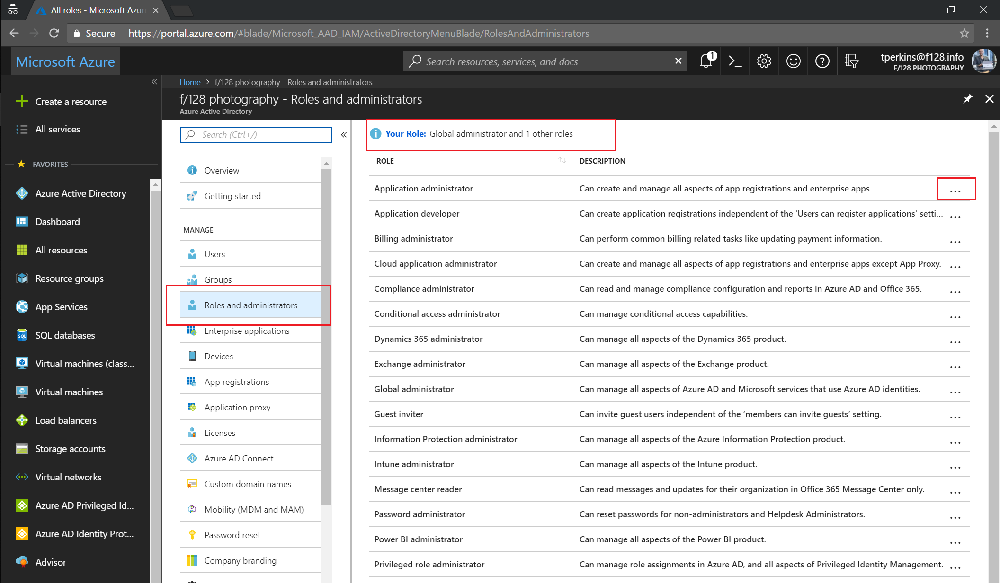
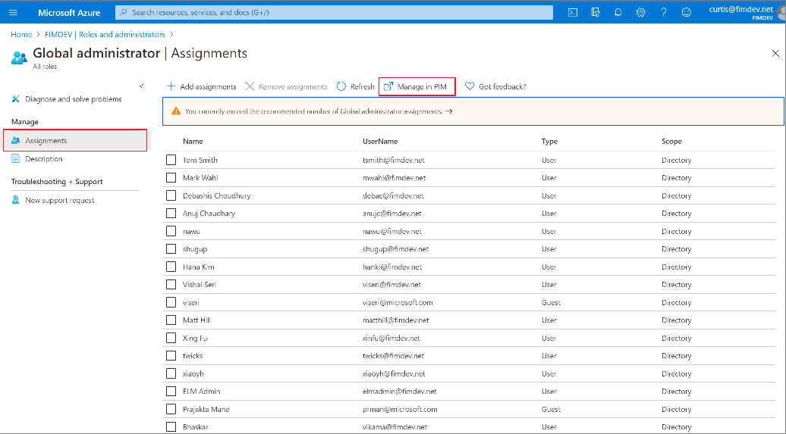
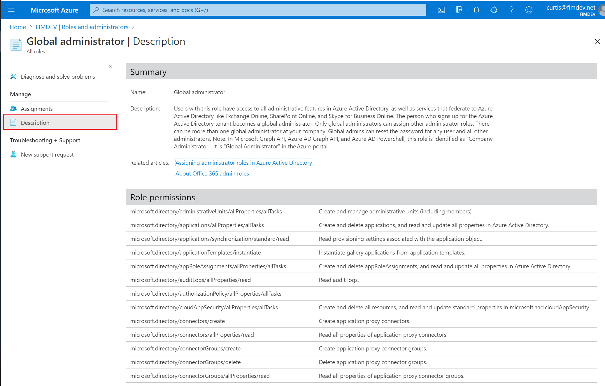

# View and assign administrator roles in Azure Active Directory

You can now see and manage all the members of the administrator roles in the Azure Active Directory portal. If you frequently manage role assignments, you will probably prefer this experience. And if you ever wondered “What the heck do these roles really do?”, you can see a detailed list of permissions for each of the Azure AD administrator roles.

## View all roles

In Azure Active Directory, select **Roles and administrators** to see the list of all available roles. 

Click the ellipsis on the right of each row to open the detailed description of the role.

## View my roles

It's easy to view your own permissions as well. Select **Your Role** on the **Roles and administrators** page to see the roles that are currently assigned to you.

## View assignments for a role

Click a role to view the users assigned to the role. You can select **Manage in PIM** for additional management capabilities. Privileged Role Administrators can change “Permanent” (always active in the role) assignments to “Eligible” (in the role only when elevated). If you don't have PIM, you can still select **Manage in PIM** to sign up for a trial. Privileged Identity Management requires an [Azure AD Premium P2 license plan](../privileged-identity-management/subscription-requirements.md).

If you are a Global Administrator or a Privileged Role Administrator, you can easily add or remove members, filter the list, or select a member to see their active assigned roles.

## View a user's role permissions

When you're viewing a role's members, select **Description** to see the complete list of permissions granted by the role assignment. The page includes links to relevant documentation to help guide you through managing directory roles.

## Next steps

* Feel free to share with us on the [Azure AD administrative roles forum](https://feedback.azure.com/forums/169401-azure-active-directory?category_id=166032).
* For more about roles and Administrator role assignment, see [Assign administrator roles](directory-assign-admin-roles.md).
* For default user permissions, see a [comparison of default guest and member user permissions](../fundamentals/users-default-permissions.md).
