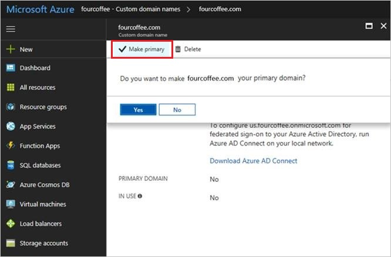

# Managing custom domain names in your Azure Active Directory

A domain name is an important part of the identifier for many directory resources: it's part of a user name or email address for a user, part of the address for a group, and is sometimes part of the app ID URI for an application. A resource in Azure Active Directory (Azure AD) can include a domain name that's owned by the directory that contains the resource. Only a Global Administrator can manage domains in Azure AD.

## Set the primary domain name for your Azure AD directory

When your directory is created, the initial domain name, such as ‘contoso.onmicrosoft.com,’ is also the primary domain name. The primary domain is the default domain name for a new user when you create a new user. Setting a primary domain name streamlines the process for an administrator to create new users in the portal. To change the primary domain name:

1. Sign in to the [Azure portal](https://portal.azure.com) with an account that's a Global Administrator for the directory.
2. Select **Azure Active Directory**.
3. Select **Custom domain names**.
  
   
4. Select the name of the domain that you want to be the primary domain.
5. Select the **Make primary** command. Confirm your choice when prompted.
  
   

You can change the primary domain name for your directory to be any verified custom domain that isn't federated. Changing the primary domain for your directory won't change the user name for any existing users.

## Add custom domain names to your Azure AD tenant

You can add up to 900 managed domain names. If you're configuring all your domains for federation with on-premises Active Directory, you can add up to 450 domain names in each directory.

## Add subdomains of a custom domain

If you want to add a third-level domain name such as ‘europe.contoso.com’ to your directory, you should first add and verify the second-level domain, such as contoso.com. The subdomain is automatically verified by Azure AD. To see that the subdomain you added is verified, refresh the domain list in the browser.

## What to do if you change the DNS registrar for your custom domain name

If you change the DNS registrars, there are no additional configuration tasks in Azure AD. You can continue using the domain name with Azure AD without interruption. If you use your custom domain name with Office 365, Intune, or other services that rely on custom domain names in Azure AD, see the documentation for those services.

## Delete a custom domain name

You can delete a custom domain name from your Azure AD if your organization no longer uses that domain name, or if you need to use that domain name with another Azure AD.

To delete a custom domain name, you must first ensure that no resources in your directory rely on the domain name. You can't delete a domain name from your directory if:

* Any user has a user name, email address, or proxy address that includes the domain name.
* Any group has an email address or proxy address that includes the domain name.
* Any application in your Azure AD has an app ID URI that includes the domain name.

You must change or delete any such resource in your Azure AD directory before you can delete the custom domain name.

### ForceDelete option

You can **ForceDelete** a domain name in the [Azure AD Admin Center](https://aad.portal.azure.com) or using [Microsoft Graph API](https://developer.microsoft.com/en-us/graph/docs/api-reference/beta/api/domain_forcedelete). These options use an asynchronous operation and update all references from the custom domain name like “user@contoso.com” to the initial default domain name such as “user@contoso.onmicrosoft.com.” 

To call **ForceDelete** in the Azure portal, you must ensure that there are fewer than 1000 references to the domain name, and any references where Exchange is the provisioning service must be updated or removed in the [Exchange Admin Center](https://outlook.office365.com/ecp/). This includes Exchange Mail-Enabled Security Groups and distributed lists; for more information, see [Removing mail-enabled security groups](https://technet.microsoft.com/library/bb123521(v=exchg.160).aspx#Remove%20mail-enabled%20security%20groups). Also, the **ForceDelete** operation won't succeed if either of the following is true:

* You purchased a domain via Office 365 domain subscription services
* You are a partner administering on behalf of another customer tenant

The following actions are performed as part of the **ForceDelete** operation:

* Renames the UPN, EmailAddress, and ProxyAddress of users with references to the custom domain name to the initial default domain name.
* Renames the EmailAddress of groups with references to the custom domain name to the initial default domain name.
* Renames the identifierUris of applications with references to the custom domain name to the initial default domain name.

An error is returned when:

* The number of objects to be renamed is greater than 1000
* One of the applications to be renamed is a multi-tenant app

### Frequently asked questions

**Q: Why is the domain deletion failing with an error that states that I have Exchange mastered groups on this domain name?**  
**A:** Today, certain groups like Mail-Enabled Security groups and distributed lists are provisioned by Exchange and need to be manually cleaned up in [Exchange Admin Center (EAC)](https://outlook.office365.com/ecp/). There may be lingering ProxyAddresses which rely on the custom domain name and will need to be updated manually to another domain name. 

**Q: I am logged in as admin@contoso.com but I cannot delete the domain name “contoso.com”?** 
**A:** You cannot reference the custom domain name you are trying to delete in your user account name. Ensure that the Global Administrator account is using the initial default domain name (.onmicrosoft.com) such as admin@contoso.onmicrosoft.com. Sign in with a different Global Administrator account that such as admin@contoso.onmicrosoft.com or another custom domain name like “fabrikam.com” where the account is admin@fabrikam.com.

**Q: I clicked the Delete domain button and see `In Progress` status for the Delete operation. How long does it take? What happens if it fails?** 
**A:** The delete domain operation is an asynchronous background task that renames all references to the domain name. It should complete within a minute or two. If domain deletion fails, ensure that you don’t have:

* Apps configured on the domain name with the appIdentifierURI
* Any mail-enabled group referencing the custom domain name
* More than 1000 references to the domain name

If you find that any of the conditions haven’t been met, manually clean up the references and try to delete the domain again.

## Use PowerShell or Graph API to manage domain names

Most management tasks for domain names in Azure Active Directory can also be completed using Microsoft PowerShell, or programmatically using Azure AD Graph API.

* [Using PowerShell to manage domain names in Azure AD](https://msdn.microsoft.com/library/azure/e1ef403f-3347-4409-8f46-d72dafa116e0#BKMK_ManageDomains)
* [Using Graph API to manage domain names in Azure AD](https://msdn.microsoft.com/Library/Azure/Ad/Graph/api/domains-operations)

## Next steps

* [Add custom domain names](/azure/active-directory/fundamentals/add-custom-domain?context=azure/active-directory/users-groups-roles/context/ugr-context)
* [Remove Exchange mail-enabled security groups in Exchange Admin Center on a custom domain name in Azure AD](https://technet.microsoft.com/library/bb123521(v=exchg.160).aspx#Remove%20mail-enabled%20security%20groups)
* [Update your applications reference to another domain in Azure AD](https://docs.microsoft.com/azure/active-directory/develop/quickstart-v1-integrate-apps-with-azure-ad#updating-an-application)
* [ForceDelete a custom domain name with Microsoft Graph API](https://developer.microsoft.com/en-us/graph/docs/api-reference/beta/api/domain_forcedelete)