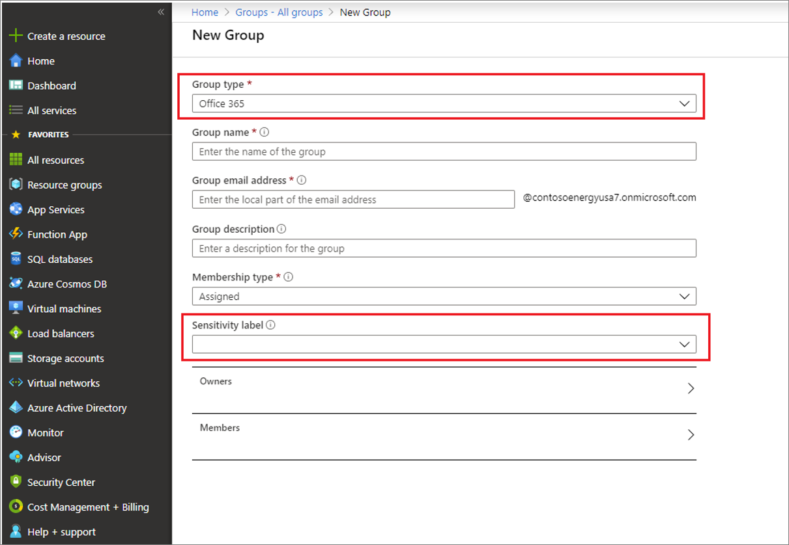
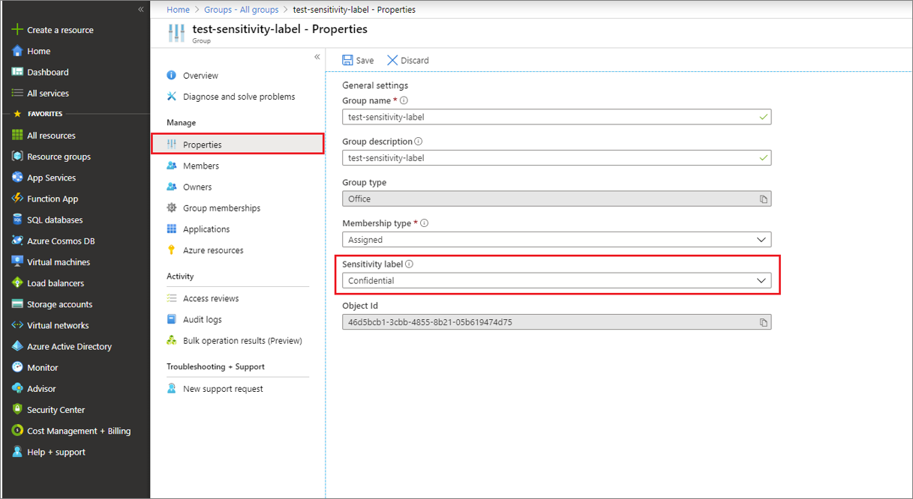

# Assign sensitivity labels to Office 365 groups in Azure Active Directory (preview)

Azure Active Directory (Azure AD) supports applying sensitivity labels published by the [Microsoft 365 compliance center](https://sip.protection.office.com/homepage) to Office 365 groups. Sensitivity labels apply to group across services like Outlook, Microsoft Teams, and SharePoint. This feature is currently in public preview. For more information about Office 365 apps support, see [Office 365 support for sensitivity labels](https://docs.microsoft.com/microsoft-365/compliance/sensitivity-labels-teams-groups-sites#support-for-the-sensitivity-labels).

> [!IMPORTANT]
> To configure this feature, there must be at least one active Azure Active Directory Premium P1 license in your Azure AD organization.

## Enable sensitivity label support in PowerShell

To apply published labels to groups, you must first enable the feature. These steps enable the feature in Azure AD.

1. Open a Windows PowerShell window on your computer. You can open it without elevated privileges.
1. Run the following commands to prepare to run the cmdlets.

    ```PowerShell
    Import-Module AzureADPreview
    Connect-AzureAD
    ```

    In the **Sign in to your account** page, enter your admin account and password to connect you to your service, and select **Sign in**.
1. Fetch the current group settings for the Azure AD organization.

    ```PowerShell
    $Setting = Get-AzureADDirectorySetting -Id (Get-AzureADDirectorySetting | where -Property DisplayName -Value "Group.Unified" -EQ).id
    ```

    > [!NOTE]
    > If no group settings have been created for this Azure AD organization, you must first create the settings. Follow the steps in [Azure Active Directory cmdlets for configuring group settings](https://docs.microsoft.com/azure/active-directory/users-groups-roles/groups-settings-cmdlets) to create group settings for this Azure AD organization.

1. Next, display the current group settings.

    ```PowerShell
    $Setting.Values
    ```

1. Then enable the feature:

    ```PowerShell
    $Setting["EnableMIPLabels"] = "True"
    ```

1. Then save the changes and apply the settings:

    ```PowerShell
    Set-AzureADDirectorySetting -Id $Setting.Id -DirectorySetting $Setting
    ```

That's it. You've enabled the feature and you can apply published labels to groups.

## Assign a label to a new group in Azure portal

1. Sign in to the [Azure AD admin center](https://aad.portal.azure.com).
1. Select **Groups**, and then select **New group**.
1. On the **New Group** page, select **Office 365**, and then fill out the required information for the new group and select a sensitivity label from the list.

   

1. Save your changes and select **Create**.

Your group is created and the site and group settings associated with the selected label are then automatically enforced.

## Assign a label to an existing group in Azure portal

1. Sign in to the [Azure AD admin center](https://aad.portal.azure.com) with a Groups admin account, or as a group owner.
1. Select **Groups**.
1. From the **All groups** page, select the group that you want to label.
1. On the selected group's page, select **Properties** and select a sensitivity label from the list.

   

1. Select **Save** to save your changes.

## Remove a label from an existing group in Azure portal

1. Sign in to the [Azure AD admin center](https://aad.portal.azure.com) with a Global admin or Groups admin account, or as a group owner.
1. Select **Groups**.
1. From the **All groups** page, select the group that you want to remove the label from.
1. On the **Group** page, select **Properties**.
1. Select **Remove**.
1. Select **Save** to apply your changes.

## Using classic Azure AD classifications

After you enable this feature, the “classic” classifications for groups will appear only existing groups and sites, and you should use them for new groups only if creating groups in apps that don’t support sensitivity labels. Your admin can convert them to sensitivity labels later if needed. Classic classifications are the old classifications you set up by defining values for the `ClassificationList` setting in Azure AD PowerShell. When this feature is enabled, those classifications will not be applied to groups.

## Troubleshooting issues

### Sensitivity labels are not available for assignment on a group

The sensitivity label option is only displayed for groups when all the following conditions are met:

1. Labels are published in the Microsoft 365 Compliance Center for this Azure AD organization.
1. The feature is enabled, EnableMIPLabels is set to True in PowerShell.
1. The group is an Office 365 group.
1. The organization has an active Azure Active Directory Premium P1 license.
1. The current signed-in user has sufficient privileges to assign labels. The user must be either a Global Administrator, Group Administrator, or the group owner.

Please make sure all the conditions are met in order to assign labels to a group.

### The label I want to assign is not in the list

If the label you are looking for is not in the list, this could be the case for one of the following reasons:

- The label might not be published in the Microsoft 365 Compliance Center. This could also apply to labels that are no longer published. Please check with your administrator for more information.
- The label may be published, however, it is not available to the user that is signed-in. Please check with your administrator for more information on how to get access to the label.

### How to change the label on a group

Labels can be swapped at any time using the same steps as assigning a label to an existing group, as follows:

1. Sign in to the [Azure AD admin center](https://aad.portal.azure.com) with a Global or Group administrator account or as group owner.
1. Select **Groups**.
1. From the **All groups** page, select the group that you want to label.
1. On the selected group's page, select **Properties** and select a new sensitivity label from the list.
1. Select **Save**.

### Group setting changes to published labels are not updated on the groups

As a best practice, we don't recommend that you change group settings for a label after the label is applied to groups. When you make changes to group settings associated with published labels in [Microsoft 365 compliance center](https://sip.protection.office.com/homepage), those policy changes aren't automatically applied on the impacted groups.

If you must make a change, use an [Azure AD PowerShell script](https://github.com/microsoftgraph/powershell-aad-samples/blob/master/ReassignSensitivityLabelToO365Groups.ps1) to manually apply updates to the impacted groups. This method makes sure that all existing groups enforce the new setting.

## Next steps

- [Use sensitivity labels with Microsoft Teams, Office 365 groups, and SharePoint sites](https://docs.microsoft.com/microsoft-365/compliance/sensitivity-labels-teams-groups-sites)
- [Update groups after label policy change manually with Azure AD PowerShell script](https://github.com/microsoftgraph/powershell-aad-samples/blob/master/ReassignSensitivityLabelToO365Groups.ps1)
- [Edit your group settings](https://docs.microsoft.com/azure/active-directory/fundamentals/active-directory-groups-settings-azure-portal)
- [Manage groups using PowerShell commands](https://docs.microsoft.com/azure/active-directory/users-groups-roles/groups-settings-v2-cmdlets)
