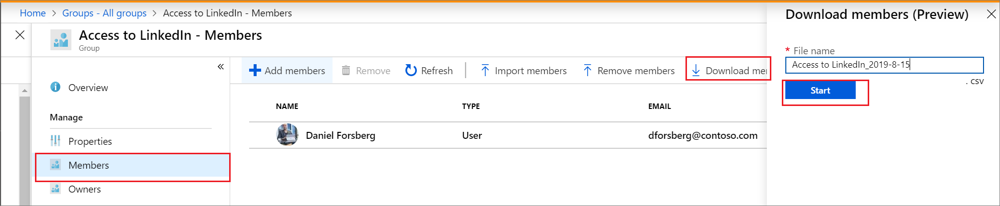

# Bulk download members of a group in Azure Active Directory

Using Azure Active Directory (Azure AD) portal, you can bulk download the members of a group in your organization to a comma-separated values (CSV) file.

## To bulk download group membership

1. Sign in to [the Azure portal](https://portal.azure.com) with a User administrator account in the organization. Group owners can also bulk download members of groups they own.
1. In Azure AD, select **Groups** > **All groups**.
1. Open the group whose membership you want to download, and then select **Members**.
1. On the **Members** page, select **Download members** to download a CSV file listing the group members.

   

## Check download status

You can see the status of all of your pending bulk requests in the **Bulk operation results** page.

## Bulk download service limits

Each bulk activity to download a list of group members can run for up to one hour. This enables you to download a list of at least 500,000 members.

## Next steps

- [Bulk import group members](groups-bulk-import-members.md)
- [Bulk remove group members](groups-bulk-download-members.md)
