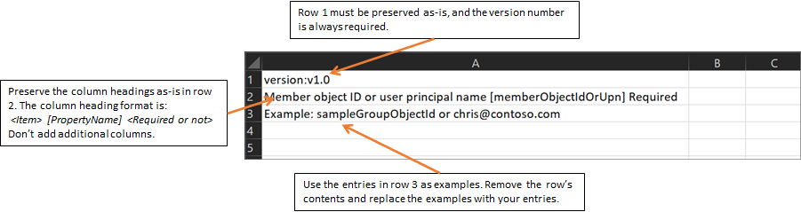
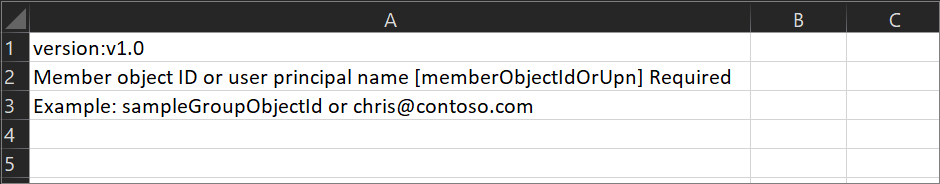

# Bulk import group members in Azure Active Directory

Using Azure Active Directory (Azure AD) portal, you can add a large number of members to a group by using a comma-separated values (CSV) file to bulk import group members.

## Understand the bulk upload spreadsheet

Use the bulk upload spreadsheet as the template to fill in to successfully create Azure AD users in bulk.

First two rows must not be removed or modified, needed for processing
There’s an example row that should be removed/replaced before upload
Note: Older versions of the template may not have the sample row
Provide info about Column header format
Format is <Item> [PropertyName] <Required or not>. For example, “Name [displayName] Required”
NOTE: Older versions of the template may have “Name (example: Chris Green) [displayName] *”
For groups, format is the same but you have the option to choose which item you use. Ex. “Member object ID or user principal name [memberObjectIdOrUpn] Required”
Required columns are list first
Any additional columns included in the uploaded CSV file will be ignored
create-template-example
I think we should recommend they download the latest version of the template periodically.

## To bulk import group members

1. Sign in to [the Azure portal](https://portal.azure.com) with a User administrator account in the organization. Group owners can also bulk import members of groups they own.
1. In Azure AD, select **Groups** > **All groups**.
1. Open the group to which you're adding members and then select **Members**.
1. On the **Members** page, select **Import members**.
1. On the **Bulk import group members** page, select **Download** to get the CSV file template with required group member properties.

    

1. Open the CSV file and add a line for each group member you want to import into the group (required values are either **Member object ID** or **User principal name**). Then save the file.

   

1. On the **Bulk import group members** page, under **Upload your csv file**, browse to the file. When you select the file, validation of the CSV file starts.
1. When the file contents are validated, the bulk import page displays **File uploaded successfully**. If there are errors, you must fix them before you can submit the job.
1. When your file passes validation, select **Submit** to start the Azure bulk operation that imports the group members to the group.
1. When the import operation completes, you'll see a notification that the bulk operation succeeded.

## Check import status

You can see the status of all of your pending bulk requests in the **Bulk operation results** page.

For details about each line item within the bulk operation, select the values under the **# Success**, **# Failure**, or **Total Requests** columns. If failures occurred, the reasons for failure will be listed.

## Bulk import service limits

Each bulk activity to import a list of group members can run for up to one hour. This enables importation of a list of at least 40,000 members.

## Next steps

- [Bulk remove group members](groups-bulk-remove-members.md)
- [Download members of a group](groups-bulk-download-members.md)
- [Download a list of all groups](groups-bulk-download.md)
