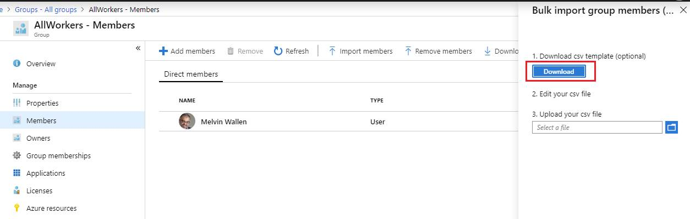

# Bulk import group members (preview) in Azure Active Directory

Using Azure Active Directory (Azure AD) portal, you can add a large number of members to a group by using a comma-separated values (CSV) file to bulk import group members.

> [!NOTE]
> Azure AD bulk operations are a public preview feature of Azure AD and are available with any paid Azure AD license plan. For more information about preview use terms, see [Supplemental Terms of Use for Microsoft Azure Previews](https://azure.microsoft.com/support/legal/preview-supplemental-terms/).

## Bulk import service limits

Each bulk activity to import a list of group members can run for up to one hour. This enables importation of a list of at least 40,000 members.

## To bulk import group members

1. Sign in to [the Azure portal](https://portal.azure.com) with a User administrator account in the organization. Group owners can also bulk import members of groups they own.
1. In Azure AD, select **Groups** > **All groups**.
1. Open the group to which you're adding members and then select **Members**.
1. On the **Members** page, select **Import members** to download, update, and upload a CSV file listing the members that you want to import into the group.

   

## Check import status

You can see the status of all of your pending bulk requests in the **Bulk operation results (preview)** page.

   

## Next steps

- [Bulk remove group members](groups-bulk-remove-members.md)
- [Download members of a group](groups-bulk-download-members.md)
