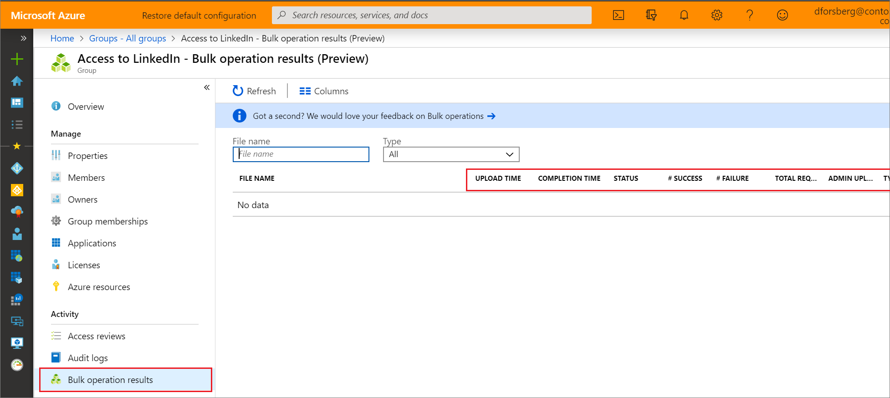

# Bulk remove group members in the Azure Active Directory portal

Azure Active Directory (Azure AD) supports bulk group list download, bulk import for group members, and bulk removal of group members.

## To bulk remove group members

1. [Sign in to your Azure AD organization](https://aad.portal.azure.com) with a User administrator account in the organization.
1. In Azure AD, select **Groups** > **All groups**.
1. Open the group to which you're adding members and then select **Members**.
1. On the **Members** page, select **Remove members** to download, update, and upload a CSV file listing the members that you want to import into the group.

   

## Check import status

You can see the status of all of your pending bulk requests in the **Bulk operation results (preview)** page.

   

## Next steps

- [Bulk import group members](groups-bulk-import-members.md)
- [Download members of a group](groups-bulk-download-members.md)
