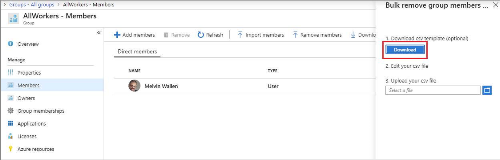
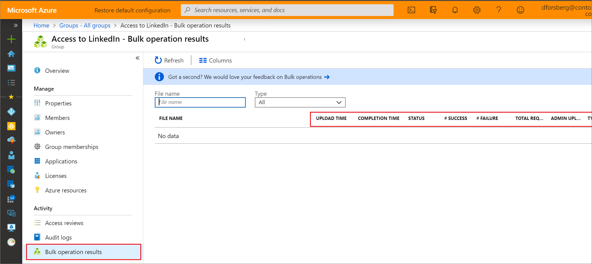

# Bulk remove group members (preview) in Azure Active Directory

Using Azure Active Directory (Azure AD) portal, you can remove a large number of members from a group by using a comma-separated values (CSV) file to bulk remove group members.

> [!NOTE]
> Azure AD bulk operations are a public preview feature of Azure AD and are available with any paid Azure AD license plan. For more information about preview use terms, see [Supplemental Terms of Use for Microsoft Azure Previews](https://azure.microsoft.com/support/legal/preview-supplemental-terms/).

## Bulk removal service limits

Each bulk activity to remove a list of group members from can run for up to one hour. This enables removal of a list of at least 40,000 members.

## To bulk remove group members

1. Sign in to [the Azure portal](https://portal.azure.com) with a User administrator account in the organization. Group owners can also bulk remove members of groups they own.
1. In Azure AD, select **Groups** > **All groups**.
1. Open the group from which you're removing members and then select **Members**.
1. On the **Members** page, select **Remove members** to download, update, and upload a CSV file listing the members that you want to remove from the group.

   

## Check removal status

You can see the status of all of your pending bulk requests in the **Bulk operation results (preview)** page.

   

## Next steps

- [Bulk import group members](groups-bulk-import-members.md)
- [Download members of a group](groups-bulk-download-members.md)
