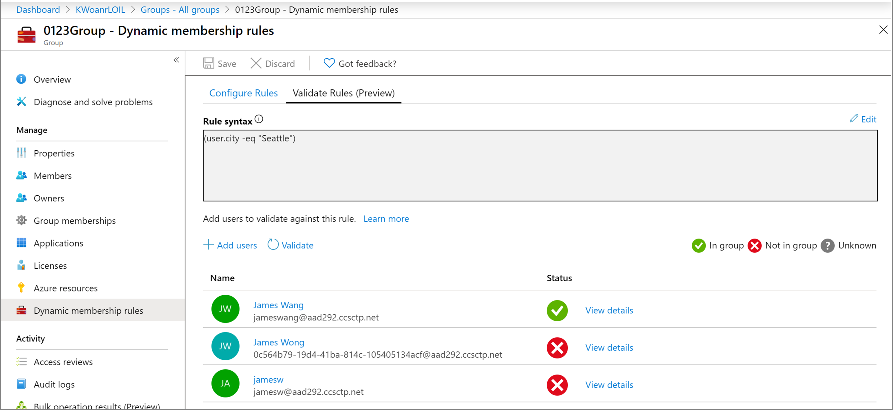
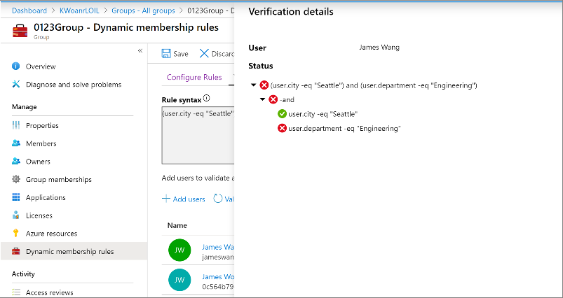

# Validate a dynamic group membership rule (preview) in Azure Active Directory

Azure Active Directory (Azure AD) now provides the means to validate dynamic group rules (in public preview). On the **Validate rules** tab, you can validate your dynamic rule against sample group members to confirm the rule is working as expected. When creating or updating dynamic group rules, administrators want to know whether a user or a device will be a member of the group. This helps evaluate whether user or device meets the rule criteria and aid in troubleshooting when membership is not expected.

## Step-by-step walk-through

To get started, go to **Azure Active Directory** > **Groups**. Select an existing dynamic group or create a new dynamic group and click on Dynamic membership rules. You can then see the **Validate Rules** tab.

On **Validate rules** tab, you can select users to validate their memberships. 20 users or devices can be selected at one time.

After choosing the users or devices from the picker, and **Select**, validation will automatically start and validation results will appear.

The results tell whether a user is a member of the group or not. If the rule is not valid or there is a network issue, the result will show as **Unknown**. In case of **Unknown**, the detailed error message will describe the issue and actions needed.

You can modify the rule and validation of memberships will be triggered. To see why user is not a member of the group, click on "View details" and verification details will show the result of each expression composing the rule. Click **OK** to exit.

## Next steps

- [Dynamic membership rules for groups](groups-dynamic-membership.md)
