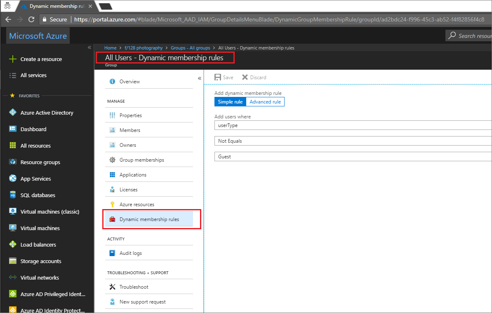

# Tutorial: Create a dynamically populated group
In Azure Active Directory (Azure AD), you can create attribute-based dynamic membership rules for security groups or Office 365 groups. Whenever any attributes of a user or device change, the system evaluates all dynamic group rules in your tenant to see if the change would trigger any group adds or removes.

If you don't have an Azure subscription, [create a free account](https://azure.microsoft.com/free/) before you begin.

In this tutorial, you learn how to:
> [!div class="checklist"]
> * Create a dynamically populated group of guest users from a particular partner company
> * Assign licenses to the group for the partner-specific features that members need to access 
> * Secure your **All users** group by removing guest users so that, for example, you can give them access to internal-only sites

## Prerequisites
This feature requires one Azure AD Premium license for you as the gobal administrator of the tenant. If you don't have one, in Azure AD, select **Licenses** > **Products** > **Try/Buy**.

You're not required to assign licenses to the users for them to be members in dynamic groups. You only need the minimum number of available Azure AD Premium P1 licenses in the tenant to cover all such users. 

## Create a group of guest users from Contoso 

1. Sign in to the Azure portal (https://portal.azure.com) with an account that is the gobal administrator for your tenant.
2. Select **Groups** > **New group**
  
3. On the **Group** blade 
  * Select **Security** as the group type
  * Enter `Guest users Contoso` as the name and description for the group
  * Change **Membership type** to **Dynamic User**
  * Select **Add dynamic query**
4. Select **Advanced rule**, and in the **Advanced rule** box, enter
  `(user.userType -eq "Guest") -and (user.companyName -eq "Contoso")`
5. Select **Add query** to close the blade
6. On the **Group** blade, select **Create** to create the group

## Assign licenses to the guest user group

1. In Azure AD, select **Licenses**, select one or more licenses, and then select **Assign**.
3. Select **Users and groups**, and select the *Guest users Contoso* group, and save your changes.
5. **Assignment options** allow you to turn on or off the service plans included the licenses that you selected. When you do, be sure to click **OK** to save your changes.
6. To complete the assignment, on the **Assign license** pane, click **Assign** at the bottom of the pane.

## Change All users group to members only

Now that you're assigning guest users to their own groups by company, you can now change the All Users group so that it is just for the members users in your tenant. For example, you can use it to assign apps and licensing that are specific to your home organization. 

   

## Clean up resources
Use the instructions in this tutorial to:

1. Delete any groups you created.
2. Remove any licenses you assigned.

## Next steps

In this tutorial, you learned how to:
> [!div class="checklist"]
> * Create a group of guest users
> * Assign licenses to your new group
> * Change All users group to members only

Advance to the next article to learn more group-based licensing basics
> [!div class="nextstepaction"]
> [Next steps button](../fundamentals/active-directory-licensing-whatis-azure-portal.md)

