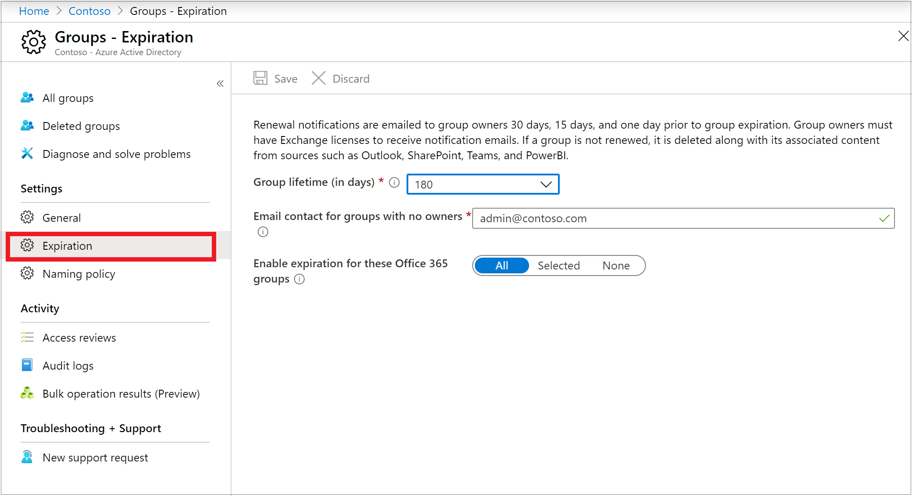
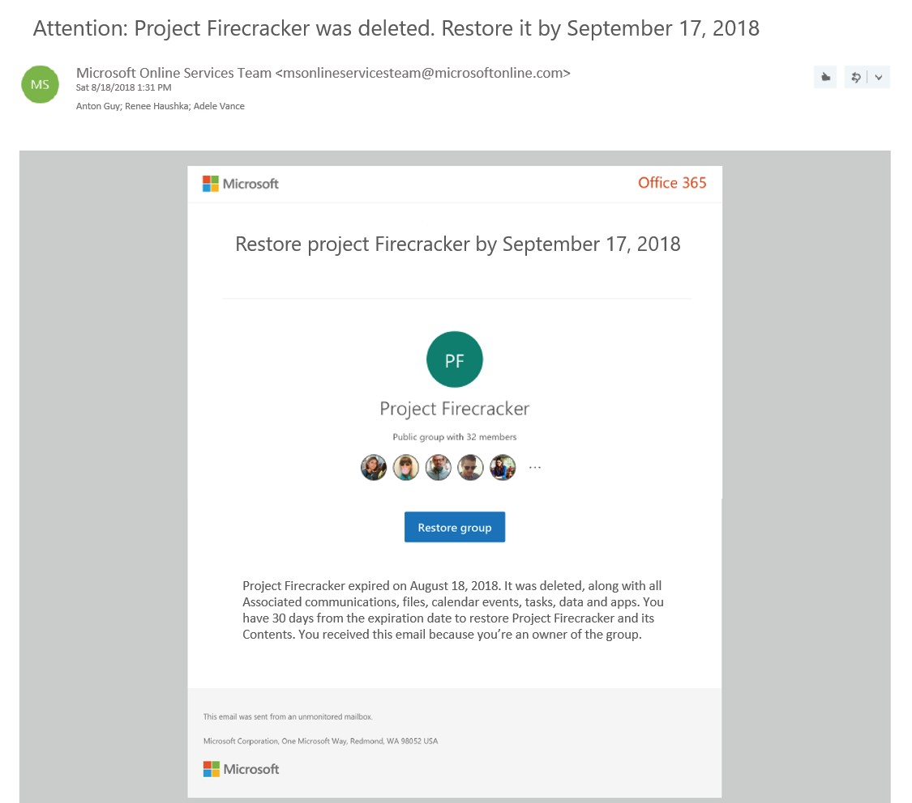

# Configure the expiration policy for Office 365 groups

You can now manage the lifecycle of Office 365 groups by setting an expiration policy for them. You can set expiration policy for only Office 365 groups in Azure Active Directory (Azure AD).

Once you set a group to expire:

- Owners of the group are notified to renew the group as the expiration nears
- Any group that is not renewed is deleted
- Any Office 365 group that is deleted can be restored within 30 days by the group owners or the administrator

Currently only one expiration policy can be configured for Office 365 groups on a tenant.

> [!NOTE]
> Configuring and using the expiration policy for Office 365 groups requires you to have on hand Azure AD Premium licenses for all members of the groups to which the expiration policy is applied.

For information on how to download and install the Azure AD PowerShell cmdlets, see [Azure Active Directory PowerShell for Graph 2.0.0.137](https://www.powershellgallery.com/packages/AzureADPreview/2.0.0.137).

## Roles and permissions

The following are roles that can configure and use expiration for Office 365 groups in Azure AD.

Role | Permissions
-------- | --------
Global administrator or User administrator | Can create, read, update, or delete the Office 365 groups expiration policy settings<br>Can renew any Office 365 group
User | Can renew an Office 365 group that they own<br>Can restore an Office 365 group that they own<br>Can read the expiration policy settings

For more information on permissions to restore a deleted group, see [Restore a deleted Office 365 group in Azure Active Directory](groups-restore-deleted.md).

## Set group expiration

1. Open the [Azure AD admin center](https://aad.portal.azure.com) with an account that is a global administrator in your Azure AD tenant.

2. Select **Groups**, then select **Expiration** to open the expiration settings.
  
   

3. On the **Expiration** blade, you can:

  * Set the group lifetime in days. You could select one of the preset values, or a custom value (should be 31 days or more). 
  * Specify an email address where the renewal and expiration notifications should be sent when a group has no owner. 
  * Select which Office 365 groups expire. You can enable expiration for **All** Office 365 groups, you can choose to enable only **Selected** Office 365 groups, or you select **None** to disable expiration for all groups.
  * Save your settings when you're done by selecting **Save**.

> [!NOTE]
> When you first set up expiration, any groups that are older than the expiration interval are set to 30 days until expiration. The first renewal notification email is sent out within a day. For example, Group A was created 400 days ago, and the expiration interval is set to 180 days. When you apply expiration policy, Group A has 30 days before it's deleted, unless the owner renews it.
> When a dynamic group is deleted and restored, it's seen as a new group and re-populated according to the rule. This process can take up to 24 hours.

## Email notifications

Email notifications such as this one are sent to the Office 365 group owners 30 days, 15 days, and 1 day prior to expiration of the group. The language of the email is determined by groups owner's preferred language or tenant language. If the group owner has defined a preferred language, or multiple owners have the same preferred language, then that language is used. For all other cases, tenant language is used.


From the **Renew group** notification email, group owners can directly access the group details page in the Access Panel. There, the users can get more information about the group such as its description, when it was last renewed, when it will expire, and also the ability to renew the group. The group details page now also includes links to the Office 365 group resources, so that the group owner can conveniently view the content and activity in their group.

When a group expires, the group is deleted one day after the expiration date. An email notification such as this one is sent to the Office 365 group owners informing them about the expiration and subsequent deletion of their Office 365 group.



The group can be restored within 30 days of its deletion by selecting **Restore group** or by using PowerShell cmdlets, as described in [Restore a deleted Office 365 group in Azure Active Directory](groups-restore-deleted.md). Please note that the 30-day group restoration period is not customizable.
    
If the group you're restoring contains documents, SharePoint sites, or other persistent objects, it might take up to 24 hours to fully restore the group and its contents.

## How to retrieve Office 365 group expiration date
In addition to Access Panel where users can view group details including expiration date and last renewed date, expiration date of an Office 365 group can be retrieved from Microsoft Graph REST API Beta. expirationDateTime as a group property has been enabled in Microsoft Graph Beta. It can be retrieved with a GET request. For more details, please refer to [this example](https://docs.microsoft.com/graph/api/group-get?view=graph-rest-beta#example).

> [!NOTE]
> In order to manage group memberships on Access Panel, "Restrict access to Groups in Access Panel" needs to be set to "No" in Azure Active Directory Groups General Setting.


## How Office 365 group expiration works with a mailbox on legal hold
When a group expires and is deleted, then 30 days after deletion the group's data from apps like Planner, Sites, or Teams is permanently deleted, but the group mailbox that is on legal hold is retained and is not permanently deleted. The administrator can use Exchange cmdlets to restore the mailbox to fetch the data. 

## How Office 365 group expiration works with retention policy
The retention policy is configured by way of the Security and Compliance Center. If you have set up a retention policy for Office 365 groups, when a group expires and is deleted, the group conversations in the group mailbox and files in the group site are retained in the retention container for the specific number of days defined in the retention policy. Users won't see the group or its content after expiration, but can recover the site and mailbox data via e-discovery.

## PowerShell examples
Here are examples of how you can use PowerShell cmdlets to configure the expiration settings for Office 365 groups in your tenant:

1. Install the PowerShell v2.0 module and sign in at the PowerShell prompt:
   ```powershell
   Install-Module -Name AzureAD
   Connect-AzureAD
   ```
2. Configure the expiration settings
   New-AzureADMSGroupLifecyclePolicy:  This cmdlet sets the lifetime for all Office 365 groups in the tenant to 365 days. Renewal notifications for Office 365 groups without owners will be sent to ‘emailaddress@contoso.com’
  
   ```powershell
   New-AzureADMSGroupLifecyclePolicy -GroupLifetimeInDays 365 -ManagedGroupTypes All -AlternateNotificationEmails emailaddress@contoso.com
   ```
3. Retrieve the existing policy
   Get-AzureADMSGroupLifecyclePolicy: This cmdlet retrieves the current Office 365 group expiration  settings that have been configured. In this example, you can see:
   * The policy ID 
   * The lifetime for all Office 365 groups in the tenant is set to 365 days
   * Renewal notifications for Office 365 groups without owners will be sent to ‘emailaddress@contoso.com.’
  
   ```powershell
   Get-AzureADMSGroupLifecyclePolicy
  
   ID                                    GroupLifetimeInDays ManagedGroupTypes AlternateNotificationEmails
   --                                    ------------------- ----------------- ---------------------------
   26fcc232-d1c3-4375-b68d-15c296f1f077  365                 All               emailaddress@contoso.com
   ``` 
   
4. Update the existing policy
   Set-AzureADMSGroupLifecyclePolicy: This cmdlet is used to update an existing policy. In the example below, the group lifetime in the existing policy is changed from 365 days to 180 days. 
  
   ```powershell
   Set-AzureADMSGroupLifecyclePolicy -Id "26fcc232-d1c3-4375-b68d-15c296f1f077" -GroupLifetimeInDays 180 -AlternateNotificationEmails "emailaddress@contoso.com"
   ```
  
5. Add specific groups to the policy
   Add-AzureADMSLifecyclePolicyGroup: This cmdlet adds a group to the lifecycle policy. As an example:
  
   ```powershell
   Add-AzureADMSLifecyclePolicyGroup -Id "26fcc232-d1c3-4375-b68d-15c296f1f077" -groupId "cffd97bd-6b91-4c4e-b553-6918a320211c"
   ```
  
6. Remove the existing Policy
   Remove-AzureADMSGroupLifecyclePolicy: This cmdlet deletes the Office 365 group expiration settings but requires the policy ID. This will disable expiration for Office 365 groups. 
  
   ```powershell
   Remove-AzureADMSGroupLifecyclePolicy -Id "26fcc232-d1c3-4375-b68d-15c296f1f077"
   ```
  
The following cmdlets can be used to configure the policy in more detail. For more information, see [PowerShell documentation](https://docs.microsoft.com/powershell/module/azuread/?view=azureadps-2.0-preview&branch=master#groups).

* Get-AzureADMSGroupLifecyclePolicy
* New-AzureADMSGroupLifecyclePolicy
* Get-AzureADMSGroupLifecyclePolicy
* Set-AzureADMSGroupLifecyclePolicy
* Remove-AzureADMSGroupLifecyclePolicy
* Add-AzureADMSLifecyclePolicyGroup
* Remove-AzureADMSLifecyclePolicyGroup
* Reset-AzureADMSLifeCycleGroup   
* Get-AzureADMSLifecyclePolicyGroup

## Next steps
These articles provide additional information on Azure AD groups.

* [See existing groups](../fundamentals/active-directory-groups-view-azure-portal.md)
* [Manage settings of a group](../fundamentals/active-directory-groups-settings-azure-portal.md)
* [Manage members of a group](../fundamentals/active-directory-groups-members-azure-portal.md)
* [Manage memberships of a group](../fundamentals/active-directory-groups-membership-azure-portal.md)
* [Manage dynamic rules for users in a group](groups-dynamic-membership.md)
