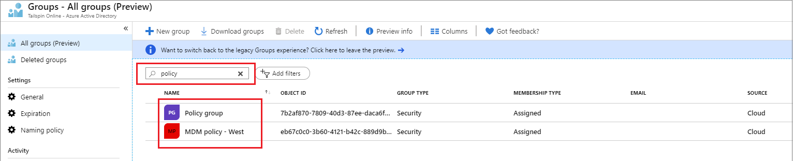
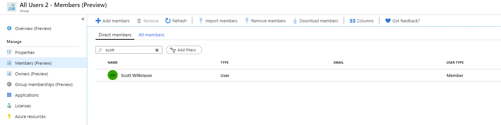

# Search groups and members (preview) in Azure Active Directory

This article tells you how to search for members and owners of a group and how to use search filters as part of the groups improvement preview in the Azure Active Directory (Azure AD) portal. There are lots of improvements in the groups experiences to help you manage your groups, including members and owners, quickly and easily. For more information about previews, see [Supplemental Terms of Use for Microsoft Azure Previews](https://azure.microsoft.com/support/legal/preview-supplemental-terms/).

Changes in this preview include:

- New groups search capabilities, such as substring search in group names
- New filtering and sorting options on member and owner lists
- New search capabilities for member and owner lists
- More accurate group counts for large groups

## Enabling and managing the preview

We’ve made it easy to join the preview:

  1. Sign in to the [Azure AD portal](https://portal.azure.com), and select **Groups**.
  2. From the Groups – All groups page, select the banner at the top of the page to join the preview.

You can also check out the the latest features and improvements by selecting **Preview info** on the **All groups** page. After you join the preview, you can see the preview tag on all groups pages that have improvements and are part of the preview. Not every groups page has been updated as part of this preview.

If you are having any issues, you can switch back the legacy experience by selecting the banner at the top of the **All groups** page. We appreciate your feedback so that we can improve our experience.

## Group search and sorting

The groups list search has been enhanced so that when you can enter a search string, the search automatically perform a `startswith` and substring search on the list of group names. The substring search is performed only on whole words, and doesn't include special characters. Substring search is case-sensitive.

For example, a search for “policy” will now return both "MDM policy – West" and "Policy group." A group named "New_policy" wouldn't be returned.

- You can perform the same search on group membership lists as well.
- You can now sort the groups list by name using the arrows to the right of the name column heading to sort the list in ascending or descending order.

## Group member search and filtering

### Search group member and owner lists

You can now search the members of a specific group by name, and perform the same search on the list of a the group's owners as well. In the new experience, if you enter a string in the search box, a startswith search will automatically performed. For example, a search for “Scott” will return Scott Wilkinson.

### Filter member and owners list

In addition to search, now you can filter the member and owner lists by user type. This is the information found in the User Type column of the list. So, you can filter the list by members and guests to determine if there are any guests in the group.

### View and manage membership

In addition to viewing the direct members of a specific group, you can now view the list of all members of the group within the Members page. The members list includes all the unique members of group including any transitive members.

You can also search and filter the direct members list and the all members list individually. Filtering the all members list does not affect the filters that are applied on the direct members list.

## Improved group member counts

We’ve improved the group **Overview** page to provide group member counts for groups of all sizes. You can see the member counts even for groups with more than 1,000 members. You can now see the total number of direct members for a group and the total membership count (all the unique members of group including transitive members) on the **Overview** page.

## Next steps

These articles provide additional information on working with groups in Azure AD.

- [View your groups and members](../fundamentals/active-directory-groups-view-azure-portal.md)
- [Manage group membership](../fundamentals/active-directory-groups-membership-azure-portal.md)
- [Manage dynamic rules for users in a group](groups-create-rule.md)
- [Edit your group settings](../fundamentals/active-directory-groups-settings-azure-portal.md)
- [Manage access to resources using groups](../fundamentals/active-directory-manage-groups.md)
- [Manage access to SaaS apps using groups](groups-saasapps.md)
- [Manage groups using PowerShell commands](groups-settings-v2-cmdlets.md)
- [Add an Azure subscription to Azure Active Directory](../fundamentals/active-directory-how-subscriptions-associated-directory.md)
