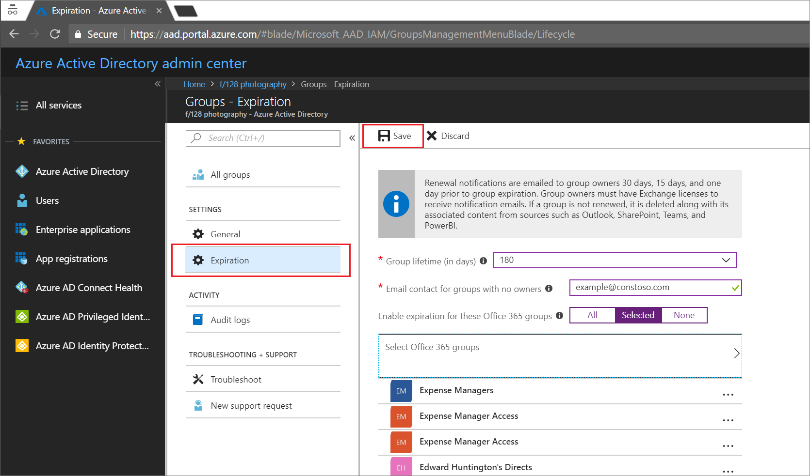

# Quickstart: Set Office 365 groups to expire in Azure Active Directory

In this quickstart, you set the expiration policy for your Office 365 groups. When users can set up their own groups, unused groups can multiply. One way to manage unused groups is to set those groups to expire, to reduce the maintenance of manually deleting groups.

Expiration policy is simple:

* Group owners are notified to renew an expiring group
* A group that is not renewed is deleted
* A deleted Office 365 group can be restored within 30 days by a group owner or by an Azure AD administrator

If you don't have an Azure subscription, [create a free account](https://azure.microsoft.com/free/) before you begin.

## Prerequisite

You must be a Global Administrator or User Account Administrator in the tenant to set up group expiration.

## Turn on user creation for groups

1. Sign in to the [Azure portal](https://portal.azure.com) with an account that's a Global Administrator or User Account Administrator for the directory.

2. Select **Groups**, and then select **General**.
  
  

3. Set  **Users can create Office 365 groups** to **Yes**.

4. Select **Save** to save the groups settings when you're done.

## Set group expiration

1. Iin to the [Azure portal](https://portal.azure.com), select **Azure Active Directory** > **Groups** > **Expiration** to open the expiration settings.
  
  

2. Set the expiration interval. Select a preset value or enter a custom value over 31 days. 

3. Provide an email address where expiration notifications should be sent when a group has no owner.

4. For this quickstart, set **Enable expiration for these Office 365 groups** to **All**.

5. Select **Save** to save the expiration settings when you're done.

That's it! In this quickstart, you successfully set the expiration policy for the selected Office 365 groups.

## Clean up resources

**To remove the expiration policy**

1. Ensure that you are signed in to the [Azure portal](https://portal.azure.com) with an account that is the Global Administrator for your tenant.
2. Select **Azure Active Directory** > **Groups** > **Expiration**.
3. Set **Enable expiration for these Office 365 groups** to **None**.

**To turn off user creation for groups**

1. Select **Azure Active Directory** > **Groups** > **General**. 
2. Set **Users can create Office 365 groups in Azure portals** to **No**.

## Next steps

For more information about expiration including technical constraints, adding a list of custom blocked words, and end user experiences across Office 365 apps, see the following article containing those expiration policy details:

> [!div class="nextstepaction"]
> [Expiration policy all details](groups-lifecycle.md)