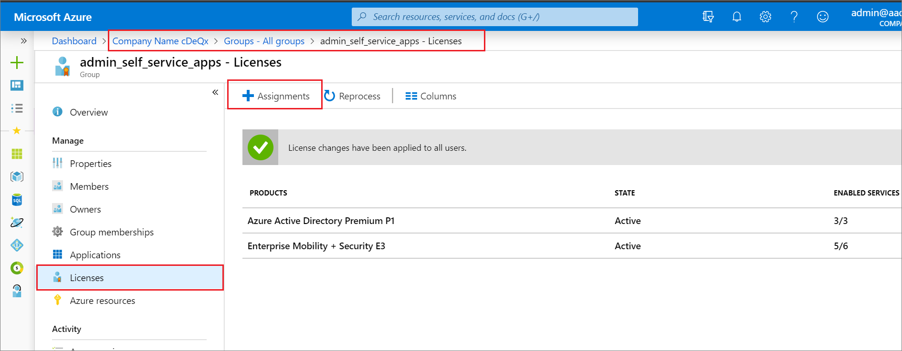
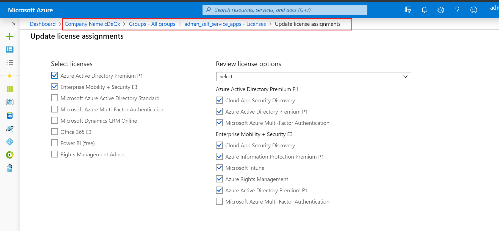

# Change license assignments for a user or group in Azure Active Directory

This article describes how to move users and groups between service license plans in Azure Active Directory (Azure AD). The goal Azure AD's approach is to ensure that there's no loss of service or data during the license change. Users should switch between services seamlessly. The license plan assignment steps in this article describe changing a user or group on Office 365 E1 to Office 365 E3, but the steps apply ao all license plans. When you update license assignments for a user or group, the license assignment removals and new assignments are made simultaneously so that users do not lose access to their services during license changes or see license conflicts between plans.

## Before you begin

Before you update the license assignments, it's important to verify certain assumptions are true for all of the users or groups to be updated. If the assumptions aren't true for all of the users in a group, the migration might fail for some. As a result, some of the users might lose access to services or data. Ensure that:

- Users have the current license plan (in this case, Office 365 E1) that's assigned to a group snd inherited by the user and not assigned directly.

- You have enough available licenses for the license plan you're assigning. If you don't have enough licenses, some users might not be assigned the new license plan. You can check the number of available licenses.

- Users don't have other assigned service licenses that can conflict with the desired license or prevent removal of the current license. For example, a license from a service such as Workplace Analytics or Project Online that has a dependency on other services.

- If you manage groups on-premises and sync them into Azure AD via Azure AD Connect, then you add or remove users by using your on-premises system. It can take some time for the changes to sync with Azure AD to be picked up by group licensing.

- If you're using Azure AD dynamic group memberships, you add or remove users by changing their attributes, but the update process for license assignments remains the same.

## Change user license assignments

1. Sign in to the [Azure portal](https://portal.azure.com/) using a License administrator account in your Azure AD organization.
1. Select **Azure Active Directory**, and then open the **Profile** page for the user or the **Overview** page for the group.
1. Select **Licenses**.
1. Select the **Assignments** command to edit license assignment for the user or group. 

Office 365 E1 to Office 365 E3
Mock up E1

click E3
check services list to ensure that at least the all your previous E1 services assigned to the user are selected
remove E1

Note
Charmi email
In the update assignments screen
checkboxes are unavailable because inherited by GBL

Azure AD will show you which features it is licensing for each license plan assigned to the user, and automatically resolves license conflicts.

    

1. Edit the options until the licenses are as you want them to be.

    

## Update group license assignments

Change direct assignment at a group level

Group > licenses > Assignments

Change group license plans

group-based licensing is just group licenses
Products appear to me to be license plans. Shouldn't we call them that in the UI? Some of those "products" enable all kinds of services that the user can't distinguish from separate products. But license plans enable combinations of services.

## Next steps

Learn about other scenarios for license management through groups in the following articles:

- [Assigning licenses to a group in Azure Active Directory](../users-groups-roles/licensing-groups-assign.md)
- [Identifying and resolving license problems for a group in Azure Active Directory](../users-groups-roles/licensing-groups-resolve-problems.md)
- [How to migrate individual licensed users to group licensing in Azure Active Directory](../users-groups-roles/licensing-groups-migrate-users.md)
- [Azure Active Directory group licensing additional scenarios](../users-groups-roles/licensing-group-advanced.md)
- [PowerShell examples for group licensing in Azure Active Directory](../users-groups-roles/licensing-ps-examples.md)
