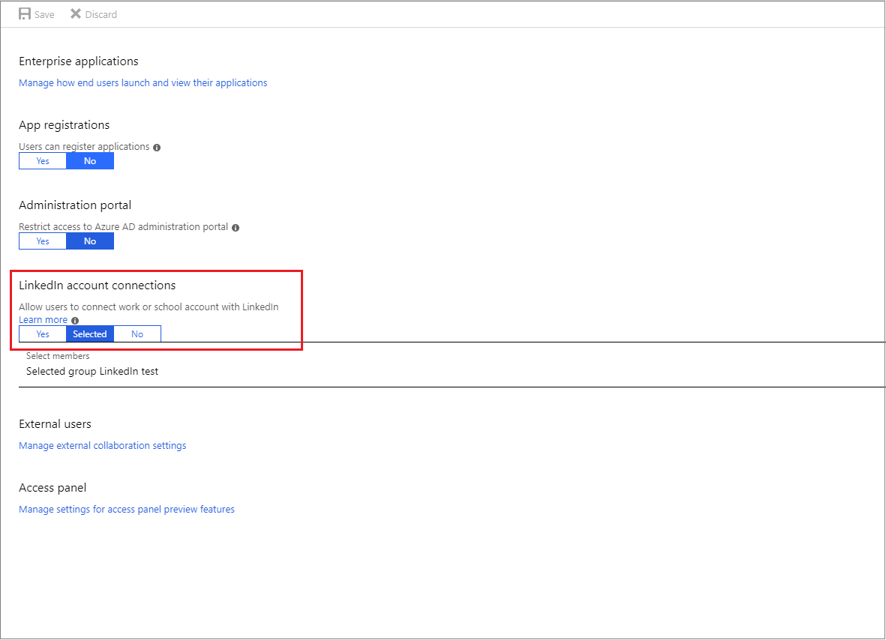

# LinkedIn account connections for Microsoft apps and services
In this article, you can learn how to manage LinkedIn account connections for your tenant in the Azure Active Directory (Azure AD) admin center. 

> [!IMPORTANT]
> LinkedIn account connections functionality is currently being rolled out to Azure AD tenants. When it is rolled out to your tenant, it is enabled by default. It is not available for United States government customers, and organizations with Exchange Online mailboxes hosted in Australia, Canada, China, France, Germany, India, South Korea, United Kingdom, Japan, and South Africa. Support for these mailbox locations is coming soon.  For an up-to-date view of rollout information, see the [Office 365 Roadmap](https://products.office.com/business/office-365-roadmap?filters=%26freeformsearch=linkedin#abc) page.

## Benefit to users
After users connect their LinkedIn account, LinkedIn information is used to show personalized information and features in various Microsoft apps or services. Users can see insights about the people they work with in the Microsoft profile card, even if those people outside your organization. Over time, their LinkedIn experience will also become more relevant and tailored to their work. For example, LinkedIn can suggest new connections based on who users work with, or surface insights about people on their calendar that day.

## How LinkedIn account connections appear to the user
LinkedIn account connections allow users to see public LinkedIn profile information within some of their Microsoft apps. Users in your tenant can choose to connect their LinkedIn and Microsoft work or school accounts to see additional LinkedIn profile information. For more information, see [LinkedIn information and features in Microsoft apps and services](https://go.microsoft.com/fwlink/?linkid=850740).

When users in your organization connect their LinkedIn and Microsoft work or school accounts, they have two options: 
* Give permission to share data between both accounts. This means that they give permission for their LinkedIn account to share data with their Microsoft work or school account, as well as their Microsoft work or school account to share data with their LinkedIn account. Data that is shared with LinkedIn leaves the online services. 
* Give permission to share data only from their LinkedIn account to their Microsoft work and school account

For more information about data that is shared between users’ LinkedIn and Microsoft work or school accounts, see [LinkedIn in Microsoft applications at your work or school](https://www.linkedin.com/help/linkedin/answer/84077). 
* [Users can disconnect accounts](https://www.linkedin.com/help/linkedin/answer/85097) and remove data sharing permissions at any time. 
* [Users can control how their own LinkedIn profile is viewed](https://www.linkedin.com/help/linkedin/answer/83), including whether their profile can be viewed in Microsoft apps.

## Privacy considerations
Enabling LinkedIn account connections allows Microsoft apps and services to access some of your users' LinkedIn information. Read the [Microsoft Privacy Statement](https://privacy.microsoft.com/privacystatement/) to learn more about the privacy considerations when enabling LinkedIn account connections in Azure AD. 

## Manage LinkedIn account connections
LinkedIn account connections functionality is on by default for your entire tenant. You can choose to disable LinkedIn account connections for your entire tenant, or enable LinkedIn account connections for selected users in your tenant. 

### Enable or disable LinkedIn account connection for your tenant in the Azure portal

1. Sign in to the [Azure Active Directory admin center](https://aad.portal.azure.com/) with an account that's a global admin for the Azure AD tenant.
2. Select **Users**.
3. On the **Users** blade, select **User settings**.
4. Under **LinkedIn account connections**:
  * Select **Yes** to enable LinkedIn account connections for all users in your tenant
  * Select **Selected** to enable LinkedIn account connections for only selected tenant users
  * Select **No** to disable LinkedIn account connections for all users
  
5. Save your settings when you're done by selecting **Save**.

### Enable or disable LinkedIn account connections for your organization's Office 2016 apps using Group Policy

1. Download the [Office 2016 Administrative Template files (ADMX/ADML)](https://www.microsoft.com/download/details.aspx?id=49030)
2. Extract the **ADMX** files and copy them to your central store.
3. Open Group Policy Management.
4. Create a Group Policy Object with the following setting: **User Configuration** > **Administrative Templates** > **Microsoft Office 2016** > **Miscellaneous** > **Show LinkedIn features in Office applications**.
5. Select **Enabled** or **Disabled**.
  * When the policy is **Enabled**, the **Show LinkedIn features in Office applications** setting found in the Office 2016 Options dialog is enabled. This also means that users in your organization can use LinkedIn features in their Office applications.
  * When the policy is **Disabled**, the **Show LinkedIn features in Office applications** setting found in the Office 2016 Options dialog is set to the disabled state, and end users can't change this setting. Users in your organization can't use LinkedIn features in their Office 2016 applications.

This group policy affects only Office 2016 apps for a local computer. Users can see LinkedIn features in profile cards throughout Office 365 even if they disable LinkedIn in their Office 2016 apps. 

### Learn more 
* [LinkedIn information and features in your Microsoft apps](https://go.microsoft.com/fwlink/?linkid=850740)

* [LinkedIn help center](https://www.linkedin.com/help/linkedin)

## Next steps
Use the following link to see your current LinkedIn account connections setting in the Azure portal:

[Configure LinkedIn account connections](https://aad.portal.azure.com/#blade/Microsoft_AAD_IAM/UserManagementMenuBlade/UserSettings) 