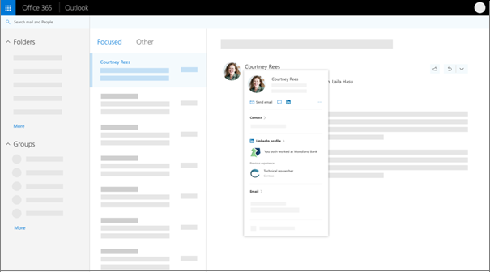

# LinkedIn account connections data sharing and consent

You can enable users in your Active Directory (Azure AD) organization to consent to connect their Microsoft work or school account with their LinkedIn account. After a user connects their accounts, information and highlights from LinkedIn are available in some Microsoft apps and services. Users can also expect their networking experience on LinkedIn to be improved and enriched with information from Microsoft.

To see LinkedIn information in Microsoft apps and services, users must consent to connect their own Microsoft and LinkedIn accounts. Users are prompted to connect their accounts the first time they click to see someone's LinkedIn information on a profile card in Outlook, OneDrive or SharePoint Online. LinkedIn account connections are not fully enabled for your users until they consent to the experience and to connect their accounts.

[!INCLUDE [active-directory-gdpr-note](../../../includes/gdpr-hybrid-note.md)]

## Benefits of sharing LinkedIn information

Access to LinkedIn information within Microsoft apps and services makes it easier for your users to connect, engage, and build professional relationships with colleagues, customers, and partners inside and outside your organization. New users can get up to speed faster by connecting with colleagues, learning more about them, and easily accessing more information. Here is an example of how LinkedIn information appears on the profile card in Microsoft apps:

## Enable and announce LinkedIn integration

You must be an Azure Active Directory Admin to manage the setting for your organization. You can enable it for all users, or for a specific set of users.

1. To enable or disable the integration, follow the steps in [Consent to LinkedIn integration for your Azure AD organization](linkedin-integration.md).
2. When you announce the LinkedIn integration in your organization, point your users to the FAQ about [LinkedIn information in Microsoft apps and services](https://support.office.com/article/about-linkedin-information-and-features-in-microsoft-apps-and-services-dc81cc70-4d64-4755-9f1c-b9536e34d381). The article provides information about where LinkedIn information shows up, how to connect accounts, and more.

## User consent for data access in Microsoft and LinkedIn

Data that is accessed from LinkedIn is not stored permanently in Microsoft services. Data that is accessed from Microsoft is not stored permanently with LinkedIn, except for Contacts. Microsoft Contacts are stored on LinkedIn until users remove them, as described in [deleting imported contacts from LinkedIn](https://www.linkedin.com/help/linkedin/answer/43377).

When users connect their accounts, information and insights from LinkedIn are available in some Microsoft apps, like the profile card. Users can also expect their networking experience on LinkedIn to be improved and enriched with information from Microsoft.
When users in your organization connect their LinkedIn and Microsoft work or school accounts, they have two options:

* Give permission for data to be accessed from both accounts. This means that they give permission for their Microsoft or work account to access data from their LinkedIn account, and for [their LinkedIn account to access data from their Microsoft work or school account](https://www.linkedin.com/help/linkedin/answer/84077).
* Give permission for only the LinkedIn data to be accessed by their Microsoft work and school account.

Users can disconnect accounts and remove data access permissions at any time, and [users can control how their own LinkedIn profile is viewed](https://www.linkedin.com/help/linkedin/answer/83), including whether their profile can be viewed in Microsoft apps.

### LinkedIn account data

When you connect your Microsoft and LinkedIn accounts, you allow LinkedIn to provide the following data to Microsoft:

* Profile data - includes LinkedIn identity, contact information, and the information you share with others on your [LinkedIn profile](https://www.linkedin.com/help/linkedin/answer/15493).
* Interests data - includes interests on LinkedIn, such as people and topics you follow, courses groups, and content you like and share.
* Subscriptions data - includes subscriptions to LinkedIn applications and services along with associated data. 
* Connections data - includes your [LinkedIn network](https://www.linkedin.com/help/linkedin/answer/110) including profiles and contact information of your 1st-degree connections.

Data that is accessed from LinkedIn is not stored permanently in Microsoft services. For more information about Microsoft’s use of personal data, see the [Microsoft Privacy Statement](https://privacy.microsoft.com/privacystatement/).

### Microsoft work or school account data

When you connect your Microsoft and LinkedIn accounts, you allow Microsoft to provide the following data to LinkedIn:

* Profile data - includes information like your first name, last name, profile photo, email address, manager, and people that you manage.
* Calendar data - includes meetings in your calendars, their times, locations, and attendees' contact information. Information about the meeting, like agenda, content, or meeting title is not included in the calendar data.
* Interests data - includes the interests associated with your account, based on your use of Microsoft services, such as Cortana and Bing for Business.
* Subscriptions data - includes subscriptions provided by your organization to Microsoft apps and services, such as Office 365.
* Contacts data - includes contact lists in Outlook, Skype, and other Microsoft account services, including the contact information for people you frequently communicate or collaborate with. Contacts will be periodically imported, stored, and used by LinkedIn, for example to suggest connections, help organize contacts, and show updates about contacts.

Data that is accessed from Microsoft is not stored permanently with LinkedIn, except for Contacts. Microsoft Contacts are stored on LinkedIn until users remove them. Learn more about [deleting imported contacts from LinkedIn](https://www.linkedin.com/help/linkedin/answer/43377).

For more information on LinkedIn’s use of personal data, see the [LinkedIn Privacy Policy](https://www.linkedin.com/legal/privacy-policy). For LinkedIn services, data transfer, and storage, data can flow from the European Union to the United States and back, and your privacy is protected as described in [European Union data transfers](https://www.linkedin.com/help/linkedin/answer/62533).

## Next steps

* [LinkedIn in Microsoft applications with your work or school account](https://www.linkedin.com/help/linkedin/answer/84077)
