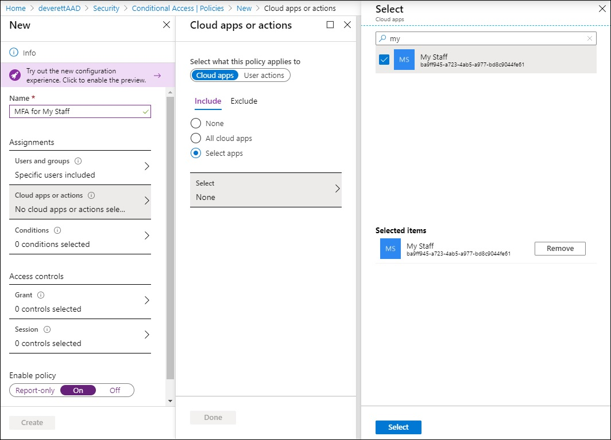
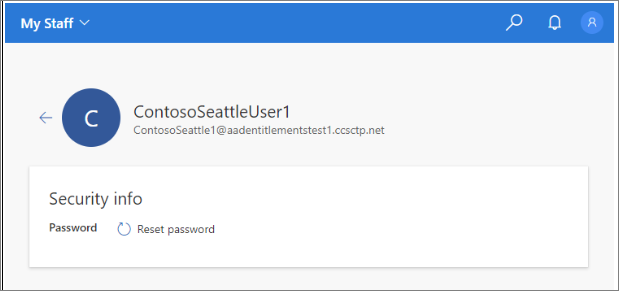

# Manage your users with My Staff (preview)

My Staff enables you to delegate to a figure of authority, such as a store manager or a team lead, the permissions to ensure that their staff members are able access to their Azure AD accounts. Instead of relying on a central helpdesk, organizations can delegate common tasks such as resetting passwords or changing phone numbers to a team manager. With My Staff, a user who can't access their account can regain access in just a couple of clicks, with no helpdesk or IT staff required.

Before you configure My Staff for your organization, we recommend that you review this documentation as well as the [user documentation](../user-help/my-staff-team-manager.md) to ensure you understand the functionality and impact of this feature on your users. You can leverage the user documentation to train and prepare your users for the new experience and help to ensure a successful rollout.

SMS-based authentication for users is a public preview feature of Azure Active Directory. For more information about previews, see [Supplemental Terms of Use for Microsoft Azure Previews](https://azure.microsoft.com/support/legal/preview-supplemental-terms/)

## How My Staff works

My Staff is based on administrative units (AUs), which are a container of resources which can be used to restrict the scope of a role assignment's administrative control. In My Staff, AUs are used to define a subset of an organization's users such as a store or department. Then, for example, a team manager could be assigned to a role whose scope is one or more AUs. In the example below, the user has been granted the Authentication Administrative role, and the three AUs are the scope of the role. For more information about administrative units, see [Administrative units management in Azure Active Directory](directory-administrative-units.md).

## Before you begin

To complete this article, you need the following resources and privileges:

* An active Azure subscription.

  * If you don't have an Azure subscription, [create an account](https://azure.microsoft.com/free/?WT.mc_id=A261C142F).
* An Azure Active Directory tenant associated with your subscription.

  * If needed, [create an Azure Active Directory tenant](../fundamentals/sign-up-organization.md) or [associate an Azure subscription with your account](../fundamentals/active-directory-how-subscriptions-associated-directory.md).
* You need *Global administrator* privileges in your Azure AD tenant to enable SMS-based authentication.
* Each user that's enabled in the text message authentication method policy must be licensed, even if they don't use it. Each enabled user must have one of the following Azure AD or Microsoft 365 licenses:

  * [Azure AD Premium P1 or P2](https://azure.microsoft.com/pricing/details/active-directory/)
  * [Microsoft 365 (M365) F1 or F3](https://www.microsoft.com/licensing/news/m365-firstline-workers)
  * [Enterprise Mobility + Security (EMS) E3 or E5](https://www.microsoft.com/microsoft-365/enterprise-mobility-security/compare-plans-and-pricing) or [Microsoft 365 (M365) E3 or E5](https://www.microsoft.com/microsoft-365/compare-microsoft-365-enterprise-plans)

## How to enable My Staff

Once you have configured AUs, you can apply this scope to your users who access My Staff. Only users who are assigned an administrative role can access My Staff. To enable My Staff, complete the following steps:

1. Sign into the Azure portal as a User administrator.
2. Browse to **Azure Active Directory** > **User settings** > **User feature previews** > **Manage user feature preview settings**.
3. Under **Administrators can access My Staff**, you can choose to enable for all users, selected users, or no user access.

> [!Note]
> Only users who've been assigned an admin role can access My Staff. If you enable My Staff for a user who is not assigned an admin role, they won't be able to access My Staff.

## Conditional access

You can protect the My Staff portal using Azure AD Conditional Access policy. Use it for tasks like requiring multi-factor authentication before accessing My Staff.

We strongly recommend that you protect My Staff using [Azure AD Conditional Access policies](https://docs.microsoft.com/azure/active-directory/conditional-access/). To apply a Conditional Access policy to My Staff, you must manually create the My Staff service principal using PowerShell.

### Apply a Conditional Access policy to My Staff

1. Install the [Microsoft Graph Beta PowerShell cmdlets](https://github.com/microsoftgraph/msgraph-sdk-powershell/blob/dev/samples/0-InstallModule.ps1).
1. Run the following commands:

        Connect-Graph -Scopes "Directory.AccessAsUser.All"
        New-MgServicePrincipal -DisplayName "My Staff" -AppId "ba9ff945-a723-4ab5-a977-bd8c9044fe61"

1. Create a Conditional Access policy that applies to the My Staff cloud application.

    

## Using My Staff

When a user goes to My Staff, they are shown the names of the [administrative units](directory-administrative-units.md) over which they have administrative permissions. In the [My Staff user documentation](../user-help/my-staff-team-manager.md), we use the term "location" to refer to administrative units. If an administrator's permissions do not have an AU scope, the permissions apply across the organization. After My Staff has been enabled, the users who are enabled and have been assigned an administrative role can access it through [https://mystaff.microsoft.com](https://mystaff.microsoft.com). They can select an AU to view the users in that AU, and select a user to open their profile.

## Reset a user's password

The following roles have permission to reset a user's password:

- [Authentication administrator](directory-assign-admin-roles.md#authentication-administrator)
- [Privileged authentication administrator](directory-assign-admin-roles.md#privileged-authentication-administrator)
- [Global administrator](directory-assign-admin-roles.md#global-administrator--company-administrator)
- [Helpdesk administrator](directory-assign-admin-roles.md#helpdesk-administrator)
- [User administrator](directory-assign-admin-roles.md#user-administrator)
- [Password administrator](directory-assign-admin-roles.md#password-administrator)

From **My Staff**, open a user's profile. Select **Reset password**.

- If the user is cloud-only, you can see a temporary password that you can give to the user.
- If the user is synced from on-premises Active Directory, you can enter a password that meets your on-premises AD policies. You can then give that password to the user.

    

The user is required to change their password the next time they sign in.

## Manage a phone number

From **My Staff**, open a user's profile.

- Select **Add phone number** section to add a phone number for the user
- Select **Edit phone number** to change the phone number
- Select **Remove phone number** to remove the phone number for the user

Depending on your settings, the user can then use the phone number you set up to sign in with SMS, perform multi-factor authentication, and perform self-service password reset.

To manage a user's phone number, you must be assigned one of the following roles:

- [Authentication administrator](directory-assign-admin-roles.md#authentication-administrator)
- [Privileged authentication administrator](directory-assign-admin-roles.md#privileged-authentication-administrator)
- [Global administrator](directory-assign-admin-roles.md#global-administrator--company-administrator)

## Search

You can search for AUs and users in your organization using the search bar in My Staff. You can search across all AUs and users in your organization, but you can only make changes to users who are in a AU over which you have been given admin permissions.

You can also search for a user within an AU. To do this, use the search bar at the top of the user list.

## Audit logs

You can view audit logs for actions taken in My Staff in the Azure Active Directory portal. If an audit log was generated by an action taken in My Staff, you will see this indicated under ADDITIONAL DETAILS in the audit event.

## Next steps

[My Staff user documentation](../user-help/my-staff-team-manager.md)
[Administrative units documentation](directory-administrative-units.md)
