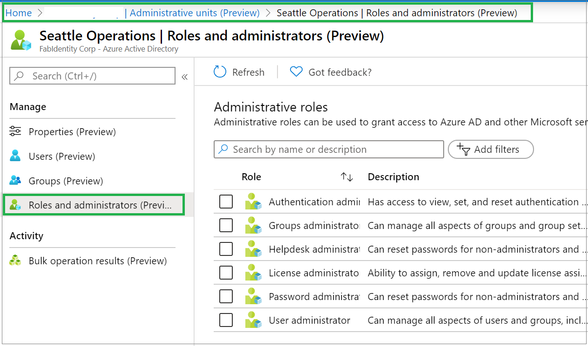
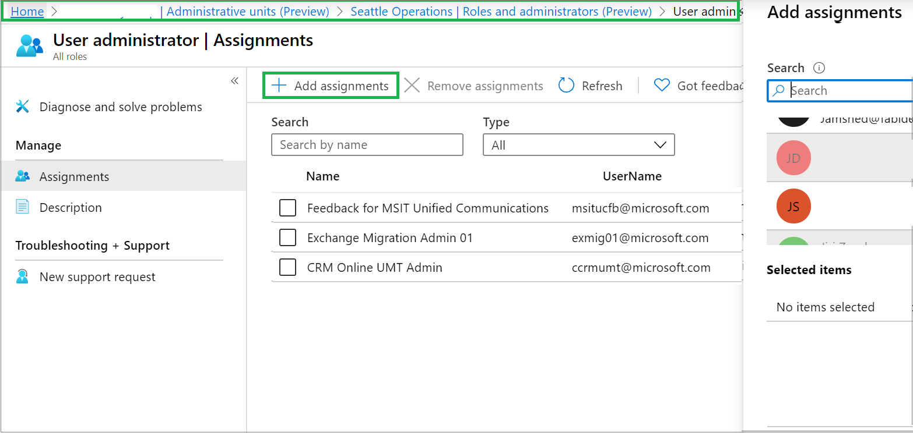

# Assign scoped roles to an administrative unit

In Azure Active Directory (Azure AD), you can assign users to an Azure AD role with a scope limited to one or more administrative units (AUs) for more granular administrative control.

For steps to prepare to use PowerShell and Microsoft Graph for administrative unit management, see [Get started](roles-admin-units-manage.md#get-started).

## Roles available

Role  |  Description
----- |  -----------
Authentication Administrator  |  Has access to view, set, and reset authentication method information for any non-admin user in the assigned administrative unit only.
Groups Administrator  |  Can manage all aspects of groups and groups settings like naming and expiration policies in the assigned administrative unit only.
Helpdesk Administrator  |  Can reset passwords for non-administrators and Helpdesk administrators in the assigned administrative unit only.
License Administrator  |  Can assign, remove and update license assignments within the administrative unit only.
Password Administrator  |  Can reset passwords for non-administrators and Password Administrators within the assigned administrative unit only.
User Administrator  |  Can manage all aspects of users and groups, including resetting passwords for limited admins within the assigned administrative unit only.

## Assign a scoped role

### Azure portal

Go to **Azure AD > Administrative units** in the portal. Select the administrative unit over which you want to assign the role to a user. On the left pane, select Roles and administrators to list all the available roles.

Select the role to be assigned and then select **Add assignments**. This will slide open a panel on the right where you can select one or more users to be assigned to the role.

### PowerShell

    $administrative = Get-AzureADAdministrativeUnit -Filter "displayname eq 'Test administrative unit 2'"
    $AdminUser = Get-AzureADUser -ObjectId 'janedoe@fabidentity.onmicrosoft.com'
    $uaRoleMemberInfo = New-Object -TypeName Microsoft.Open.AzureAD.Model.RoleMemberInfo -Property @{ObjectId = $AdminUser.ObjectId}
    Add-AzureADScopedRoleMembership -RoleObjectId $UserAdminRole.ObjectId -ObjectId $administrative unitObj.ObjectId -RoleMemberInfo  $uaRoleMemberInfo

The highlighted section may be changed as required for the specific environment.

### Microsoft Graph

    Http request
    POST /administrativeUnits/{id}/scopedRoleMembers
    
    Request body
    {
      "roleId": "roleId-value",
      "roleMemberInfo": {
        "id": "id-value"
      }
    }

## List the scoped admins on an AU

### Azure portal

All the role assignments done with an administrative unit scope can be viewed in the [Administrative units section of Azure AD](https://ms.portal.azure.com/?microsoft_aad_iam_adminunitprivatepreview=true&microsoft_aad_iam_rbacv2=true#blade/Microsoft_AAD_IAM/ActiveDirectoryMenuBlade/AdminUnit). Go to **Azure AD > Administrative units** in the portal. Select the admin unit for the role assignments you want to list. Select **Roles and administrators** and open a role to view the assignments in the admin unit.

### PowerShell

    $administrative unitObj = Get-AzureADAdministrativeUnit -Filter "displayname eq 'Test administrative unit 2'"
    Get-AzureADScopedRoleMembership -ObjectId $administrative unitObj.ObjectId | fl *

The highlighted section may be changed as required for the specific environment.

### Microsoft Graph

    Http request
    GET /administrativeUnits/{id}/scopedRoleMembers
    Request body
    {}

## Next steps

- [Administrative units troubleshooting and FAQ](roles-admin-units-faq-troubleshoot.md)
