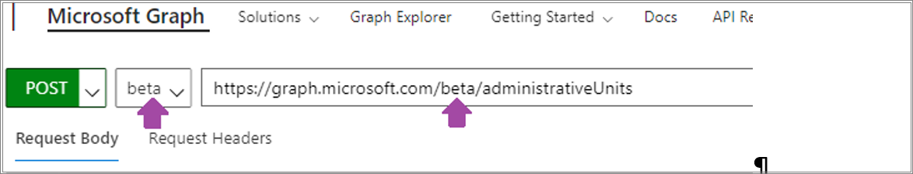
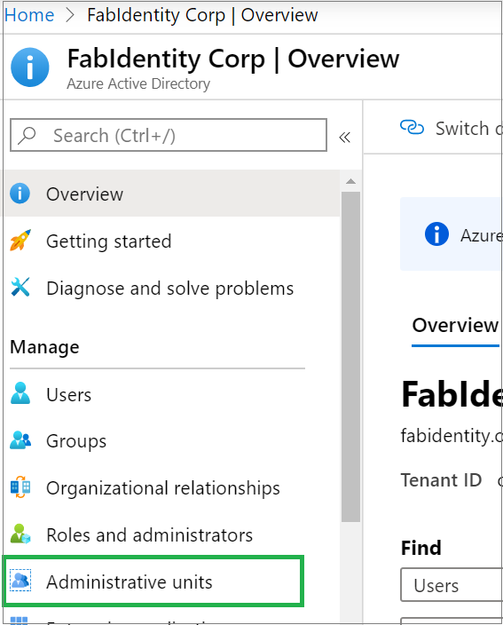
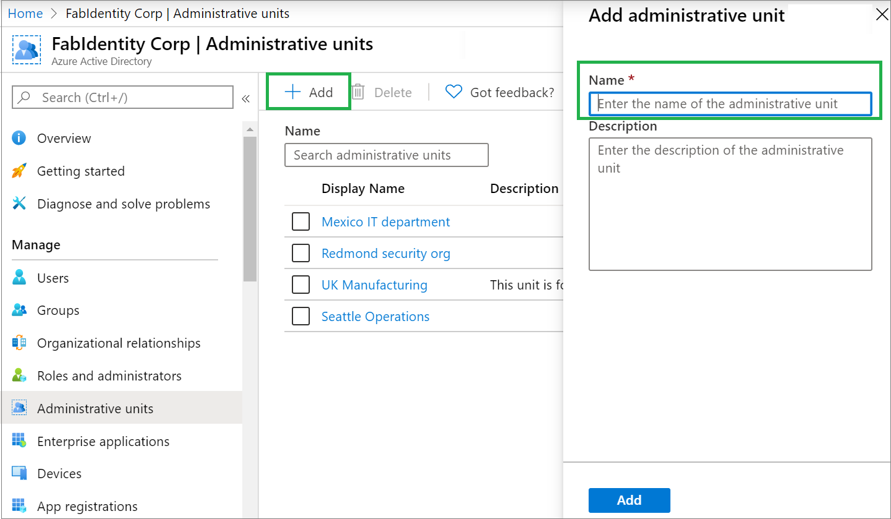
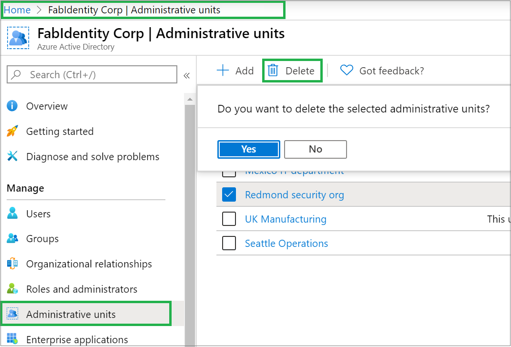

# Manage administrative units in Azure Active Directory

For more granular administrative control in Azure Active Directory (Azure AD), you can assign users to an Azure AD role with a scope that's limited to one or more administrative units (AUs).

## Get started

1. To run queries from the following instructions via [Graph Explorer](https://aka.ms/ge), do the following:

    a. In the Azure portal, go to Azure AD. In the applications list, select **Graph Explorer**, and then select **Grant admin consent to Graph Explorer**.

    

    b. In Graph Explorer, select the **beta** version.

    

1. Use the preview version of Azure AD PowerShell.

## Add an administrative unit

### Use the Azure portal

1. In the Azure portal, go to Azure AD, and then, in the left pane, select **Administrative units**.

    

1. Select **Add** and then enter the name of the administrative unit. Optionally, add a description of the administrative unit.

    

1. Select **Add** to finalize the administrative unit.

### Use PowerShell

Install Azure AD PowerShell (preview) before you try to run the following commands:

    Connect-AzureAD
    New-AzureADAdministrativeUnit -Description "West Coast region" -DisplayName "West Coast"

You can modify the values that are enclosed in quotation marks, as required.

### Use Microsoft Graph

    Http Request
    POST /administrativeUnits
    Request body
    {
        "displayName": "North America Operations",
        "description": "North America Operations administration"
    }

## Remove an administrative unit

In Azure AD, you can remove an administrative unit that you no longer need as a unit of scope for administrative roles.

### Use the Azure portal

1. In the Azure portal, go to **Azure AD** > **Administrative units**. 
1. Select the administrative unit to be deleted, and then select **Delete**. 
1. To confirm that you want to delete the administrative unit, select **Yes**. The administrative unit is deleted.

### Use PowerShell

    $delau = Get-AzureADAdministrativeUnit -Filter "displayname eq 'DeleteMe Admin Unit'"
    Remove-AzureADAdministrativeUnit -ObjectId $delau.ObjectId

You can modify the values that are enclosed in quotation marks, as required for the specific environment.

### Use the Graph API

    HTTP request
    DELETE /administrativeUnits/{Admin id}
    Request body
    {}

## Next steps

* [Manage users in an administrative unit](roles-admin-units-add-manage-users.md)
* [Manage groups in an administrative unit](roles-admin-units-add-manage-groups.md)
