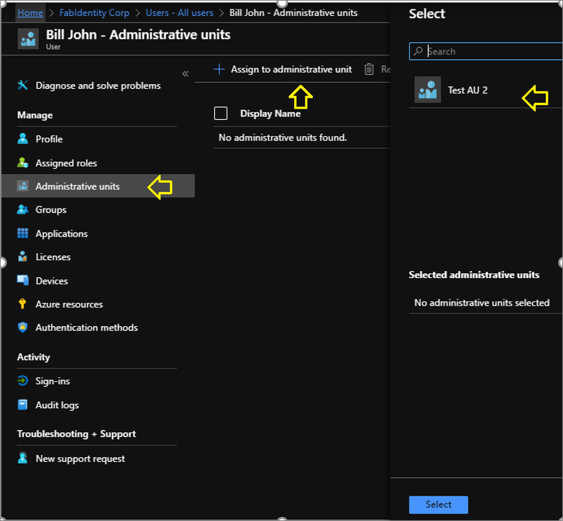
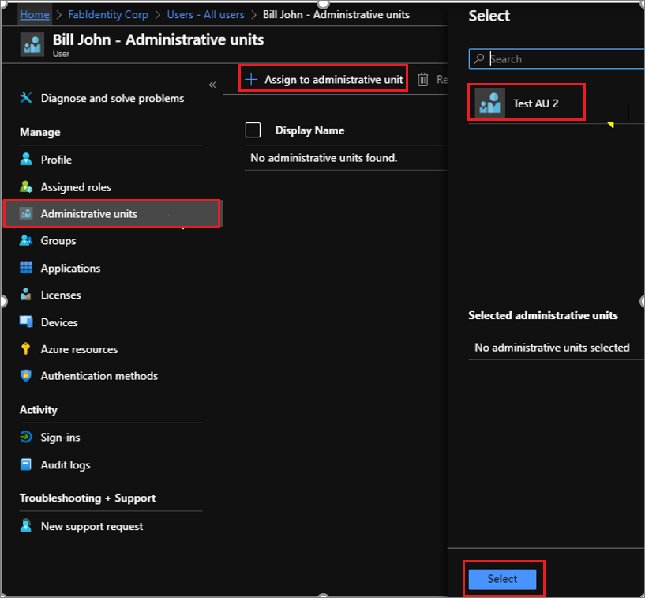

# Add and manage users in an administrative unit in Azure Active Directory

In Azure Active Directory (Azure AD), you can add users to an administrative unit (AU) for more granular administrative scope of control.

For steps to prepare to use PowerShell and Microsoft Graph for administrative unit management, see [Getting started](roles-aus-manage-admin-units.md#getting-started).

## Add users to an AU

### Azure portal

You can assign users to administrative units in two ways.

1. Individual assignment

    1. You can go to the Azure AD in the portal and select Users and select the user to be assigned to an administrative unit. You can then select Administrative units in the left panel. The user can be assigned to one or more administrative units by clicking on Assign to administrative unit and selecting the administrative units where the user is to be assigned.

       

    1. You can go to Azure AD in the portal and select Administrative units in the left pane and then select the administrative unit where the users is to be assigned. Select All users on the left pane and then select Add member. You can then go ahead and select one or more users to be assigned to the administrative unit from the right pane.

        

1. Bulk assignment
    Go to Azure AD in the portal and select Administrative units. Select the administrative unit where users are to be added. Proceed by clicking on All users -> Add members from .csv file. You can then download the CSV template and edit the file. The format is simple and needs a single UPN to be added in each line. Once the file is ready, save it at an appropriate location and then upload it in step 3 as highlighted in the snapshot.

        

### PowerShell

    $administrative unitObj = Get-AzureADAdministrativeUnit -Filter "displayname eq 'Test administrative unit 2'"
    $UserObj = Get-AzureADUser -Filter "UserPrincipalName eq 'billjohn@fabidentity.onmicrosoft.com'"
    Add-AzureADAdministrativeUnitMember -ObjectId $administrative unitObj.ObjectId -RefObjectId $UserObj.ObjectId

In the above example, the cmdlet Add-AzureADAdministrativeUnitMember is used to add the user to the administrative unit. The object ID of the Administrative Unit where user is to be added and the object ID of the user who is to be added are taken as argument. The highlighted section may be changed as required for the specific environment.

### The Microsoft Graph

    Http request
    POST /administrativeUnits/{Admin Unit id}/members/$ref
    Request body
    {
      "@odata.id":"https://graph.microsoft.com/beta/users/{id}"
    }

Example:

    {
      "@odata.id":"https://graph.microsoft.com/beta/users/johndoe@fabidentity.com"
    }

## List administrative units for a user

### Azure portal

In the Azure portal you can open a user's profile by going to Azure AD > Users. Click on the user to open the user's profile.
 
(user_profile_au.png)

Select **Administrative units** on the left panel to see the list of administrative units where the user has been assigned.
 
(list_user_au.png)

### PowerShell

### Graph

## Remove users from an AU

### Azure portal

#### Removing a single user from an administrative unit

There are two ways you can remove a user from an administrative unit. In the Azure portal you can open a user's profile by going to Azure AD > Users. Click on the user to open the user's profile. Select the administrative unit you want the user to be removed from and click on Remove from administrative unit.
 
(user_remove_au.png)
Alternatively, go to Azure AD > Administrative units and select the administrative unit you want to remove users from. Select the user and click Remove member.
  
(au_remove_user.png)

#### Bulk remove more than one user from an administrative unit

You can go to Azure AD > Administrative units and select the administrative unit you want to remove users from. Click on Bulk remove member. Download the CSV template for providing the list of users to be removed.

Edit the downloaded CSV template with the relevant user entries. Do not remove the first two rows of the template. Add one user UPN in each row.
  (bulk_user_entries.png)

Once you have saved the entries in the file, upload the file, select **Submit**.
 
(bulk_user_remove.png)

PowerShell

Graph

## Next steps

- [Assign a role to an administrative unit](roles-aus-assign-role.md)
- [Add groups to an administrative unit](roles-aus-add-manage-groups.md)
