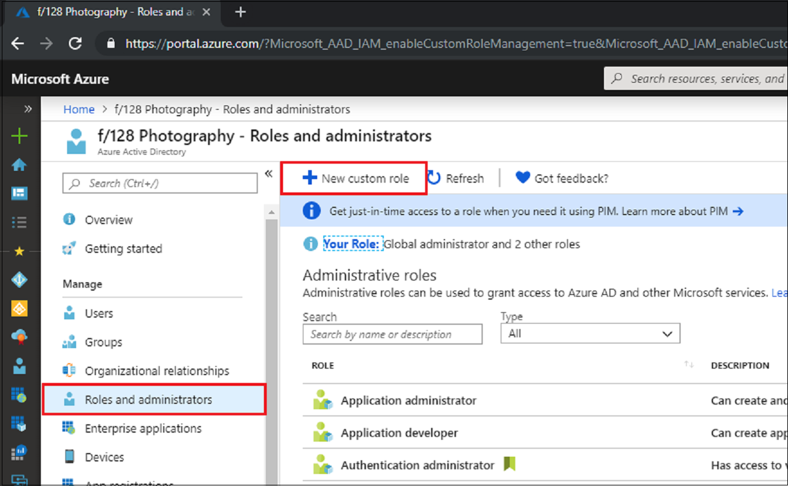
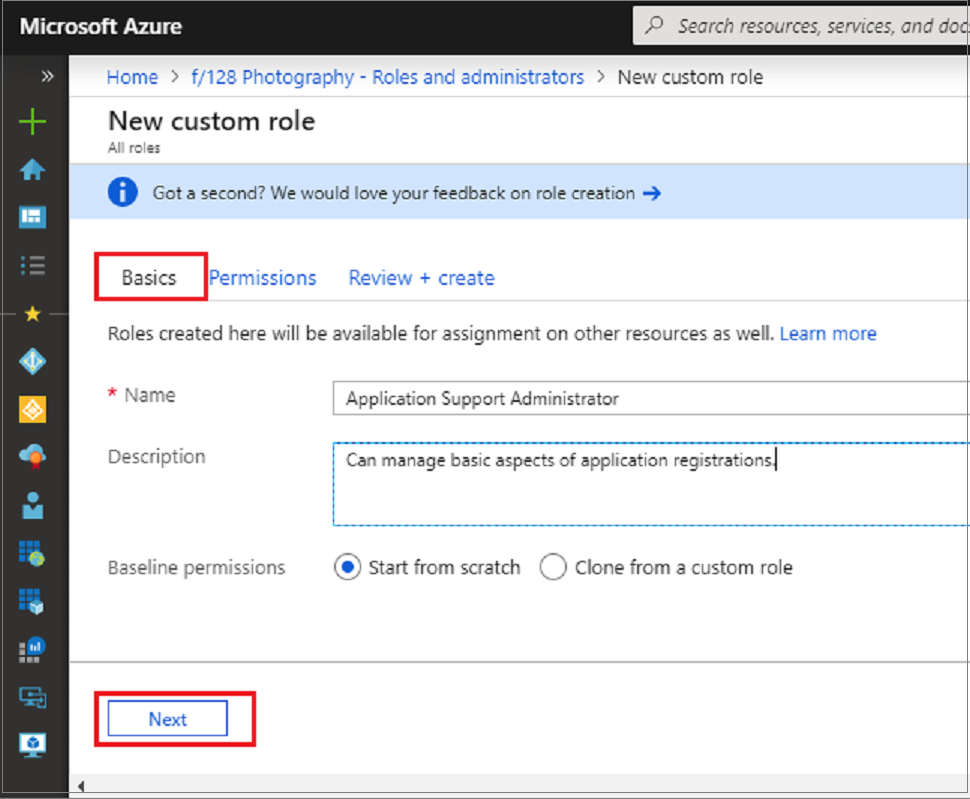
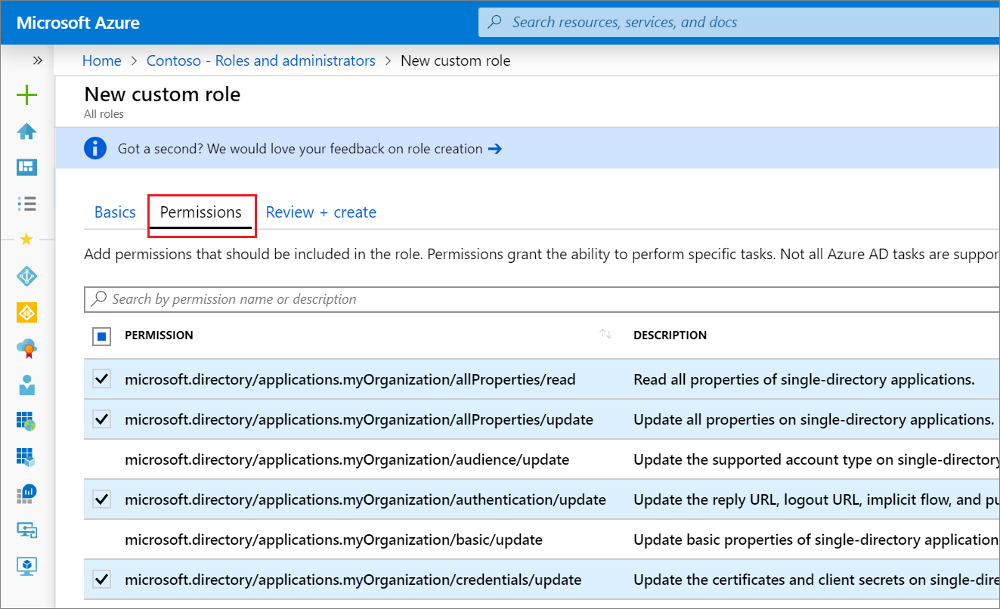

---
title: Create custom roles in Azure AD role-based access control | Microsoft Docs
description: Create and assign custom Azure AD roles with resource scope on Azure Active Directory resources.
services: active-directory
author: curtand
manager: daveba
ms.service: active-directory
ms.workload: identity
ms.subservice: users-groups-roles
ms.topic: how-to
ms.date: 11/08/2019
ms.author: curtand
ms.reviewer: vincesm
ms.custom: it-pro
ms.collection: M365-identity-device-management
---
# Create and assign a custom role in Azure Active Directory

This article describes how to create new custom roles in Azure Active Directory (Azure AD). For the basics of custom roles, see the [custom roles overview](roles-custom-overview.md). The role can be assigned either at the directory-level scope or an app registration resource scope only.

Custom roles can be created in the [Roles and administrators](https://portal.azure.com/#blade/Microsoft_AAD_IAM/ActiveDirectoryMenuBlade/RolesAndAdministrators) tab on the Azure AD overview page.

## Create a role in the Azure portal

### Create a new custom role to grant access to manage app registrations

1. Sign in to the [Azure AD admin center](https://aad.portal.azure.com) with Privileged role administrator or Global administrator permissions in the Azure AD organization.
1. Select **Azure Active Directory** > **Roles and administrators** > **New custom role**.

   

1. On the **Basics** tab, provide a name and description for the role and then click **Next**.

   

1. On the **Permissions** tab, select the permissions necessary to manage basic properties and credential properties of app registrations. For a detailed description of each permission, see [Application registration subtypes and permissions in Azure Active Directory](./roles-custom-available-permissions.md).
   1. First, enter "credentials" in the search bar and select the `microsoft.directory/applications/credentials/update` permission.

      

   1. Next, enter "basic" in the search bar, select the `microsoft.directory/applications/basic/update` permission, and then click **Next**.
1. On the **Review + create** tab, review the permissions and select **Create**.

Your custom role will show up in the list of available roles to assign.

## Create a role using PowerShell

### Prepare PowerShell

First, you must [download the Azure AD Preview PowerShell module](https://www.powershellgallery.com/packages/AzureADPreview).

To install the Azure AD PowerShell module, use the following commands:

``` PowerShell
install-module azureadpreview
import-module azureadpreview
```

To verify that the module is ready to use, use the following command:

``` PowerShell
get-module azureadpreview
  ModuleType Version      Name                         ExportedCommands
  ---------- ---------    ----                         ----------------
  Binary     2.0.2.31     azuread                      {Add-AzureADAdministrati...}
```

### Create the custom role

Create a new role using the following PowerShell script:

``` PowerShell
# Basic role information
$displayName = "Application Support Administrator"
$description = "Can manage basic aspects of application registrations."
$templateId = (New-Guid).Guid
 
# Set of permissions to grant
$allowedResourceAction =
@(
    "microsoft.directory/applications/basic/update",
    "microsoft.directory/applications/credentials/update"
)
$rolePermissions = @{'allowedResourceActions'= $allowedResourceAction}
 
# Create new custom admin role
$customAdmin = New-AzureADMSRoleDefinition -RolePermissions $rolePermissions -DisplayName $displayName -Description $description -TemplateId $templateId -IsEnabled $true
```

### Assign the custom role using Azure AD PowerShell

Assign the role using the below PowerShell script:

``` PowerShell
# Get the user and role definition you want to link
$user = Get-AzureADUser -Filter "userPrincipalName eq 'cburl@f128.info'"
$roleDefinition = Get-AzureADMSRoleDefinition -Filter "displayName eq 'Application Support Administrator'"

# Get app registration and construct resource scope for assignment.
$appRegistration = Get-AzureADApplication -Filter "displayName eq 'f/128 Filter Photos'"
$resourceScope = '/' + $appRegistration.objectId

# Create a scoped role assignment
$roleAssignment = New-AzureADMSRoleAssignment -ResourceScope $resourceScope -RoleDefinitionId $roleDefinition.Id -PrincipalId $user.objectId
```

## Create a role with Graph API

1. Create the role definition.

    HTTP request to create a custom role definition.

    POST

    ``` HTTP
    https://graph.microsoft.com/beta/roleManagement/directory/roleDefinitions
    ```

    Body

    ``` HTTP
   {
       "description": "Can manage basic aspects of application registrations.",
       "displayName": "Application Support Administrator",
       "isEnabled": true,
       "templateId": "<GUID>",
       "rolePermissions": [
           {
               "allowedResourceActions": [
                   "microsoft.directory/applications/basic/update",
                   "microsoft.directory/applications/credentials/update"
               ]
           }
       ]
   }
    ```

  > [!Note]
  > The "templateId": "GUID" is an optional parameter being sent in the body depending on requirement. If you have a requirement for creating multiple different custom role with common parameters , it is best to create a template and define a templateId . You can generate a templateId beforehand using the powershell cmdlet (New-Guid).Guid . 

1. Create the role assignment.

    HTTP request to create a custom role definition.

    POST

    ``` HTTP
    https://graph.microsoft.com/beta/roleManagement/directory/roleAssignments
    ```

    Body

    ``` HTTP
   {
       "principalId":"<GUID OF USER>",
       "roleDefinitionId":"<GUID OF ROLE DEFINITION>",
       "resourceScope":"/<GUID OF APPLICATION REGISTRATION>"
   }
    ```


## Assign a custom role scoped to a resource

Like built-in roles, custom roles are assigned by default at the default organization-wide scope to grant access permissions over all app registrations in your organization. But unlike built-in roles, custom roles can also be assigned at the scope of a single Azure AD resource. This allows you to give the user the permission to update credentials and basic properties of a single app without having to create a second custom role.

1. Sign in to the [Azure AD admin center](https://aad.portal.azure.com) with Application developer permissions in the Azure AD organization.
1. Select **App registrations**.
1. Select the app registration to which you are granting access to manage. You might have to select **All applications** to see the complete list of app registrations in your Azure AD organization.

    

1. In the app registration, select **Roles and administrators**. If you haven't already created one, instructions are in the [preceding procedure](#create-a-new-custom-role-to-grant-access-to-manage-app-registrations).

1. Select the role to open the **Assignments** page.
1. Select **Add assignment** to add a user. The user will be granted any permissions over only the selected app registration.

## Next steps

- Feel free to share with us on the [Azure AD administrative roles forum](https://feedback.azure.com/forums/169401-azure-active-directory?category_id=166032).
- For more about roles and Administrator role assignment, see [Assign administrator roles](directory-assign-admin-roles.md).
- For default user permissions, see a [comparison of default guest and member user permissions](../fundamentals/users-default-permissions.md).
