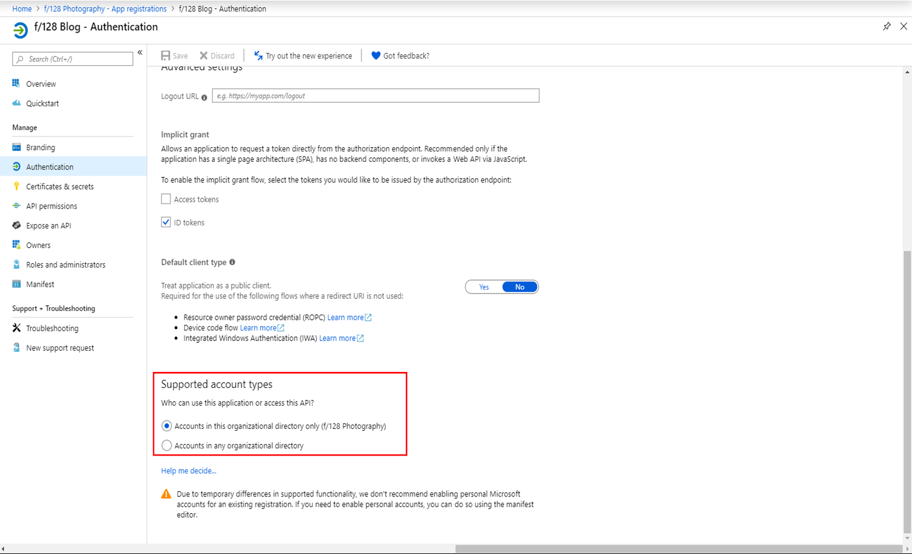
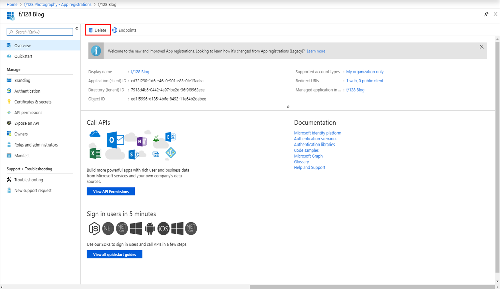
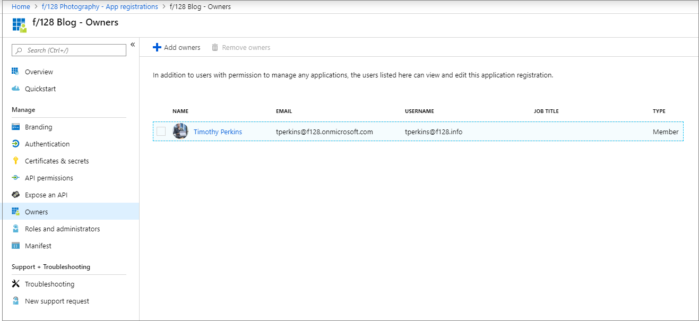
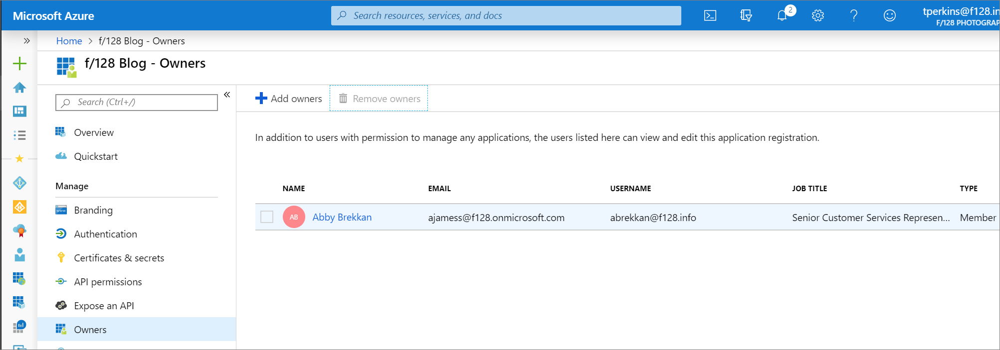
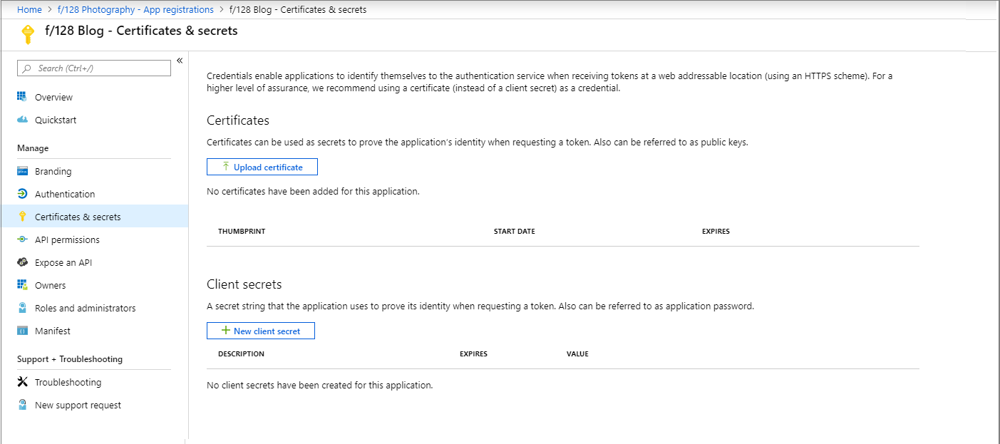
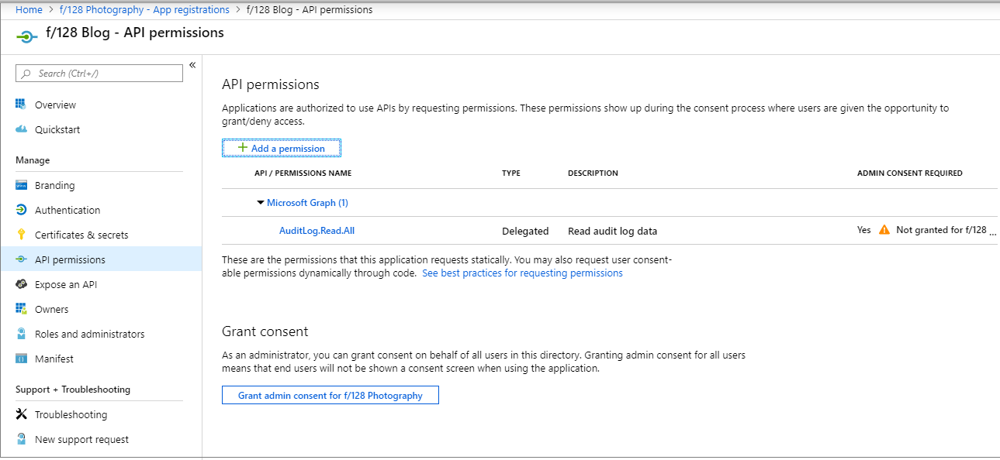
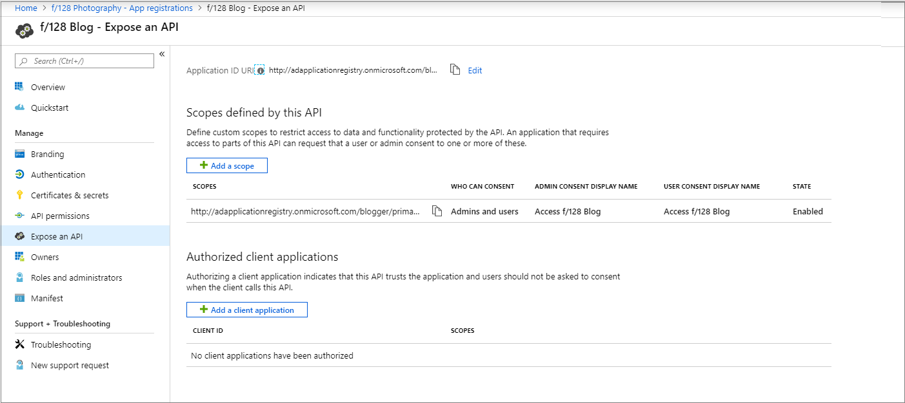

# Application registration subtypes and permissions in Azure Active Directory

This article contains the currently available app registration permissions for custom role definitions in Azure Active Directory (Azure AD).

## Single-tenant v. multi-tenant permissions

Custom role permissions differ for single-tenant and multi-tenant applications. Single-tenant applications are available only to users in the Azure AD organization where the application is registered. Multi-tenant applications are available to all Azure AD organizations. Single-tenant applications are defined as having **Supported account types** set to "Accounts in this organizational directory only." In the Graph API, single-tenant applications have the signInAudience property set to "AzureADMyOrg."

## Application registration subtypes and permissions

See the [custom roles overview](roles-custom-overview.md) for an explanation of what the general terms subtype, permission, and property set mean. The following information is specific to application registrations.

### Subtypes

There is just one app registration subtype - applications.myOrganization. For example, microsoft.directory/applications.myOrganization/basic/update. This subtype is set on the **Authentication** page for a specific app registration, and corresponds to setting the signInAudience property to "AzureADMyOrg" using Graph API or PowerShell. The subtype restricts the permission to app registrations that are marked as accessible only by accounts in your organization (single-tenant applications).

You can use the restricted permission to grant read or manage permissions to internal applications only without granting read or manage permissions to applications accessible by accounts in other organizations.

There are applications.myOrganization versions of all read and update permissions as well as the delete permission. There is no applications.myOrganization version of create at this time. Standard permissions (for example, microsoft.directory/applications/basic/update) grant read or management permissions for all app registration types.

Details for the following permissions for the custom roles preview are listed in [Available custom role permissions in Azure Active Directory](roles-custom-available-permissions.md).

### Create and delete

There are two permissions available for granting the ability to create application registrations, each with different behavior:

- **microsoft.directory/applications/createAsOwner**: Assigning this permission results in the creator being added as the first owner of the created app registration, and the created app registration will count against the creator's 250 created objects quota.
- **microsoft.directory/applicationPolicies/create**: Assigning this permission results in the creator not being added as the first owner of the created app registration, and the created app registration will not count against the creator's 250 created objects quota. Use this permission carefully, because there is nothing preventing the assignee from creating app registrations until the directory-level quota is hit. If both permissions are assigned, this permission takes precedence.

If both permissions are assigned, the /create permission will take precedence. Though the /createAsOwner permission does not automatically add the creator as the first owner, owners can be specified during the creation of the app registration when using Graph APIs or PowerShell cmdlets.

Create permissions grant access to the **New registration** command.

[These permissions grant access to the New Registration portal command](./media/roles-create-custom/new-custom-role.png)

There are two permissions available for granting the ability to delete app registrations:

#### microsoft.directory/applications/delete

Grants the ability to delete app registrations regardless of subtype; that is, both single-tenant and multi-tenant applications.

#### microsoft.directory/applications.myOrganization/delete

Grants the ability to delete app registrations restricted to those that are accessible only to accounts in your organization or single-tenant applications (myOrganization subtype).

> [!NOTE]
> When assigning a role that contains create permissions, the role assignment must be made at the directory scope. A create permission assigned at a resource scope does not grant the ability to create app registrations.

### Read

All member users in the organization can read app registration information by default. However, guest users and application service principals can't. If you plan to assign a role to a guest user or application, you must include the appropriate read permissions.

#### microsoft.directory/applications/allProperties/read

Ability to read all properties of single-tenant and multi-tenant applications outside of sensitive properties like credentials.

#### microsoft.directory/applications.myOrganization/allProperties/read

Grants the same permissions as microsoft.directory/applications/allProperties/read, but only for single-tenant applications.

#### microsoft.directory/applications/standard/read: Grants access to all fields on the application registration branding page

#### microsoft.directory/applications.myOrganization/standard/read

Grants the same permissions as microsoft.directory/applications/standard/read, but for only single-tenant applications.

#### microsoft.directory/applications/owners/read

Grants the ability to read owners property on single-tenant and multi-tenant applications. Grants access to all fields on the application registration owners page:

Grants access to the following properties on the application entity:

- AllowActAsForAllClients
- AllowPassthroughUsers
- AppAddress
- AppBrandingElements
- AppCategory
- AppCreatedDateTime
- AppData
- AppId
- AppInformationalUrl
- ApplicationTag
- AppLogoUrl
- AppMetadata
- AppOptions
- BinaryExtensionAttribute
- BooleanExtensionAttribute
- CountriesBlockedForMinors
- CreatedOnBehalfOf
- DateTimeExtensionAttribute
- DisplayName
- ExtensionAttributeDefinition
- IntegerExtensionAttribute
- KnownClientApplications
- LargeIntegerExtensionAttribute
- LegalAgeGroupRule
- LocalizedAppBrandingElements
- MainLogo
- MsaAppId
- ResourceApplicationSet
- ServiceDiscoveryEndpoint
- StringExtensionAttribute
- TrustedCertificateSubject
- WebApi
- WebApp
- WwwHomepage

### Update

#### microsoft.directory/applications/allProperties/update

#### microsoft.directory/applications.myOrganization/allProperties/update

Grants the same permissions as microsoft.directory/applications/allProperties/update, but only for single-tenant applications.

#### microsoft.directory/applications/audience/update

Grants access to all fields on the application registration authentication page:

Grants access to the following properties on the application resource:

- AvailableToOtherTenants
- SignInAudience

#### microsoft.directory/applications.myOrganization/audience/update

Grants the same permissions as microsoft.directory/applications/audience/update, but only for single-tenant applications.

#### microsoft.directory/applications/authentication/update

Ability to update the reply URL, sign-out URL, implicit flow, and publisher domain properties on single-tenant and multi-tenant applications. Grants access to all fields on the application registration authentication page except supported account types:

 Grants access to the following properties on the application resource:

- AcceptMappedClaims
- AccessTokenAcceptedVersion
- AddIns
- GroupMembershipClaims
- IsDeviceOnlyAuthSupported
- OAuth2LegacyUrlPathMatching
- OauthOidcResponsePolicyBitmap
- OptionalClaims
- OrgRestrictions
- PublicClient
- UseCustomTokenSigningKey

#### microsoft.directory/applications.myOrganization/authentication/update

Grants the same permissions as microsoft.directory/applications/authentication/update, but only for single-tenant applications.

#### microsoft.directory/applications/basic/update

Ability to update the name, logo, homepage URL, terms of service URL, and privacy statement URL properties on single-tenant and multi-tenant applications. Grants access to all fields on the application registration branding page:

Grants access to the following properties on the application resource:

- AllowActAsForAllClients
- AllowPassthroughUsers
- AppAddress
- AppBrandingElements
- AppCategory
- AppData
- AppId
- AppInformationalUrl
- ApplicationTag
- AppLogoUrl
- AppMetadata
- AppOptions
- BinaryExtensionAttribute
- BooleanExtensionAttribute
- CountriesBlockedForMinors
- CreatedOnBehalfOf
- DateTimeExtensionAttribute
- DisplayName
- ExtensionAttributeDefinition
- IntegerExtensionAttribute
- KnownClientApplications
- LargeIntegerExtensionAttribute
- LegalAgeGroupRule
- LocalizedAppBrandingElements
- MainLogo
- MsaAppId
- ResourceApplicationSet
- ServiceDiscoveryEndpoint
- StringExtensionAttribute
- TrustedCertificateSubject
- WebApi
- WebApp
- WwwHomepage

#### microsoft.directory/applications.myOrganization/basic/update

Grants the same permissions as microsoft.directory/applications/basic/update, but only for single-tenant applications.

#### microsoft.directory/applications/credentials/update

Ability to update the certificates and client secrets properties on single-tenant and multi-tenant applications. Grants access to all fields on the application registration certificates & secrets page:

Grants access to the following properties on the application resource:
- AsymmetricKey
- EncryptedSecretKey
- KeyDescription
- SharedKeyReference
- TokenEncryptionKeyId

#### microsoft.directory/applications.myOrganization/credentials/update

Grants the same permissions as microsoft.directory/applications/credentials/update, but only for single-directory applications.

#### microsoft.directory/applications/owners/update

Ability to update the owner property on single-tenant and multi-tenant. Grants access to all fields on the application registration owners page:

Grants access to the following properties on the application resource:
- Owners

#### microsoft.directory/applications.myOrganization/owners/update

Grants the same permissions as microsoft.directory/applications/owners/update, but only for single-tenant applications.

#### microsoft.directory/applications/permissions/update

Ability to update the delegated permissions, application permissions, authorized client applications, required permissions, and grant consent properties on single-tenant and multi-tenant applications. Does not grant the ability to perform consent. Grants access to all fields on the application registration API permissions and Expose an API pages:

Grants access to the following properties on the application resource:

- AppIdentifierUri
- Entitlement
- PreAuthorizedApplications
- RecordConsentConditions
- RequiredResourceAccess

#### microsoft.directory/applications.myOrganization/permissions/update

Grants the same permissions as microsoft.directory/applications/permissions/update, but only for single-tenant applications.

## Required license plan

[!INCLUDE [License requirement for using custom roles in Azure AD](../../../includes/active-directory-p1-license.md)]

## Next steps

- Create custom roles using [the Azure portal, Azure AD PowerShell, and Graph API](roles-create-custom.md)
- [View the assignments for a custom role](roles-view-assignments.md)
