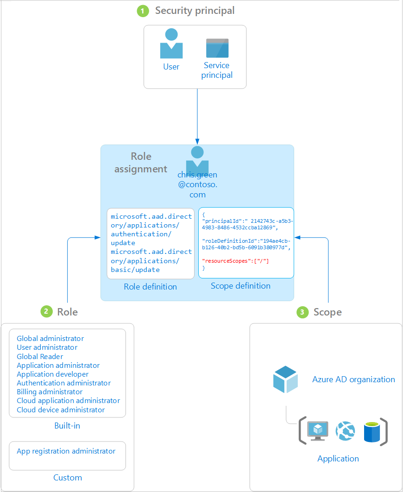

# Custom administrator roles in Azure Active Directory (preview)

This article describes how to understand Azure AD custom roles in Azure Active Directory (Azure AD) with roles-based access control and resource scopes. Custom Azure AD roles surface the underlying permissions of the [built-in roles](directory-assign-admin-roles.md), so that you can create and organize your own custom roles. This approach allows you to grant access in a more granular way than built-in roles, whenever they're needed. This first release of Azure AD custom roles includes the ability to create a role to assign permissions for managing app registrations. Over time, additional permissions for organization resources like enterprise applications, users, and devices will be added.  

Additionally, Azure AD custom roles support assignments on a per-resource basis, in addition to the more traditional organization-wide assignments. This approach gives you the ability to grant access to manage some resources (for example, one app registration) without giving access to all resources (all app registrations).

Azure AD role-based access control is a public preview feature of Azure AD and is available with any paid Azure AD license plan. For more information about previews, see [Supplemental Terms of Use for Microsoft Azure Previews](https://azure.microsoft.com/support/legal/preview-supplemental-terms/).

## Understand Azure AD role-based access control

Granting permission using custom Azure AD roles is a two-step process that involves creating a custom role definition and then assigning it using a role assignment. A custom role definition is a collection of permissions that you add from a preset list. These permissions are the same permissions used in the built-in roles.  

Once you’ve created your role definition, you can assign it to a user by creating a role assignment. A role assignment grants the user the permissions in a role definition at a specified scope. This two-step process allows you to create a single role definition and assign it many times at different scopes. A scope defines the set of Azure AD resources the role member has access to. The most common scope is organization-wide (org-wide) scope. A custom role can be assigned at org-wide scope, meaning the role member has the role permissions over all resources in the organization. A custom role can also be assigned at an object scope. An example of an object scope would be a single application. The same role can be assigned to one user over all applications in the organization and then to another user with a scope of only the Contoso Expense Reports app.  

Azure AD built-in and custom roles operate on concepts similar to [Azure role-based access control](../../role-based-access-control/overview.md). The [difference between these two role-based access control systems](../../role-based-access-control/rbac-and-directory-admin-roles.md) is that Azure RBAC controls access to Azure resources such as virtual machines or storage using Azure Resource Management, and Azure AD custom roles control access to Azure AD resources using Graph API. Both systems leverage the concept of role definitions and role assignments.

### How Azure AD determines if a user has access to a resource

The following are the high-level steps that Azure AD uses to determine if you have access to a management resource. Use this information to troubleshoot access issues.

1. A user (or service principal) acquires a token to the Microsoft Graph or Azure AD Graph endpoint.

1. The user makes an API call to Azure Active Directory (Azure AD) via Microsoft Graph or Azure AD Graph using the issued token.

1. Depending on the circumstance, Azure AD takes one of the following actions:

    - Evaluates the user’s role memberships based on the [wids claim](https://docs.microsoft.com/azure/active-directory/develop/access-tokens) in the user’s access token.
    - Retrieves all the role assignments that apply for the user, either directly or via group membership, to the resource on which the action is being taken.

1. Azure AD determines if the action in the API call is included in the roles the user has for this resource.
1. If the user doesn't have a role with the action at the requested scope, access is not granted. Otherwise access is granted.

### Role assignments

A role assignment is the object that attaches a role definition to a user at a particular scope to grant Azure AD resource access. Access is granted by creating a role assignment, and access is revoked by removing a role assignment. At its core, a role assignment consists of three elements:

- User (an individual who has a user profile in Azure Active Directory)
- Role definition
- Resource scope

You can [create role assignments](roles-create-custom.md) using the Azure portal, Azure AD PowerShell, or Graph API. You can also [view the assignments for a custom role](roles-view-assignments.md#view-the-assignments-of-a-role).

The following diagram shows an example of a role assignment. In this example, Chris Green has been assigned the App registration administrator custom role at the scope of the Contoso Widget Builder app registration. The assignment grants Chris the permissions of the App registration administrator role for only this specific app registration.

### Security principal

A security principal represents the user that is to be assigned access to Azure AD resources. A *user* is an individual who has a user profile in Azure Active Directory.

### Role

A role definition, or role, is a collection of permissions. A role definition lists the operations that can be performed on Azure AD resources, such as create, read, update, and delete. There are two types of roles in Azure AD:

- Built-in roles created by Microsoft that can't be changed.
- Custom roles created and managed by your organization.

### Scope

A scope is the restriction of permitted actions to a particular Azure AD resource as part of a role assignment. When you assign a role, you can specify a scope that limits the administrator's access to a specific resource. For example, if you want to grant a developer a custom role, but only to manage a specific application registration, you can include the specific application registration as a scope in the role assignment.

  > [!Note]
  > Custom roles can be assigned at directory scope and resource scoped. They cannot yet be assigned at Administrative Unit scope.
  > Built-in roles can can be assigned at directory scope, and in some cases, Administrative Unit scope. They cannot yet be assigned at Azure AD resource scope.

## Required license plan

[!INCLUDE [License requirement for using custom roles in Azure AD](../../../includes/active-directory-p1-license.md)]

## Next steps

- Create custom role assignments using [the Azure portal, Azure AD PowerShell, and Graph API](roles-create-custom.md)
- [View the assignments for a custom role](roles-view-assignments.md#view-assignments-of-single-application-scope)
