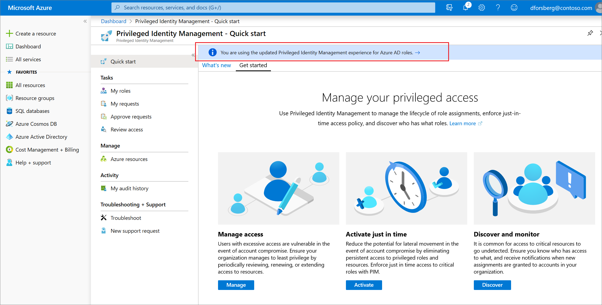

# Use cloud groups to manage role assignments in Azure Active Directory (preview)

Azure Active Directory (Azure AD) is introducing a public preview in which you can assign a cloud group to Azure AD built-in roles. With this feature, you can use groups to grant admin access in Azure AD with minimal effort from your Global and Privileged role admins.

Consider this example: Contoso has hired people across geographies to manage and reset passwords for employees in its Azure AD organization. Instead of asking a Privileged role admin or Global admin to assign the Helpdesk admin role to each person individually, they can create a Contoso_Helpdesk_Administrators group and assign it to the role. When people join the group, they are assigned the role indirectly. Your existing governance workflow can then take care of the approval process and auditing of the group’s membership to ensure that only legitimate users are members of the group and are thus assigned to the Helpdesk admin role.

## How this feature works

Beginning in November 2019, the Azure AD roles portion of Privileged Identity Management is being updated to a new version. You can assign a role to a group only in the new version. While the new version is being rolled out, make sure you're in the new version of Privileged Identity Management to use the procedures in this article:

1. Sign in to the [Azure portal](https://portal.azure.com/) with a user who is in the [Privileged role administrator](../users-groups-roles/directory-assign-admin-roles.md#privileged-role-administrator) role.
1. Open **Azure AD Privileged Identity Management**. If you have a banner on the top of the overview page, you have the new version and con proceed with the instructions in this article. If you don't have the new version, you can't complete the tasks.

  

After you have verified your version, create a new Office 365 or security group with the ‘isAssignableToRole’ property set to ‘true’. You can enable this property in UI by turning on **Eligible for role assignment** when creating a new group. Then you can assign this group to one or more Azure AD roles in the same way as you assign roles to users.

If you do not want members of the group to have standing access to the role, you can use Azure AD Privileged Identity Management. Assign a group an eligible member of an Azure AD role. Each member of the group is then eligible to have their assignment activated for the role that the group is assigned to. They can, then, activate their role assignment for a fixed time duration.

## Why we enforce creation of a special group for assigning it to a role

If a group is assigned a role, any IT admin who can manage group membership could also indirectly manage the membership of that role. For example, assume that a group Contoso_User_Administrators is assigned to User account admin role. An Exchange admin who can modify group membership could add themselves to the Contoso_User_Administrators group and in that way become a User account admin. As you can see, an admin could elevate their privilege in a way you did not intend.

Azure AD allows you to protect a group assigned to a role by using a new property called isAssignableToRole for groups. Only cloud groups that had the isAssignableToRole property set to ‘true’ at creation time can be assigned to a role. This property is immutable; once a group is created with this property set to ‘true’, it can’t be changed. You can't set the property on an existing group.
We designed how groups are assigned to roles to prevent that sort of potential breach from happening:

- Only Global admins and Privileged role admins can create a role-eligible group (with the "isAssignableToRole" property enabled).
- It can't be an Azure AD dynamic group; that is, it must have a membership type of "Assigned." Automated population of dynamic groups could lead to an unwanted account being added to the group and thus assigned to the role.
-  To prevent elevation of privilege, the credentials of the owner of a role-eligible group can be changed only by a Privileged authentication administrator or a Global administrator.
- By default, only Global admins and Privileged role admins can manage the membership of a role-eligible group, but you can delegate the management of role-eligible groups by adding group owners.
- No nesting. A group can't be added as a member of a role-eligible group.

## Limitations

Following scenarios are not supported right now:  

- Assign cloud groups to Azure AD custom roles
- Assign cloud groups to Azure AD roles (built-in or custom) over an Admin Unit
- Assign on-premises groups to Azure AD roles (built-in or custom)

We are working on these capabilities.

## Known Issues

*Azure AD P2 license customers only*: Don't assign a group as Active to a role through both Azure AD and Privileged Indentity Management. This will lead to issues where users can’t see their active role assignments in the PIM as well as the inability to remove that PIM assignment. Eligible assignments are not affected in this scenario. If you do attempt to make this assignment, you might see unexpected behavior such as:

End time of the assignment might end up showing incorrectly

In the PIM UI, My Roles can only show one role assignment regardless of how many methods the assignment is granted (through one or more groups and directly)

[Azure AD P2 license customers only] Even after deleting the group, it is still shown an eligible member of the role in PIM UI. Functionality wise, there is no problem; it's just a cache issue in UI.

We are fixing these issues.

## Required license plan

Using this feature requires you to have an available Azure AD Premium P1 license in your Azure AD organization. If you want to use also Privileged Identity Management for just-in-time role activation along with it, you are required to also have an available Azure AD Premium P2 license. To find the right license for your requirements, see [Comparing generally available features of the Free and Premium plans](../fundamentals/active-directory-whatis.md#what-are-the-azure-ad-licenses).

## Next steps

- [Create a role-eligible group](roles-groups-create-eligible.md)
- [Assign a role to a group](roles-groups-assign-role.md)
- [View a group's role assignments](roles-groups-view-assignments.md)
- [Remove a group role assignment](roles-groups-remove-assignment.md)
