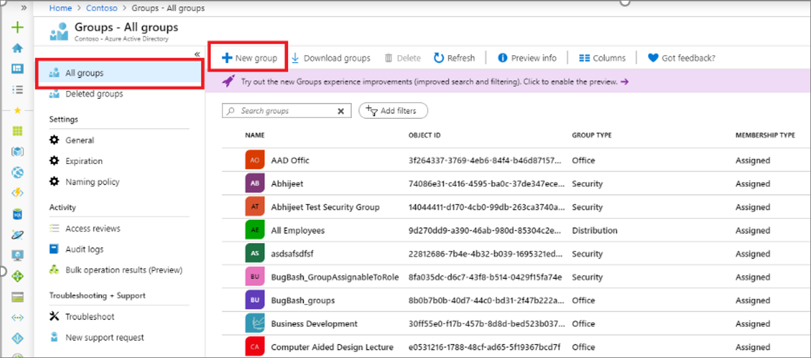
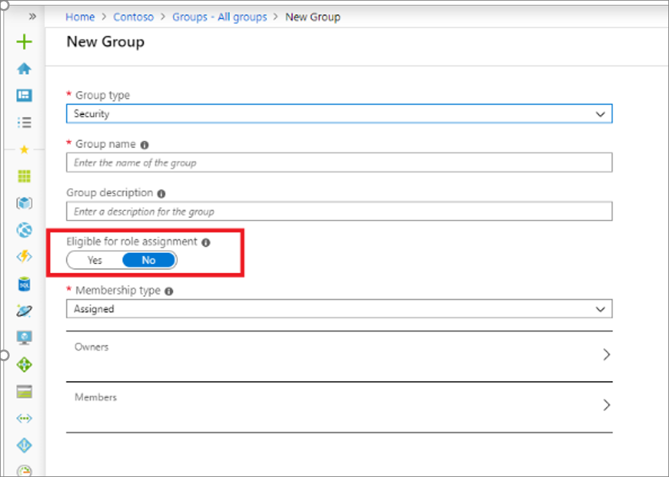
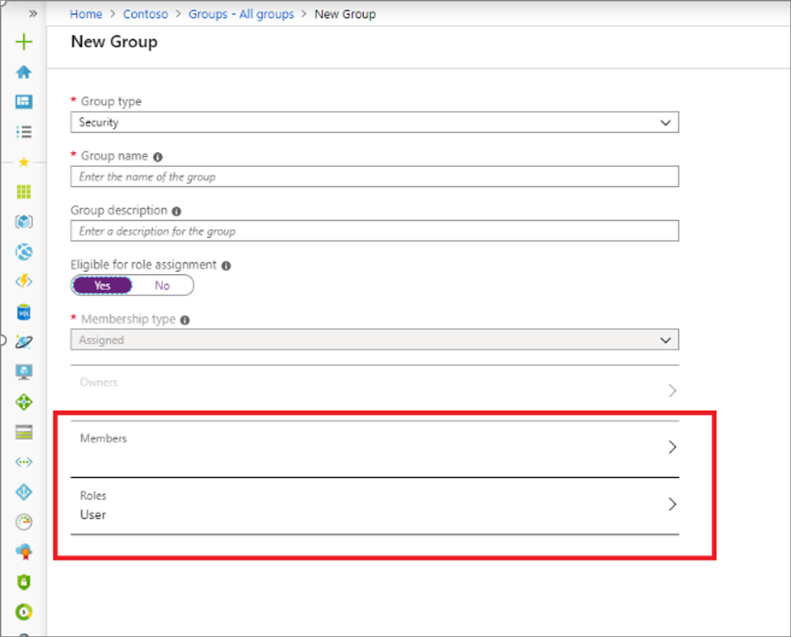
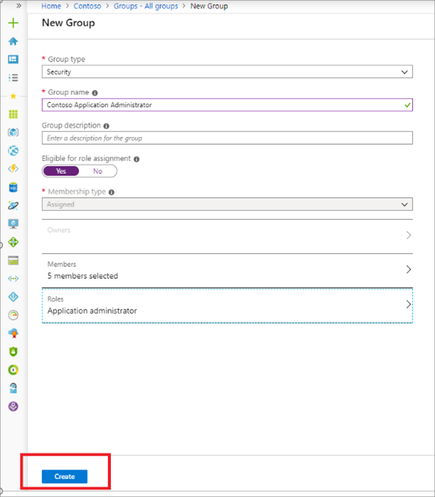

# Create a role-assignable group in Azure Active Directory

You can only assign a role to a group that was created with the ‘isAssignableToRole’ property set to True, or was created in the Azure AD portal with **Azure AD roles can be assigned to the group** turned on. This group attribute makes the group one that can be assigned to a role in Azure Active Directory (Azure AD). This article describes how to create this special kind of group. **Note:** A group with isAssignableToRole property set to true cannot be of dynamic membership type. For more information, see [Using a group to manage Azure AD role assignments](./roles-groups-concept.md).

## Using Azure AD admin center

1. Sign in to the [Azure AD admin center](https://portal.azure.com/#blade/Microsoft_AAD_IAM/ActiveDirectoryMenuBlade/Overview) with Privileged role administrator or Global administrator permissions in the Azure AD organization.
1. Select **Groups** > **All groups** > **New group**.

    [](media/roles-groups-create-eligible/new-group.png#<lightbox>)

1. On the **New Group** tab, provide group type, name and description.
1. Turn on **Azure AD roles can be assigned to the group**. This switch is visible to only Privileged Role Administrators and Global Administrators because these are only two roles that can set the switch.

    [](media/roles-groups-create-eligible/eligible-switch.png#<lightbox>)

1. Select the members and owners for the group. You also have the option to assign roles to the group, but assigning a role isn't required here.

    [](media/roles-groups-create-eligible/specify-members.png#<lightbox>)

1. After the members and owners are specified, select **Create**.

    [](media/roles-groups-create-eligible/create-button.png#<lightbox>)

The group is created with any roles you might have assigned to it.

## Using PowerShell

### Install the Azure AD preview module

```powershell
install-module azureadpreview
import-module azureadpreview
```

To verify that the module is ready to use, issue the following command:

```powershell
get-module azureadpreview
```

### Create a group that can be assigned to role

```powershell
$group = New-AzureADMSGroup -DisplayName "Contoso_Helpdesk_Administrators" -Description "This group is assigned to Helpdesk Administrator built-in role in Azure AD." -MailEnabled $true -SecurityEnabled $true -MailNickName "contosohelpdeskadministrators" -IsAssignableToRole $true
```

For this type of group, `isPublic` will always be false and `isSecurityEnabled` will always be true.

### Copy one group's users and service principals into a role-assignable group

```powershell
#Basic set up
install-module azureadpreview
import-module azureadpreview
get-module azureadpreview

#Connect to Azure AD. Sign in as Privileged Role Administrator or Global Administrator. Only these two roles can create a role-assignable group.
Connect-AzureAD

#Input variabled: Existing group
$idOfExistingGroup = "14044411-d170-4cb0-99db-263ca3740a0c"

#Input variables: New role-assignable group
$groupName = "Contoso_Bellevue_Admins"
$groupDescription = "This group is assigned to Helpdesk Administrator built-in role in Azure AD."
$mailNickname = "contosobellevueadmins"

#Create new security group which is a role assignable group. For creating a Microsoft 365 group, set GroupTypes="Unified" and MailEnabled=$true
$roleAssignablegroup = New-AzureADMSGroup -DisplayName $groupName -Description $groupDescription -MailEnabled $false -MailNickname $mailNickname -SecurityEnabled $true -IsAssignableToRole $true

#Get details of existing group
$existingGroup = Get-AzureADMSGroup -Id $idOfExistingGroup
$membersOfExistingGroup = Get-AzureADGroupMember -ObjectId $existingGroup.Id

#Copy users and service principals from existing group to new group
foreach($member in $membersOfExistingGroup){
if($member.ObjectType -eq 'User' -or $member.ObjectType -eq 'ServicePrincipal'){
Add-AzureADGroupMember -ObjectId $roleAssignablegroup.Id -RefObjectId $member.ObjectId
}
}
```

## Using Microsoft Graph API

### Create a role-assignable group in Azure AD

```powershell
POST https://graph.microsoft.com/beta/groups
{
"description": "This group is assigned to Helpdesk Administrator built-in role of Azure AD.",
"displayName": "Contoso_Helpdesk_Administrators",
"groupTypes": [
"Unified"
],
"mailEnabled": true,
"securityEnabled": true
"mailNickname": "contosohelpdeskadministrators",
"isAssignableToRole": true,
}
```

For this type of group, `isPublic` will always be false and `isSecurityEnabled` will always be true.

## Next steps

- [Assign a role to a cloud group](roles-groups-assign-role.md)
- [Use cloud groups to manage role assignments](roles-groups-concept.md)
- [Troubleshooting roles assigned to cloud groups](roles-groups-faq-troubleshooting.md)