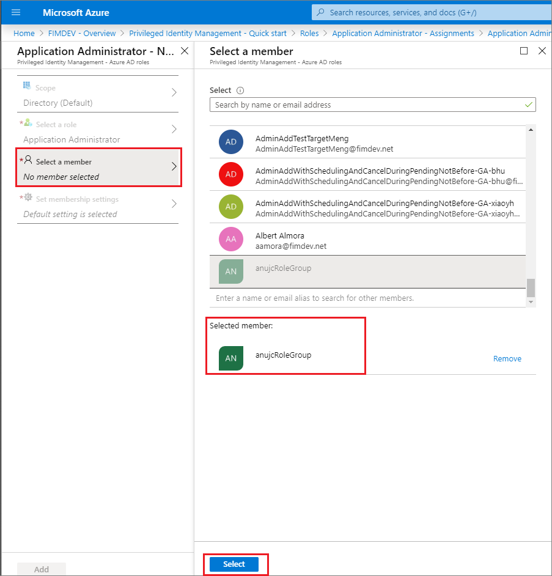

# Assign a role to a group using Privileged Identity Management

This article describes how an IT admin can assign an Azure Active Directory (Azure AD) role to a group using Azure AD Privileged Identity Management.

## Using Azure AD Admin Center

1. Open https://aka.ms//assignrolestogroups. Sign in with Privileged role administrator or Global administrator permissions in the Azure AD organization.  

1. Select Privileged Identity Management > Azure AD roles > Roles > Add member

    

1. Select the group. Only groups that are eligible for role assignment (the cloud groups created with "Eligible for role assignment") are shown in the list, not all groups.

    

1. Select the desired membership setting. For roles requiring activation, choose eligible. By default, the user would be permanently eligible, but you could also set a start and end time for the user’s eligibility. Once you are complete, hit Save and Add to complete the role assignment.

    

## Using PowerShell

#First, you must download the Azure AD Preview PowerShell module. To install the Azure AD #PowerShell module, use the following commands: 

 

install-module azureadpreview 

import-module azureadpreview 

 

#To verify that the module is ready to use, use the following command: 

get-module azureadpreview 

 

# Assign a group as an eligible member of a role 

 

$schedule = New-Object Microsoft.Open.MSGraph.Model.AzureADMSPrivilegedSchedule 				  $schedule.Type = "Once" 				 

$schedule.StartDateTime = "2019-04-26T20:49:11.770Z" 				 $schedule.endDateTime = "2019-07-25T20:49:11.770Z" 				   Open-AzureADMSPrivilegedRoleAssignmentRequest -ProviderId aadRoles -Schedule $schedule -ResourceId "[YOUR TENANT ID]" -RoleDefinitionId "9f8c1837-f885-4dfd-9a75-990f9222b21d" -SubjectId "[YOUR GROUP ID]" -AssignmentState "Eligible" -Type "AdminAdd" 

 

Using Microsoft Graph API 

 

POST https://graph.microsoft.com/beta/privilegedAccess/aadroles/roleAssignmentRequests  

{ 

  “roleDefinitionId": {roleDefinitionId}, 

     “resourceId”: {tenantId}, 

     “subjectId”: {GroupId}, 

     “assignmentState”: “Eligible”, 

     “type”: “AdminAdd”, 

     “reason”: “reason string”, 

     “schedule”: { 

           “startDateTime”: {DateTime}, 

           “endDateTime”: {DateTime}, 

           “type”: “Once”  

     } 

} 

 