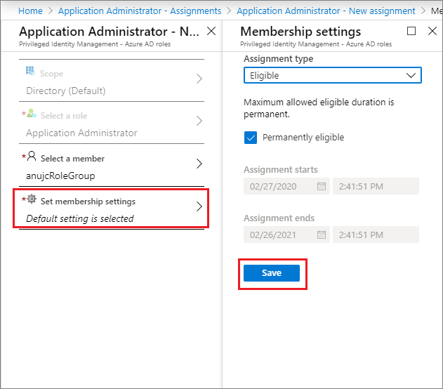

# Assign a role to a group using Privileged Identity Management

This article describes how you can assign an Azure Active Directory (Azure AD) role to a group using Azure AD Privileged Identity Management. Beginning in November 2019, the Azure AD roles portion of Privileged Identity Management is being updated to a new version. You can assign a role to a group only in the new version. While the new version is being rolled out, you need to make sure you're in the new version to use the procedures in this article depend on version of Privileged Identity Management you currently have.

1. Sign in to the [Azure portal](https://portal.azure.com/) with a user who is in the [Privileged role administrator](../users-groups-roles/directory-assign-admin-roles.md#privileged-role-administrator) role.
1. Open **Azure AD Privileged Identity Management**. If you have a banner on the top of the overview page, you have the new version and con proceed with the instructions in this article. If you don't have the new version, you can't complete the role assignment.

   

## Using Azure AD admin center

1. Open Azure AD [Privileged Identity Management](https://ms.portal.azure.com/?Microsoft_AAD_IAM_GroupRoles=true&Microsoft_AAD_IAM_userRolesV2=true&Microsoft_AAD_IAM_enablePimIntegration=true#blade/Microsoft_Azure_PIMCommon/CommonMenuBlade/quickStart) and sign in with Privileged role administrator or Global administrator permissions in the Azure AD organization.  

1. Select Privileged Identity Management > Azure AD roles > Roles > Add assignment

    

1. Select the group. Only groups that are eligible for role assignment (the cloud groups created with "Azure AD roles can be assigned to the group") are shown in the list, not all groups.

    

1. Select the desired membership setting. For roles requiring activation, choose eligible. By default, the user would be permanently eligible, but you could also set a start and end time for the user's eligibility. Once you are complete, hit Save and Add to complete the role assignment.

    

## Using PowerShell

### Download the Azure AD Preview PowerShell module

To install the Azure AD #PowerShell module, use the following cmdlets:

    install-module azureadpreview 
    import-module azureadpreview 

To verify that the module is ready to use, use the following cmdlet:

    get-module azureadpreview 

### Assign a group as an eligible member of a role

    $schedule = New-Object Microsoft.Open.MSGraph.Model.AzureADMSPrivilegedSchedule
    $schedule.Type = "Once"     
    $schedule.StartDateTime = "2019-04-26T20:49:11.770Z"
    $schedule.endDateTime = "2019-07-25T20:49:11.770Z"
    Open-AzureADMSPrivilegedRoleAssignmentRequest -ProviderId aadRoles -Schedule $schedule -ResourceId "[YOUR TENANT ID]" -RoleDefinitionId "9f8c1837-f885-4dfd-9a75-990f9222b21d" -SubjectId "[YOUR GROUP ID]" -AssignmentState "Eligible" -Type "AdminAdd" 

## Using Microsoft Graph API

    POST 
    https://graph.microsoft.com/beta/privilegedAccess/aadroles/roleAssignmentRequests  
    
    {
    
     "roleDefinitionId": {roleDefinitionId}, 
    
     "resourceId": {tenantId}, 
    
     "subjectId": {GroupId}, 
    
     "assignmentState": "Eligible", 
    
     "type": "AdminAdd", 
    
     "reason": "reason string", 
    
     "schedule": { 
    
           "startDateTime": {DateTime}, 
    
           "endDateTime": {DateTime}, 
    
           "type": "Once"  
    
     } 
    
    }

## Next steps

- [Configure Azure AD admin role settings in Privileged Identity Management](../privileged-identity-management/pim-how-to-change-default-settings.md)
- [Assign Azure resource roles in Privileged Identity Management](../privileged-identity-management/pim-resource-roles-assign-roles.md)
