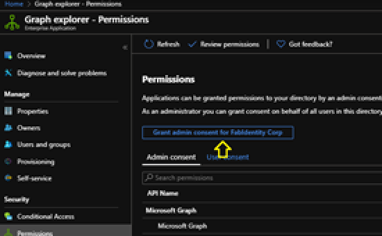
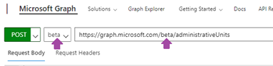
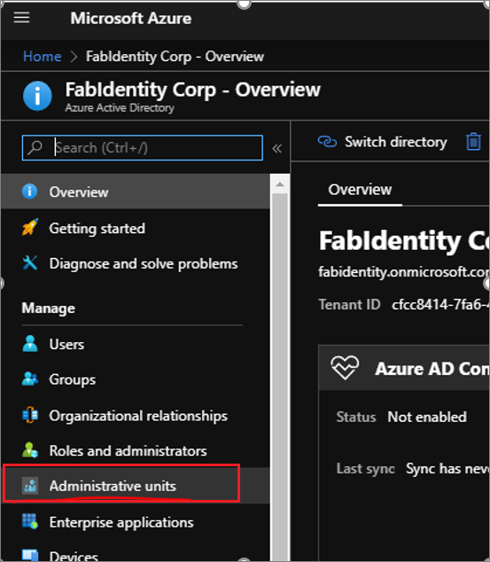
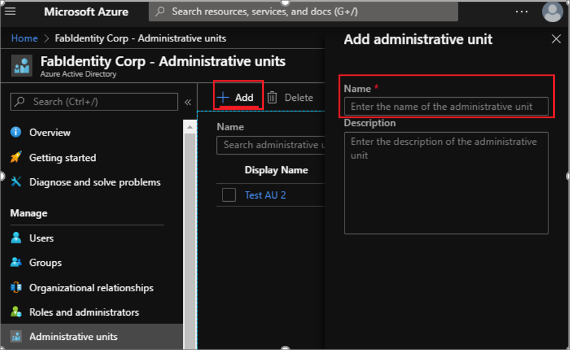
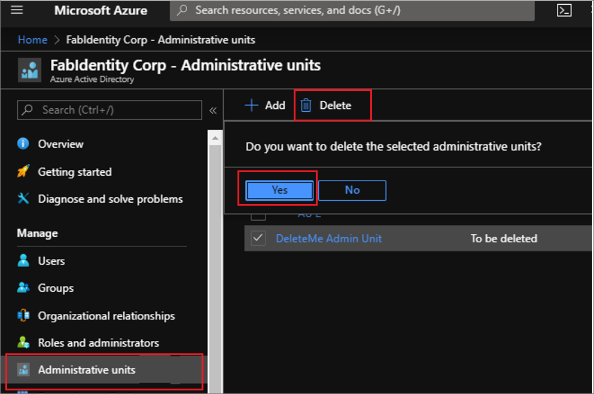

# Administrative unit scope for roles in Azure Active Directory (preview)

This article tells you about what's available in Administrative Units public preview in Azure Active Directory (Azure AD). We cover the basic tasks for setting up and using administrative units to restrict the scope of Azure AD role assignments.

Administrative units allow you to grant admin permissions that are restricted to a department, region, or other segment of your organization that you define. For example, delegating to regional support specialists the [Helpdesk Administrator](directory-assign-admin-roles.md#helpdesk-administrator) role restricted to managing just the users in the region they support.

Restricting administrative scope via administrative units can be useful in organizations with independent divisions. Consider the example of a large university that is made up of many autonomous schools (School of Business, School of Engineering, and so on) that each has their own IT administrators who control access, manage users, and set policies for their school. A central administrator could create an administrative unit for the School of Business and populate it with only the business school students and staff. Then the central administrator can add the Business school IT staff to a scoped role that grants administrative permissions over only Azure AD users in the business school administrative unit.

In addition to this article, you can also refer to the following:

- [Working with Admin Units](https://docs.microsoft.com/powershell/azure/active-directory/working-with-administrative-units?view=azureadps-2.0): How to work with administrative units using PowerShell
- [Administrative Unit Graph support](https://docs.microsoft.com/graph/api/resources/administrativeunit?view=graph-rest-beta): Detailed documentation on Graph APIs available for administrative units.

Creating and managing administrative units themselves is available at no additional charge as part of Azure Active Directory (Azure AD). Using administrative units to restrict the scope of Azure AD role assignments requires Azure AD Premium 1 licenses for administrators and Azure Active Directory Basic licenses for administrative unit members.

## Roles available

Role  |  Description
----- |  -----------
Authentication Administrator  |  Has access to view, set, and reset authentication method information for any non-admin user in the assigned administrative unit only.
Groups Administrator  |  Can manage all aspects of groups and groups settings like naming and expiration policies in the assigned administrative unit only.
Helpdesk Administrator  |  Can reset passwords for non-administrators and Helpdesk administrators in the assigned administrative unit only.
License Administrator  |  Can assign, remove and update license assignments within the administrative unit only.
Password Administrator  |  Can reset passwords for non-administrators and Password Administrators within the assigned administrative unit only.
User Administrator  |  Can manage all aspects of users and groups, including resetting passwords for limited admins within the assigned administrative unit only.

## Currently supported functions

Global administrators or Privileged Role Administrators can use the Azure AD portal to create administrative units, add users as members of administrative units, and then assign IT staff to administrative unit-scoped administrator roles. The administrative unit-scoped admins can then use the Office 365 portal for basic management of users in their administrative units.

Additionally, groups can be added as members of administrative unit, and an admin unit-scoped group administrator can manage them using PowerShell, the Microsoft Graph, and the Azure AD portal.

The below table describes current support for administrative unit scenarios.

### Administrative unit management

Permissions | MS Graph API/PowerShell | Azure AD Portal | M365 Admin Center
----------- | ----------------------- | --------------- | -----------------
Creating and deleting administrative units   |    Supported    |   Supported   |    No plan to support
Adding and removing administrative unit members individually    |   Supported    |   Supported   |    No plan to support
Bulk adding and removing administrative unit members using .csv file   |    Not supported     |  Supported   |    No plan to support
Assigning administrative unit-scoped administrators  |     Supported    |   Supported    |   No plan to support
Adding and removing administrative unit members dynamically based on attributes   |    Future improvement     |  Future improvement    |   No plan to support

### User management

Permissions | MS Graph API/PowerShell | Azure AD Portal | M365 Admin Center
----------- | ----------------------- | --------------- | -----------------
administrative unit-scoped management of user properties, passwords, licenses   |    Supported     |  Supported   |   Supported
administrative unit-scoped blocking and unblocking of user sign-ins    |   Supported   |    Supported   |    Supported
administrative unit-scoped management of user MFA credentials   |    Supported   |   Supported   |   Future improvement
administrative unit-scoped viewing of user sign-in reports    |   Future improvement   |   Future improvement   |   Future improvement
administrative unit-scoped creating and deleting users    |   Future improvement   |    Future improvement    |   Future improvement

### Group management

Permissions | MS Graph API/PowerShell | Azure AD Portal | M365 Admin Center
----------- | ----------------------- | --------------- | -----------------
administrative unit-scoped management of group properties and members     |  Supported   |    Supported    |  Future improvement
administrative unit-scoped management of group licensing   |    Supported  |    Supported   |   Future improvement
administrative unit-scoped creating and deleting groups    |   Future improvement    |   Future improvement   |    Future improvement

### Additional areas

Permissions | MS Graph API/PowerShell | Azure AD Portal | M365 Admin Center
----------- | ----------------------- | --------------- | -----------------
administrative unit-scoped device management   |    Future improvement    |   Future improvement   |    Future improvement
administrative unit-scoped application management   |    Future improvement    |   Future improvement   |    Future improvement

Administrative units apply scope only to management permissions. They do not prevent members or administrators from using their [default user permissions](../fundamentals/users-default-permissions.md) to browse other users, groups, or resources outside of the administrative unit. In the Office 365 portal, users outside of an administrative unit-scoped admin's administrative units are filtered out, but you can browse other users in the Azure AD portal, PowerShell, and other Microsoft services.

## Getting started

The term "portal" is used here to refer to [the Administrative units page in Azure AD in the Azure portal](https://ms.portal.azure.com/?microsoft_aad_iam_adminunitprivatepreview=true&microsoft_aad_iam_rbacv2=true#blade/Microsoft_AAD_IAM/ActiveDirectoryMenuBlade/AdminUnit)

1. To run queries from the following instructions via [Graph Explorer](https://aka.ms/ge), please ensure the following:

    1. Go to Azure AD in the portal, and then in the applications select Graph Explorer and provide admin consent to Graph Explorer.

        

    1. In the Graph Explorer, ensure that you select the beta version.

        

1. Please use the preview version of Azure AD PowerShell. Detailed instructions are here.

## Create an AU

### Azure portal

1. Go to Active Directory in the portal and select Administrative Units in the left panel

    

1. Select **Add*** and provide the name of the administrative unit and optionally can add a description for the administrative unit.

    

1. Select **Add** to finalize the administrative unit.

### PowerShell

Install Azure AD PowerShell (preview version) before trying to perform the actions below:

    Connect-AzureAD
    New-AzureADAdministrativeUnit -Description "West Coast region" -DisplayName "West Coast"

The values highlighted above can be modified as required.

### The Microsoft Graph

    Http Request
    POST /administrativeUnits
    Request body
    {
        "displayName": "North America Operations",
        "description": "North America Operations administration"
    }

## Adding users to AUs

### Azure portal

You can assign users to administrative units in two ways.

1. Individual assignment

    1. You can go to the Azure AD in the portal and select Users and select the user to be assigned to an administrative unit. You can then select Administrative units in the left panel. The user can be assigned to one or more administrative units by clicking on Assign to administrative unit and selecting the administrative units to which the user needs to be assigned.

       

    1. You can go to Azure AD in the portal and select Administrative units in the left pane and then select the administrative unit in which the users need to be assigned. Select All users on the left pane and then select Add member. You can then go ahead and select one or more users to be assigned to the administrative unit from the right pane.

        

1. Bulk assignment
    Go to Azure AD in the portal and select Administrative units. Select the administrative unit in which users need to be added. Proceed by clicking on All users -> Add members from .csv file. You can then download the CSV template and edit the file. The format is simple and needs a single UPN to be added in each line. Once the file is ready, save it at an appropriate location and then upload it in step 3 as highlighted in the snapshot.

        

### PowerShell

    $administrative unitObj = Get-AzureADAdministrativeUnit -Filter "displayname eq 'Test administrative unit 2'"
    $UserObj = Get-AzureADUser -Filter "UserPrincipalName eq 'billjohn@fabidentity.onmicrosoft.com'"
    Add-AzureADAdministrativeUnitMember -ObjectId $administrative unitObj.ObjectId -RefObjectId $UserObj.ObjectId

In the above example, the cmdlet Add-AzureADAdministrativeUnitMember is used to add the user to the administrative unit. The object ID of the Administrative Unit to which user is to be added and the object ID of the user which needs to be added are taken as argument. The highlighted section may be changed as required for the specific environment.

### The Microsoft Graph

    Http request
    POST /administrativeUnits/{Admin Unit id}/members/$ref
    Request body
    {
      "@odata.id":"https://graph.microsoft.com/beta/users/{id}"
    }

Example:

    {
      "@odata.id":"https://graph.microsoft.com/beta/users/johndoe@fabidentity.com"
    }

## Adding groups to AUs

### Azure portal

In the preview, you can assign groups only individually to an administrative unit. There is no option of bulk assignment of groups to an administrative unit. You can assign a group to an administrative unit in one of the two ways in portal:

1. From the **Azure AD > Groups** page

    Open the Groups overview page in Azure AD and select the group that needs to be assigned to the administrative unit. On the left side, select **Administrative units** to list out the administrative units the group is assigned to. On the top you will find the option Assign to administrative unit and clicking on it will give a panel on right side to choose the administrative unit.

    

1. From the **Azure AD > Administrative units > All Groups** page

    Open the All Groups blade in Azure AD > Administrative Units. If there are groups already assigned to the administrative unit, they will be displayed on the right side. Select **Add** on the top and a right panel will slide in listing the groups available in your Azure AD organization. Select one or more groups to be assigned to the administrative units.

    

### PowerShell

    $administrative unitObj = Get-AzureADAdministrativeUnit -Filter "displayname eq 'Test administrative unit 2'"
    $GroupObj = Get-AzureADGroup -Filter "displayname eq 'TestGroup'"
    Add-AzureADAdministrativeUnitMember -ObjectId $administrative unitObj.ObjectId -RefObjectId $GroupObj.ObjectId

In this example, the cmdlet Add-AzureADAdministrativeUnitMember is used to add the group to the administrative unit. The object ID of the Administrative Unit to which user is to be added and the object ID of the group which needs to be added are taken as argument. The highlighted section may be changed as required for the specific environment.

### Graph API

    Http request
    POST /administrativeUnits/{Admin Unit id}/members/$ref

    Request body
    {
      "@odata.id":"https://graph.microsoft.com/beta/groups/{id}"
    }

Example:

    {
      "@odata.id":"https://graph.microsoft.com/beta/users/ 871d21ab-6b4e-4d56-b257-ba27827628f3"
    }

## Assign a role with AU scope

### Azure portal

Go to **Azure AD > Administrative** units in the portal. Select the administrative unit over which you want to assign the role to a user. On the left pane, select Roles and administrators to list all the available roles.

Select the role to be assigned and then select **Add assignments**. This will slide open a panel on the right where you can select one or more users to be assigned to the role.

### PowerShell

    $administrative unitObj = Get-AzureADAdministrativeUnit -Filter "displayname eq 'Test administrative unit 2'"
    $AdminUser = Get-AzureADUser -ObjectId 'janedoe@fabidentity.onmicrosoft.com'
    $uaRoleMemberInfo = New-Object -TypeName Microsoft.Open.AzureAD.Model.RoleMemberInfo -Property @{ObjectId = $AdminUser.ObjectId}
    Add-AzureADScopedRoleMembership -RoleObjectId $UserAdminRole.ObjectId -ObjectId $administrative unitObj.ObjectId -RoleMemberInfo  $uaRoleMemberInfo

The highlighted section may be changed as required for the specific environment.

### Graph API

<add info>

## Deleting an administrative unit

### Azure portal

Go to **Azure AD > Administrative units** in the portal. Select the administrative unit to be deleted and then select **Delete**. After confirming **Yes**, the administrative unit will be deleted.

### PowerShell

    $delau = Get-AzureADAdministrativeUnit -Filter "displayname eq 'DeleteMe Admin Unit'"
    Remove-AzureADAdministrativeUnit -ObjectId $delau.ObjectId

The highlighted section may be changed as required for the specific environment.

### Graph API

    HTTP request
    DELETE /administrativeUnits/{Admin id}
    Request body
    {}

## List users in an administrative unit

### Azure portal

In the portal, there are two ways to list the users in an administrative unit:

1. Users overview page in Azure AD
    Go to **Azure AD > Users** blade. On the right side, you would find a (makeshift) option to select an administrative unit. Select **Choose an administrative unit** and a panel will slide on right. You can now select an administrative unit and the user list will be filtered down to the members of the selected administrative unit.

    

1. Administrative units blade in Azure AD
    Go to **Azure AD > Administrative units** in the portal. Select the administrative unit for which you want to list the users. By default, **All users** is selected already on the left panel and on the right you will find the list of users who are member of the selected administrative unit.

    

### PowerShell

    $administrative unitObj = Get-AzureADAdministrativeUnit -Filter "displayname eq 'Test administrative unit 2'"
    Get-AzureADAdministrativeUnitMember -ObjectId $administrative unitObj.ObjectId

This will help you get all the members of the administrative unit. If you want to display all the users in the administrative unit scope, you can use the below code snippet:

    foreach ($member in (Get-AzureADAdministrativeUnitMember -ObjectId $administrative unitObj.ObjectId)) 
    {
    if($member.ObjectType -eq "User")
    {
    Get-AzureADUser -ObjectId $member.ObjectId
    }
    }

### Graph API

    HTTP request
    GET /administrativeUnits/{Admin id}/members/$/microsoft.graph.user
    Request body
    {}

## List groups in an administrative unit

### Azure portal

Go to **Azure AD > Administrative units** in the portal. Select the administrative unit for which you want to list the users. By default, **All users** is selected already on the left panel. Select **All groups** and on the right you will find the list of groups which are member of the selected administrative unit.

### PowerShell

    $administrative unitObj = Get-AzureADAdministrativeUnit -Filter "displayname eq 'Test administrative unit 2'"
    Get-AzureADAdministrativeUnitMember -ObjectId $administrative unitObj.ObjectId

This will help you get all the members of the administrative unit. If you want to display all the groups which are members of the administrative unit, you can use the below code snippet:

    foreach ($member in (Get-AzureADAdministrativeUnitMember -ObjectId $administrative unitObj.ObjectId)) 
    {
    if($member.ObjectType -eq "Group")
    {
    Get-AzureADGroup -ObjectId $member.ObjectId
    }
    }

### Graph API

    HTTP request
    GET /administrativeUnits/{Admin id}/members/$/microsoft.graph.group
    Request body
    {}

## Listing the scoped administrators in an administrative unit

### Azure portal

All the role assignments done on an administrative unit level can be viewed in the Administrative units section in Azure AD. Go to **Azure AD > Administrative units** in the portal. Select the administrative unit for which you want to list the role assignments. Select the **Roles and administrators**

### PowerShell

    $administrative unitObj = Get-AzureADAdministrativeUnit -Filter "displayname eq 'Test administrative unit 2'"
    Get-AzureADScopedRoleMembership -ObjectId $administrative unitObj.ObjectId | fl *

The highlighted section may be changed as required for the specific environment.

### Graph API

    Http request
    GET /administrativeUnits/{id}/scopedRoleMembers
    Request body
    {}

## Frequently asked questions

**Why are Administrative Units necessary? Couldn't we have used Security Groups as the way to define a scope?**
Security Groups have an existing purpose and authorization model. A User Administrator, for example, can manage membership of all Security Groups in the directory. That is because is it reasonable that a User Administrator can manage access to applications like Salesforce. A User Administrator should not have the ability to manage the delegation model itself, which would be the result if Security Groups were extended to support 'resource grouping' scenarios. Administrative Units, like Organizational Units in Windows Server Active Directory, are intended to provide a way to scope administration of a wide range of directory objects. Security Groups themselves can be members of resource scopes. Using Security Groups to define the set of Security Groups an administrator can manage would get very confusing.

**What does it mean to add a Group to an Administrative Unit?**
Adding a group to an administrative unit brings the group itself into the management scope of any administrative unit-scoped User Administrators. User Administrators for the administrative unit can manage the name and membership of the group itself. It does not grant the User Administrator for the administrative unit any permission to manage the users of the group (e.g. reset their passwords). To grant the User Administrator the ability to manage users, the users have to be direct members of the administrative unit.

**Can a resource (user, group, etc.) be a member of more than one Administrative Unit?**
Yes, a resource can be a member of more than one administrative unit. The resource can be managed by all tenant and administrative unit-scoped admins who have permissions over the resource.

**Are nested Administrative Units supported?**
Nesting administrative units is not supported.

**Are Administrative Units supported in PowerShell and Graph API?**
Yes. Support for Administrative Units exists in [PowerShell cmdlet documentation](https://docs.microsoft.com/powershell/module/Azuread/?view=azureadps-2.0-preview) and [sample scripts](https://docs.microsoft.com/powershell/azure/active-directory/working-with-administrative-units?view=azureadps-2.0-preview), and support is in the Microsoft Graph for the [administrativeUnit resource type](https://developer.microsoft.com/graph/docs/api-reference/beta/resources/administrativeunit).

## Next steps

[Azure Active Directory license plans](../fundamentals/active-directory-whatis.md)
