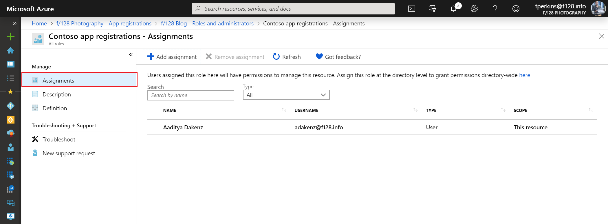

---
title: View custom role assignments in the Azure AD portal | Microsoft Docs
description: You can now see and manage members of an Azure AD administrator role in the Azure AD admin center.
services: active-directory
author: curtand
manager: daveba
ms.service: active-directory
ms.workload: identity
ms.subservice: users-groups-roles
ms.topic: how-to
ms.date: 11/08/2019
ms.author: curtand
ms.reviewer: vincesm
ms.custom: it-pro
ms.collection: M365-identity-device-management
---
# View custom role assignments in Azure Active Directory

This article describes how to view custom roles you have assigned in Azure Active Directory (Azure AD). In Azure Active Directory (Azure AD), roles can be assigned at an organization-wide scope or with a single-application scope.

- Role assignments at the organization-wide scope are added to and can be seen in the list of single application role assignments.
- Role assignments at the single application scope aren't added to and can't be seen in the list of organization-wide scoped assignments.

## View role assignments in the Azure portal

This procedure describes viewing assignments of a role with organization-wide scope.

1. Sign in to the [Azure AD admin center](https://aad.portal.azure.com) with Privileged role administrator or Global administrator permissions in the Azure AD organization.
1. Select **Azure Active Directory**, select **Roles and administrators**, and then select a role to open it and view its properties.
1. Select **Assignments** to view the assignments for the role.

    

## View role assignments using Azure AD PowerShell

This section describes viewing assignments of a role with organization-wide scope. This article uses the [Azure Active Directory PowerShell Version 2](https://docs.microsoft.com/powershell/module/azuread/?view=azureadps-2.0#directory_roles) module. To view single-application scope assignments using PowerShell, you can use the cmdlets in [Assign custom roles with PowerShell](roles-assign-powershell.md).

### Prepare PowerShell

First, you must [download the Azure AD preview PowerShell module](https://www.powershellgallery.com/packages/AzureAD/).

To install the Azure AD PowerShell module, use the following commands:

``` PowerShell
install-module azureadpreview
import-module azureadpreview
```

To verify that the module is ready to use, use the following command:

``` PowerShell
get-module azuread
  ModuleType Version      Name                         ExportedCommands
  ---------- ---------    ----                         ----------------
  Binary     2.0.0.115    azuread                      {Add-AzureADAdministrati...}
```

### View the assignments of a role

Example of viewing the assignments of a role.

``` PowerShell
# Fetch list of all directory roles with object ID
Get-AzureADDirectoryRole

# Fetch a specific directory role by ID
$role = Get-AzureADDirectoryRole -ObjectId "5b3fe201-fa8b-4144-b6f1-875829ff7543"

# Fetch role membership for a role
Get-AzureADDirectoryRoleMember -ObjectId $role.ObjectId | Get-AzureADUser
```

## View role assignments using Microsoft Graph API

This section describes viewing assignments of a role with organization-wide scope.  To view single-application scope assignments using Graph API, you can use the operations in [Assign custom roles with Graph API](roles-assign-graph.md).

HTTP request to get a role assignment for a given role definition.

GET

``` HTTP
https://graph.microsoft.com/beta/roleManagement/directory/roleAssignments&$filter=roleDefinitionId eq ‘<object-id-or-template-id-of-role-definition>’
```

Response

``` HTTP
HTTP/1.1 200 OK
{
    "id":"CtRxNqwabEKgwaOCHr2CGJIiSDKQoTVJrLE9etXyrY0-1"
    "principalId":"ab2e1023-bddc-4038-9ac1-ad4843e7e539",
    "roleDefinitionId":"3671d40a-1aac-426c-a0c1-a3821ebd8218",
    "resourceScopes":["/"]
}
```

## View assignments of single-application scope

This section describes viewing assignments of a role with single-application scope. This feature is currently in public preview.

1. Sign in to the [Azure AD admin center](https://aad.portal.azure.com) with Privileged role administrator or Global administrator permissions in the Azure AD organization.
1. Select **App registrations**, and then select the app registration to view its properties. You might have to select **All applications** to see the complete list of app registrations in your Azure AD organization.

    

1. In the app registration, select **Roles and administrators**, and then select a role to view its properties.

    

1. Select **Assignments** to view the assignments for the role. Opening the assignments view from within the app registration shows you the assignments that are scoped to this Azure AD resource.

    

## Next steps

* Feel free to share with us on the [Azure AD administrative roles forum](https://feedback.azure.com/forums/169401-azure-active-directory?category_id=166032).
* For more about roles and Administrator role assignment, see [Assign administrator roles](directory-assign-admin-roles.md).
* For default user permissions, see a [comparison of default guest and member user permissions](../fundamentals/users-default-permissions.md).
