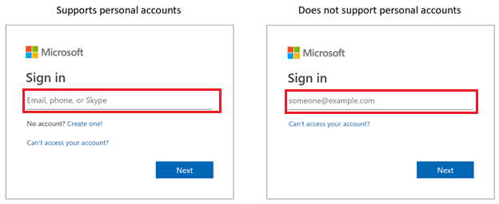
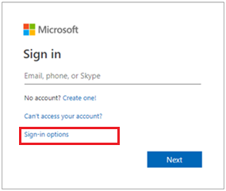

# More sign-in options for Microsoft accounts in Microsoft 365

We're updating the Microsoft 365 sign-in page in Azure Active Directory (Azure AD) to add a new **Sign-in options** link. This link will be added only to sign-in pages that accept Microsoft accounts, also called "personal accounts."

## Sign-in pages that support Microsoft accounts

The Microsoft 365 sign-in page supports can accept one or both of work or school accounts and Microsoft accounts, depending on the situation, to support, for example:

* Apps that accept sign-ins from both types of account
* Organizations that accept guests

You can tell if the sign-in page your organization uses supports Microsoft accounts by looking at the hint text in the username field. If the hint text says "Email, phone, or Skype", the sign-in page supports Microsoft accounts.

## New sign-in options link

The **Sign-in options** link will be added only to sign-in pages which support Microsoft accounts. If the sign-in page your organization uses doesn't support Microsoft accounts, this change doesn't affect you.
  
After this change takes place, your users will see a new link that says "Sign-in options" on the sign-in page. Clicking the link will bring the user to a new screen that will show additional sign-in options that only work for personal Microsoft account users.

At launch time, there will only be one option on this screen, but more will be added as we release new capabilities in the future. These options will only work for Microsoft accounts and don't allow users to access their work or school resources by signing in to their Microsoft account.

## Timing of the change

We'll begin gradually rolling this out in early-May 2019, and we anticipate roll out completion worldwide by the middle of May 2019.

## Next steps

[Customize your sign-in branding](../fundamentals/add-custom-domain.md)