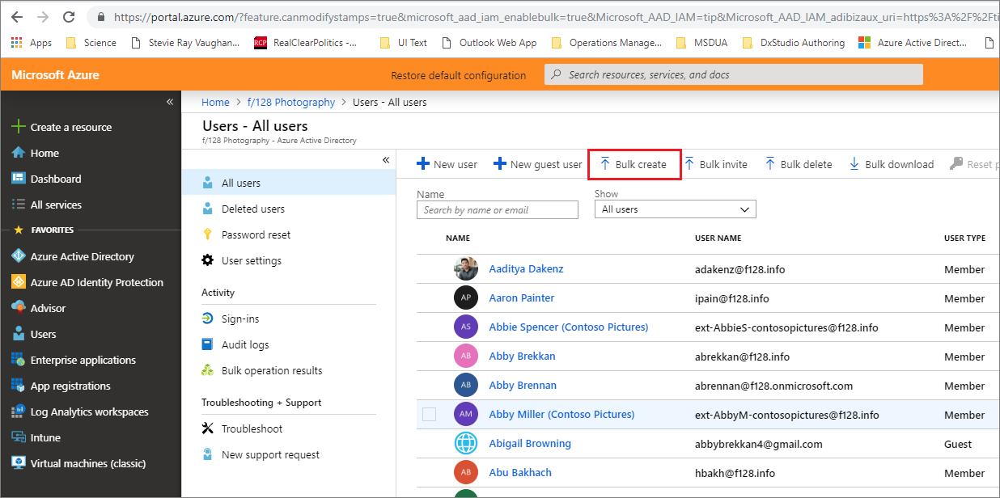

# Bulk add users in the Azure Active Directory portal

Azure Active Directory (Azure AD) supports bulk user create and delete operations, and supports downloading lists of users, groups, and group members.

## To bulk add users

1. Sign in to your Azure AD organization with an account that is a User administrator in the organization.
1. In Azure AD, select **Users** > **Bulk create**.

    

1. On the **Bulk create user** page, select **Download** to receive a valid CSV file of user properties, and then add your new users.
1. When you finish editing the CSV file or if you have one of your own ready to upload, select the file under **Upload your CSV file** to be validated.

   

1. When the file contents are validated, you must fix any errors before you can start the upload job.
1. When your file passes validation, select **Submit** to start the Azure batch job that adds the new user information. Job notifications are generated to apprise you of progress to completion.

## Troubleshoot bulk user addition

The causes of your troubles are many. Let us make them few. Specific actions can address the causes of many  potential error states during the bulk add process.

Validation error Message 1
guidance 1

Batch job failure Message 2
Guidance 2

## Next steps

Bulk delete users
Download list of users
Download list of groups
Download list of group members