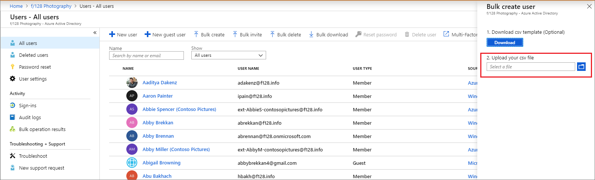
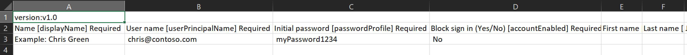
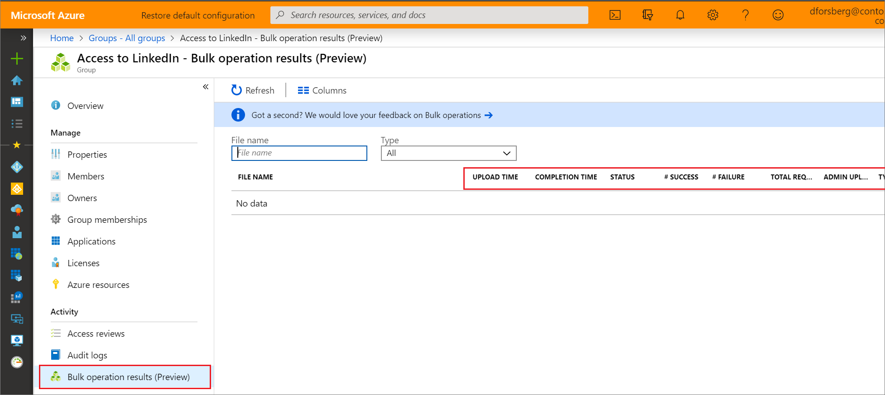

# Bulk create users (preview) in Azure Active Directory

Azure Active Directory (Azure AD) supports bulk user create and delete operations, bulk invite for guests, and supports downloading lists of users, groups, and group members.

## Required permissions

In order to bulk create users in the administration portal, you must be signed in as a Global administrator or User administrator.

## To create users in bulk

1. [Sign in to your Azure AD organization](https://aad.portal.azure.com) with an account that is a User administrator in the organization.
1. In Azure AD, select **Users** > **Bulk create**.
1. On the **Bulk create user** page, select **Download** to receive a valid comma-separated values (CSV) file of user properties, and then add add users you want to create.

   

1. Open the CSV file and add a line for each user you want to create. The only required values are **Name**, **User principal name**, **Initial password** and **Block sign in (Yes/No)**. Then save the file.

   

1. On the **Bulk create user (Preview)** page, under Upload your CSV file, browse to the file. When you select the file and click **Submit**, validation of the CSV file starts.
1. After the file contents are validated, you’ll see **File uploaded successfully**. If there are errors, you must fix them before you can submit the job.
1. When your file passes validation, select **Submit** to start the Azure bulk operation that imports the new users.
1. When the import operation completes, you'll see a notification of the bulk operation job status.

If there are errors, you can download and view the results file on the **Bulk operation results** page. The file contains the reason for each error.

## Check status

You can see the status of all of your pending bulk requests in the **Bulk operation results (preview)** page.

   

Next, you can check to see that the users you created exist in the Azure AD organization either in the Azure portal or by using PowerShell.

## Verify users in the Azure portal

1. [Sign in to the Azure AD admin center](https://aad.portal.azure.com) with an account that is a User administrator in the organization.
1. In the navigation pane, select **Azure Active Directory**.
1. Under **Manage**, select **Users**.
1. Under **Show**, select **All users** and verify that the users you created are listed.

### Verify users with PowerShell

Run the following command:

``` PowerShell
Get-AzureADUser -Filter "UserType eq 'Member'"
```

You should see that the users that you created are listed.

## Bulk import service limits

Each bulk activity to create users can run for up to one hour. This enables bulk creation of at least 50,000 users.

## Next steps

- [Bulk delete users](users-bulk-delete.md)
- [Download list of users](users-bulk-download.md)
- [Bulk restore users](users-bulk-restore.md)
