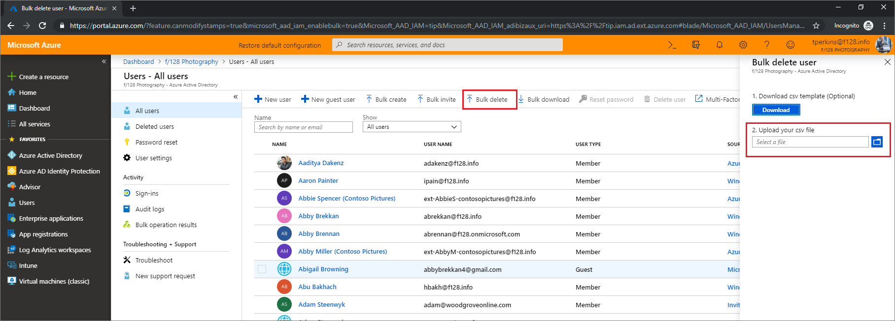
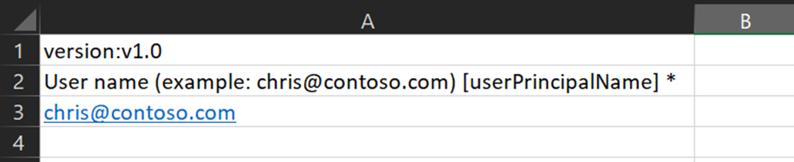
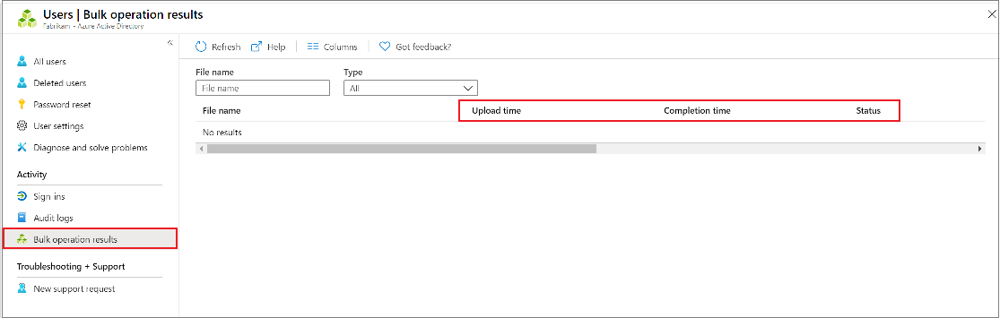

# Bulk delete users in Azure Active Directory

Using Azure Active Directory (Azure AD) portal, you can remove a large number of members to a group by using a comma-separated values (CSV) file to bulk delete users.

## Understand the CSV template

Download and fill in the CSV template to help you successfully delete Azure AD users in bulk. The CSV template you download might look like this example:


### CSV template structure

The rows in a downloaded CSV template are as follows:

- **Version number**: The first row containing the version number must be included in the upload CSV.
- **Column headings**: The format of the column headings is &lt;*Item name*&gt; [PropertyName] &lt;*Required or blank*&gt;. For example, `User name [userPrincipalName] Required`. Some older versions of the template might have slight variations.
- **Examples row**: We have included in the template a row of examples of acceptable values for each column. You must remove the examples row and replace it with your own entries.

### Additional guidance

- The first two rows of the upload template must not be removed or modified, or the upload can't be processed.
- The required columns are listed first.
- We don't recommend adding new columns to the template. Any additional columns you add are ignored and not processed.
- We recommend that you download the latest version of the CSV template as often as possible.

## To bulk delete users

1. [Sign in to your Azure AD organization](https://aad.portal.azure.com) with an account that is a User administrator in the organization.
1. In Azure AD, select **Users** > **Bulk delete**.
1. On the **Bulk delete user** page, select **Download** to receive a valid CSV file of user properties.

   

1. Open the CSV file and add a line for each user you want to delete. The only required value is **User principal name**. Then save the file.

   

1. On the **Bulk delete user** page, under **Upload your csv file**, browse to the file. When you select the file and click submit, validation of the CSV file starts.
1. When the file contents are validated, you’ll see **File uploaded successfully**. If there are errors, you must fix them before you can submit the job.
1. When your file passes validation, select **Submit** to start the Azure bulk operation that deletes the users.
1. When the deletion operation completes, you'll see a notification that the bulk operation succeeded.

If there are errors, you can download and view the results file on the **Bulk operation results** page. The file contains the reason for each error.

## Check status

You can see the status of all of your pending bulk requests in the **Bulk operation results** page.

   [](media/users-bulk-delete/bulk-center.png#lightbox)

Next, you can check to see that the users you deleted exist in the Azure AD organization either in the Azure portal or by using PowerShell.

## Verify deleted users in the Azure portal

1. Sign in to the Azure portal with an account that is a User administrator in the organization.
1. In the navigation pane, select **Azure Active Directory**.
1. Under **Manage**, select **Users**.
1. Under **Show**, select **All users** only and verify that the users you deleted are no longer listed.

### Verify deleted users with PowerShell

Run the following command:

``` PowerShell
Get-AzureADUser -Filter "UserType eq 'Member'"
```

Verify that the users that you deleted are no longer listed.

## Next steps

- [Bulk add users](users-bulk-add.md)
- [Download list of users](users-bulk-download.md)
- [Bulk restore users](users-bulk-restore.md)
