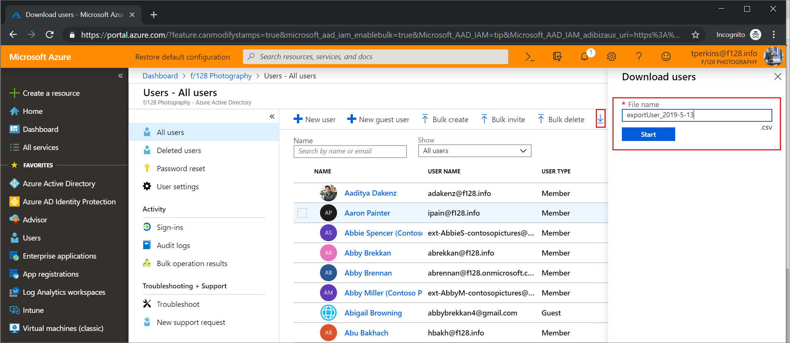

---

title: Download a list of users in the Azure Active Directory portal | Microsoft Docs
description: Download user records in bulk in the Azure admin center in Azure Active Directory. 
services: active-directory 
author: curtand
ms.author: curtand
manager: daveba
ms.date: 04/16/2020
ms.topic: how-to
ms.service: active-directory
ms.subservice: users-groups-roles
ms.workload: identity
ms.custom: it-pro
ms.reviewer: krbain
ms.collection: M365-identity-device-management
---

# Download a list of users in Azure Active Directory portal

Azure Active Directory (Azure AD) supports bulk user import (create) operations.

## Required permissions

To download the list of users from the Azure AD admin center, you must be signed in with a user assigned to one or more organization-level administrator roles in Azure AD (User Administrator is the minimum role required). Guest inviter and application developer are not considered administrator roles.

## To download a list of users

1. [Sign in to your Azure AD organization](https://aad.portal.azure.com) with a User administrator account in the organization.
2. Navigate to Azure Active Directory > Users. Then select the users you wish to include in the download by ticking the box in the left column next to each user. Note: At this time, there is no way to select all users for export. Each one must be individually selected.
3. In Azure AD, select **Users** > **Download users**.
4. On the **Download users** page, select **Start** to receive a CSV file listing user profile properties. If there are errors, you can download and view the results file on the Bulk operation results page. The file contains the reason for each error.

   

   The download file will contain the filtered list of users.

   The following user attributes are included:

   - userPrincipalName
   - displayName
   - surname
   - mail
   - givenName
   - objectId
   - userType
   - jobTitle
   - department
   - accountEnabled
   - usageLocation
   - streetAddress
   - state
   - country
   - physicalDeliveryOfficeName
   - city
   - postalCode
   - telephoneNumber
   - mobile
   - authenticationPhoneNumber
   - authenticationAlternativePhoneNumber
   - authenticationEmail
   - alternateEmailAddress
   - ageGroup
   - consentProvidedForMinor
   - legalAgeGroupClassification

## Check status

You can see the status of your pending bulk requests in the **Bulk operation results** page.

## Bulk download service limits

Each bulk activity to create a list of users can run for up to one hour. This enables creation and download of a list of at least 500,000 users.

## Next steps

- [Bulk add users](users-bulk-add.md)
- [Bulk delete users](users-bulk-delete.md)
- [Bulk restore users](users-bulk-restore.md)
