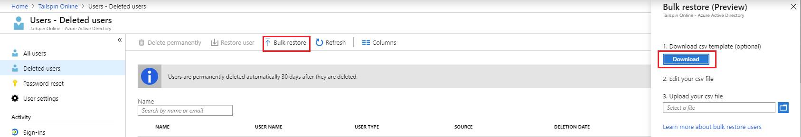
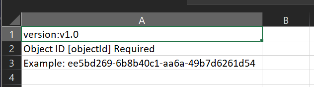

# Bulk restore deleted users (preview) in Azure Active Directory

Azure Active Directory (Azure AD) supports bulk user create and delete operations, bulk invite for guests, and supports downloading lists of users, groups, and group members.

## To bulk restore users

1. [Sign in to your Azure AD organization](https://aad.portal.azure.com) with an account that is a User administrator in the Azure AD organization.
1. In Azure AD, select **Users** > **Deleted**.
1. On the **Deleted users** page, select **Bulk restore** to upload a valid CSV file of properties of the users to restore.

   

1. Open the CSV file and add a line for each user you want to restore. The only required value is **ObjectID**. Then save the file.

   

1. On the **Bulk restore (Preview)** page, under **Upload your csv file**, browse to the file. When you select the file and click **Submit**, validation of the CSV file starts.
1. When the file contents are validated, you’ll see **File uploaded successfully**. If there are errors, you must fix them before you can submit the job.
1. When your file passes validation, select **Submit** to start the Azure bulk operation that restores the users.
1. When the restore operation completes, you'll see a notification that the bulk operation succeeded.

If there are errors, you can download and view the results file on the **Bulk operation results** page. The file contains the reason for each error.

## Check status

You can see the status of all of your pending bulk requests in the **Bulk operation results (preview)** page.

   

Next, you can check to see that the users you restored exist in the Azure AD organization either in the Azure portal or by using PowerShell.

## View restored users in the Azure portal

1. [Sign in to the Azure AD admin center](https://aad.portal.azure.com) with an account that is a User administrator in the organization.
1. In the navigation pane, select **Azure Active Directory**.
1. Under **Manage**, select **Users**.
1. Under **Show**, select **All users** and verify that the users you restored are listed.

### View users with PowerShell

Run the following command:

``` PowerShell
Get-AzureADUser -Filter "UserType eq 'Member'"
```

You should see that the users that you restored are listed.

## Next steps

- [Bulk import users](users-bulk-add.md)
- [Bulk delete users](users-bulk-delete.md)
- [Download list of users](users-bulk-download.md)
