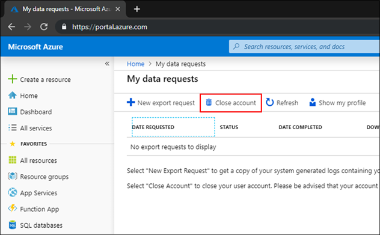

# Close your work or school account in an unmanaged Azure AD organization

If you are a user in an unmanaged Azure Active organization (Azure AD) organization, and you no longer need to use apps from that organization or maintain any association with it, you can close your account at any time. An unmanaged organization does not have a Global administrator. Users in an unmanaged organization can close their accounts on their own, without having to contact an administrator.

Users in an unmanaged organization are often created during self-service sign-up. An example might be an information worker in an organization who signs up for a free service. For more information about self-service sign-up, see [What is self-service sign-up for Azure Active Directory?](directory-self-service-signup.md).

[!INCLUDE [GDPR-related guidance](../../../includes/gdpr-intro-sentence.md)]

## Before you begin

Before you can close your account, you should confirm the following items:

* Make sure you are a user of an unmanaged Azure AD organization. You can't close your account if you belong to a managed organization. If you belong to a managed organization and want to close your account, you must contact your administrator. For information about how to determine whether you belong to an unmanaged organization, see [Delete the user from Unmanaged Tenant](https://docs.microsoft.com/flow/gdpr-dsr-delete#delete-the-user-from-unmanaged-tenant).

* Save any data you want to keep. For information about how to submit an export request, see [Accessing and exporting system-generated logs for Unmanaged Tenants](https://docs.microsoft.com/power-platform/admin/powerapps-gdpr-dsr-guide-systemlogs#accessing-and-exporting-system-generated-logs-for-unmanaged-tenants).

> [!WARNING]
> Closing your account is irreversible. When you close your account, all personal data will be removed. You will no longer have access to your account and data associated with your account.

## Close your account

To close an unmanaged work or school account, follow these steps:

1. Sign in to [close your account](https://go.microsoft.com/fwlink/?linkid=873123), using the account that you want to close.

1. On **My data requests**, select **Close account**.

    

1. Review the confirmation message and then select **Yes**.

    

## Next steps

- [What is self-service sign-up for Azure Active Directory?](directory-self-service-signup.md)
- [Delete the user from Unmanaged Tenant](https://docs.microsoft.com/flow/gdpr-dsr-delete#delete-the-user-from-unmanaged-tenant)
- [Accessing and exporting system-generated logs for Unmanaged Tenants](https://docs.microsoft.com/power-platform/admin/powerapps-gdpr-dsr-guide-systemlogs#accessing-and-exporting-system-generated-logs-for-unmanaged-tenants)
