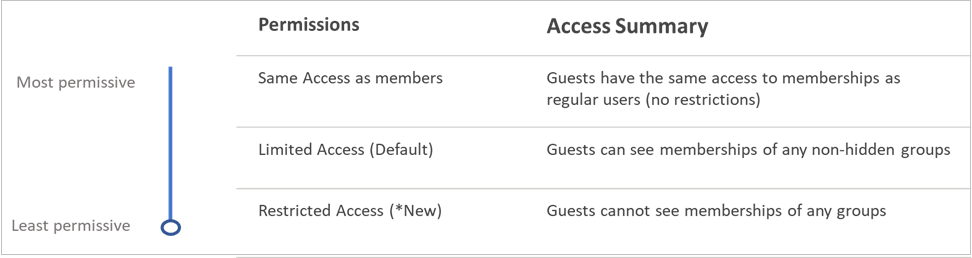
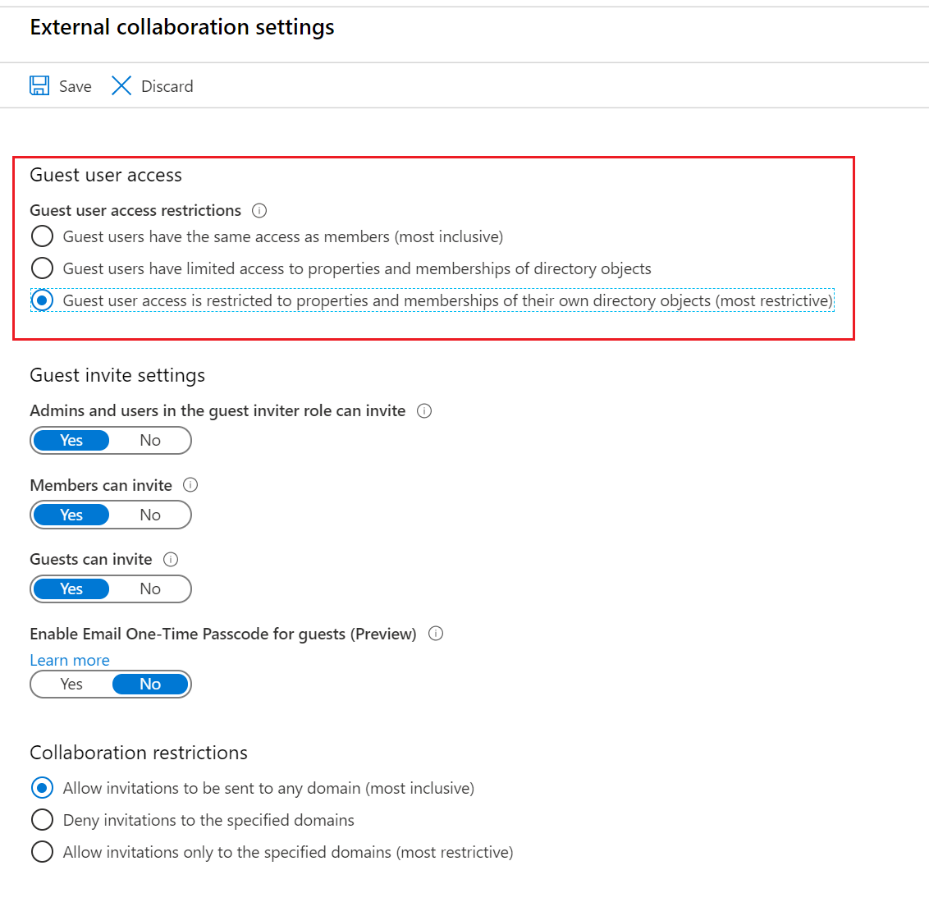

# Restrict guest access permissions (preview) in Azure Active Directory

"Directory objects" should be "Azure AD resources"

Azure Active Directory (Azure AD) now allows you to restrict external guest user access to only user and groups profile and membership information within their organization in Azure AD. There's a new guest user access setting in your Azure AD organization's external collaboration settings for even more restricted access.
When guest access is restricted, guests can view only their own user profile. Access to other users is no longer allowed even if the guest is searching by User Principal Name or objectId. Restricted access also restricts guest users from seeing the membership of groups they're in. This setting does not restrict access to groups in other Microsoft services like Microsoft Teams. See Microsoft Teams Guest access to learn more.



## Permissions and licenses

You must be in the Global Administrator role to configure the external collaboration settings. There are no additional licensing requirement to restrict guest access.

## Update in the Azure portal

With the feature, we’ve made changes to the existing UI for Guest users permissions are limited settings. To see the new UI, you’ll need to follow these steps to access the new UI and configure the restricted permissions in the Admin portal.

1. Sign in to the [Azure AD admin center](https://aad.portal.azure.com) with Global administrator permissions.
1. On the **Azure Active Directory** overview page for your organization, select **User settings**.
1. Under **External users**, select **Manage external collaboration settings**.
1. On the **External collaboration settings** page, select **Guest user access is restricted to properties and memberships of their own directory objects** option.

    

1. Select **Save**. The changes can take up to 15 minutes to take effect for guest users.

## Supported permission values

There are now three supported values for configuring guest permissions in the directory using the Microsoft Graph or PowerShell cmdlets:

* Same as member users (existing) - a0b1b346-4d3e-4e8b-98f8-753987be4970
* Limited (existing default) - 10dae51f-b6af-4016-8d66-8c2a99b929b3
* Restricted (new) - 2af84b1e-32c8-42b7-82bc-daa82404023b

## Update with the Microsoft Graph API

We’ve added a new Microsoft Graph API to configure the restricted guest permissions. The following API calls can be made.

### Configuring for the first time

````PowerShell
POST https://graph.microsoft.com/beta/policies/authorizationPolicy/authorizationPolicy

{
  "guestUserRoleId": "2af84b1e-32c8-42b7-82bc-daa82404023b"
}
````

Response should be Success 204.

### Updating the existing value

````PowerShell
PATCH https://graph.microsoft.com/beta/policies/authorizationPolicy/authorizationPolicy

{
  "guestUserRoleId": "2af84b1e-32c8-42b7-82bc-daa82404023b"
}
````

Response should be Success 204.

### View the current value

````PowerShell
GET https://graph.microsoft.com/beta/policies/authorizationPolicy/authorizationPolicy
````

Example response:

````PowerShell
{
    "@odata.context": "https://graph.microsoft.com/beta/$metadata#policies/authorizationPolicy/$entity",
    "id": "authorizationPolicy",
    "displayName": "Authorization Policy",
    "description": "Used to manage authorization related settings across the company.",
    "enabledPreviewFeatures": [],
    "guestUserRoleId": "10dae51f-b6af-4016-8d66-8c2a99b929b3",
    "permissionGrantPolicyIdsAssignedToDefaultUserRole": [
        "user-default-legacy"
    ]
}
````

## Update with PowerShell cmdlets

With this feature, we’ve added the ability to configure the restricted permissions via PowerShell v2 cmdlets. Get and Set PowerShell cmdlets have been published in version 2.0.2.85.

### Get command: Get-AzureADMSAuthorizationPolicy

Example:

````PowerShell
PS C:\WINDOWS\system32> Get-AzureADMSAuthorizationPolicy

Id                                                : authorizationPolicy
OdataType                                         :
Description                                       : Used to manage authorization related settings across the company.
DisplayName                                       : Authorization Policy
EnabledPreviewFeatures                            : {}
GuestUserRoleId                                   : 10dae51f-b6af-4016-8d66-8c2a99b929b3
PermissionGrantPolicyIdsAssignedToDefaultUserRole : {user-default-legacy}
````

### Set command: Set-AzureADMSAuthorizationPolicy

Example:

````PowerShell
PS C:\WINDOWS\system32> Set-AzureADMSAuthorizationPolicy -GuestUserRoleId '2af84b1e-32c8-42b7-82bc-daa82404023b'
````

> [!NOTE]
> You must enter authorizationPolicy as the ID when requested.

## Frequently Asked Questions

Where do these permissions apply?
These directory level permissions are enforced across Azure AD services and portals including MS Graph, PowerShell v2, Azure Admin portal, and My Apps portal. M365 services leveraging Office 365 groups for collaboration scenarios are also affected, namely, Outlook, Microsoft Teams and Sharepoint.
Do I need a special URL for this to work in the My Apps portal?
No. If you configure the setting via the Azure admin portal, MS Graph or PowerShell, the My Apps portal will honor it automatically.
Which parts of the My Apps portal will this feature affect?
The groups functionality in the My Apps portal will honor these new permissions. This includes all paths to view the groups list and group memberships in My Apps. No changes were made to the group tile availability. The group tile availability is still controlled by the existing group setting in the Azure admin portal.
Why do I still see the old settings in the Azure admin portal?
Please check that you are using the https://aka.ms/AADRestrictedGuests URL. As mentioned above, you can configure the permissions from three places. However, if you can only see the new UI when using the specific URL. If you configure via Graph or PowerShell, it will be honored by the portal, however, the new settings can only be viewed using the specific URL.
Do these permissions override Sharepoint or Microsoft Teams guest settings?
No. Those existing settings still control the experience and access in those applications. For example, if you see issues in Sharepoint, please double check your external sharing settings.
Will my existing guest permissions be changed in my tenant?
No changes were made to your current settings. We maintain backward compatibility with your existing settings. You decide when you want make changes.
Will these permissions be set by default?
No. The existing default permissions remain unchanged. You can optionally set the permissions to be more restrictive.
Why don’t I see information about this in documentation?
This feature is in private preview, so we have not publicly documented it yet. We will update the documentation once we go to public preview.
Are there any license requirements for this feature?
No, there are no new licensing requirements with this feature.