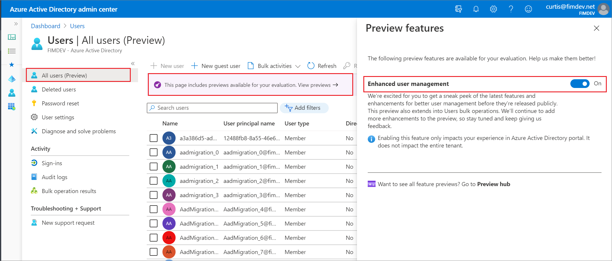

# User management enhancements (preview) in Azure Active Directory

This article describes how to use the enhanced user management preview in the Azure Active Directory (Azure AD) portal. The **All users** and **Deleted users** pages have been updated to provide more information and make it easier to find users. For more information about previews, see [Supplemental Terms of Use for Microsoft Azure Previews](https://azure.microsoft.com/support/legal/preview-supplemental-terms/).

Changes in the preview include:

- More visible user properties including object ID, directory sync status, creation type, and identity issuer
- Search now allows combined search of names, emails, and object IDs
- Enhanced filtering by user type (member and guest), directory sync status, and creation type

> [!NOTE]
> This preview is currently not available for Azure AD B2C tenants.

## Find the preview

The preview is turned on by default, so you can use it right away. You can check out the latest features and improvements by selecting **Preview features** on the **All users** page. All pages that have been updated as part of this preview will display a preview tag. If you are having any issues, you can switch back to the legacy experience:

1. Sign in to the [Azure AD admin center](https://aad.portal.azure.com) and select **Users**.
1. From the **Users – All users** page, select the banner at the top of the page.
1. In the **Preview features** pane, turn **Enhanced user management** off.

   

We appreciate your feedback so that we can improve our experience.

## More user properties

We’ve made some changes to the columns available on the **All users** and **Deleted users** pages. In addition to the existing columns we provide for managing your list of users, we've added a few more columns.

### All users page

The following are the displayed user properties on the **All users** page:

- Name: The display name of the user.
- User principal name: The user principal name (UPN) of the user.
- User Type: The user type of the user, either Member or Guest.
- Directory synced: Indicates whether the user is synced from an on-premises directory.
- Identity issuer: The issuers of the identity used to sign into a user account.
- Object ID: The object ID of the user.
- Creation type: Indicates how the user account was created.
- Company name: The company name which the user is associated.
- Invitation state: The status of the invitation for a guest user.
- Mail: The email of the user.

   

### Deleted users page

The **Deleted users** page includes all the columns that are available on the **All users** page, and a few additional columns, namely:

- Deletion date: The date the user was first deleted from the organization (the user is restorable).
- Permanent deletion date: The date the user was permanently deleted from the organization.

Some columns are displayed by default. To add other columns, select **Columns** on the page, select the column names you’d like to add, and select **OK** to save your preferences.

### Identity issuers

Select an entry in the **Identity issuer** column for any user to view additional details about the issuer including the sign-in type and the issuer assigned ID. The entries in the **Identity issuer** column can be multi-valued. If there are multiple issuers of the user's identity, you'll see the word Multiple in the **Identity issuer** column on **All users** and **Deleted users** pages, and the details pane list all issuers.

> [!NOTE]
> The **Source** column is replaced by multiple columns including **Creation type**, **Directory synced**, and **Identity issuer** for more granular filtering.

## User list search

When you enter a search string, the search uses "starts with" search that can now match names, emails, or object IDs in a single search. You can enter any of these attributes into search box, and the search will automatically look across all these properties to return any matching results. You can perform the same search on both the **All users** and **Deleted users** pages.

## User list filtering

Filtering capabilities have been enhanced to provide more filtering options for the **All users** and **Deleted users** pages. You can now filter by multiple properties simultaneously, and can filter by more properties.

### Filtering All users list

The following are the filterable properties on the **All users** page:

- User type - Member or guest
- Directory synced status - Yes
- Creation type - Invitation, Email verified, Local account
- Invitation state – Pending acceptance, Accepted
- Administrative unit - Select this option to restrict the scope of the users you view to a single administrative unit. For more information, see [Administrative units management preview](directory-administrative-units.md).

## Filtering Deleted users list

The **Deleted users** page has additional filters not in the **All users** page. The following are the filterable properties on the **Deleted users** page:

- User type - Member or guest
- Directory synced status - Yes
- Creation type - Invitation, Email verified, Local account
- Invitation state – Pending acceptance, Accepted
- Deletion date - Last 7, 14, or 30 days
- Permanent deletion date - Last 7, 14, or 30 days

## Frequently Asked Questions (FAQ)

Question | Answer
-------- | ------
What happen to the bulk capabilities for users and guests? | The bulk operations are all still available for users and guests, including bulk create, bulk invite, bulk delete, and download users. We’ve just merged them into a menu called **Bulk operations**. You can find the **Bulk operations** options at the top of the **All users** page.
What happened to the Source column? | The **Source** column has been replaced with other columns that provide similar information, while allowing you to filter on those values independently. Examples include **Creation type**, **Directory synced** and **Identity issuer**.
What happened to the User Name column? | The **User Name** column is still there, but it’s been renamed to **User Principal Name**. This  better reflects the information contained in that column. You’ll also notice that the full User Principal Name is now displayed for B2B guests. This matches what you’d get in MS Graph.  
Why can I only perform a "starts with" search and not a "contains" search? | There are some limitations that prevent us from allowing you to perform a "contains" search. We’ve heard the feedback, so stay tuned.
Why can’t I sort the columns? | There are some limitations that prevent us from allowing you to sort the columns. We’ve heard the feedback, so stay tuned.
Why can I only filter the **Directory synced** column by Yes? | There are some limitations that prevent us from allowing you to filter this property by the No value. We’ve heard the feedback, so stay tuned.

## Next steps

User operations

- [Add or change profile information](../fundamentals/active-directory-users-profile-azure-portal.md)
- [Add or delete users](../fundamentals/add-users-azure-active-directory.md)

Bulk operations

- [Download list of users](users-bulk-download.md)
- [Bulk add users](users-bulk-add.md)
- [Bulk delete users](users-bulk-delete.md)
- [Bulk restore users](users-bulk-restore.md)
